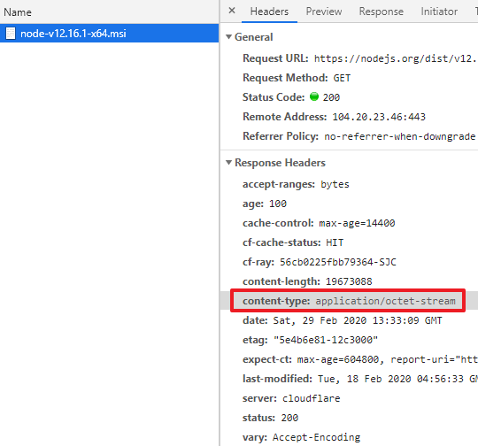
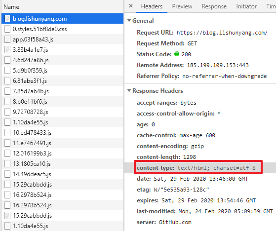
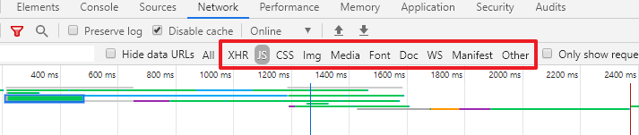
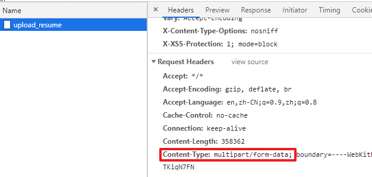
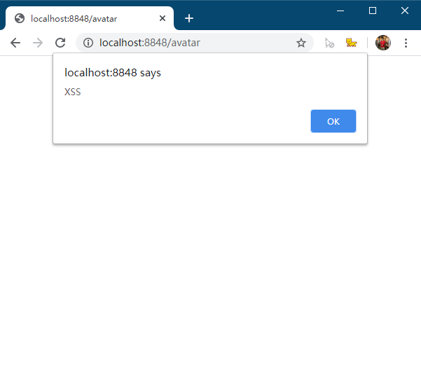
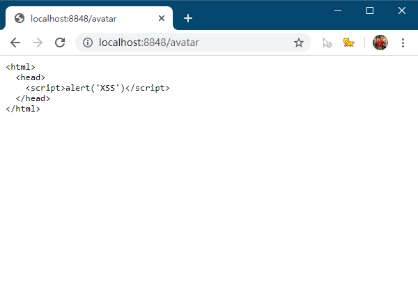

# 用a标签下载

我们经常能在页面中看到一些下载链接，比如Nodejs的下载页


如果观察html源代码你会发现，这其实就是个a标签：

```html
<a
  href="https://nodejs.org/dist/v12.16.1/node-v12.16.1-x64.msi"
  target="_blank"
>
  12.16.1 LTS
</a>
```

看上去就是一个普通的a标签而已，我们知道a标签的默认行为应该是打开一个页面才对，你有没有想过为什么这里的a标签不是打开一个页面而是触发了下载行为呢？

# MIME

你也许听说过`Content-Type`这个header，没错，当我们点击那个a标签时，浏览器检查了response的Content-Type，发现这是一个特殊的类型，因而触发了下载行为。如果你打开浏览器的调试工具看的话，上面的下载链接的Content-Type实际上是`application/octet-stream`。



而如果一个链接的response header的Content-Type是`text/html`的话，浏览器就会打开页面，比如点击[“这里”](https://blog.lishunyang.com/)将打开博客首页，我们可以发现Content-Type是`text/html`。



Content-Type头部的内容实际上是MIME类型，它的全称是Multipurpose Internet Mail Extension，没错这个标准一开始被发明出来是用来扩展邮件的，要知道邮件比互联网出现得更早，很多现在的互联网标准其实最初都是用在邮件里的。如果你想更多细节，可以参考wikipedia对MIME的介绍，这里是[传送门](https://zh.wikipedia.org/wiki/%E5%A4%9A%E7%94%A8%E9%80%94%E4%BA%92%E8%81%AF%E7%B6%B2%E9%83%B5%E4%BB%B6%E6%93%B4%E5%B1%95)

MIME的最常见格式为

```
[type]/[subtype]; parameter
```

其中，type常见的值有以下几种：

- text：文本信息
- application：应用数据
- image：图片
- audio：音频
- video：视频
- multipart：由多个部分组合而成的数据，比如表单数据

而subtype则根据type不同而不同，比如刚才见到的`application/octet-stream`和`text/html`，其他比较常见的还有`application/json`，`img/png`，`text/javascript`，`text/css`等等。总之，浏览器就是根据这个MIME来识别不同的response，并决定如何处理它。例如前面的a标签，如果url的Content-Type是audio，Chrome浏览器会打开一个内置的音频播放器。浏览器的network面板也是根据Content-Type来对网络请求分类的：



需要强调的是，Content-Type这个header不仅用于response，同样可以用于request。比如向服务器提交表单或上传文件，request里也有Content-Type这个header：



> PS：上传文件时的Content-Type与文件内容无关，总是multi-part/form-data

# Content-Type Sniffing

Content-Type既然是个header，就需要开发者人为指定，如果Content-Type缺失的话会怎么样呢？

比如在浏览器中输入一个不带Content-Type的请求地址，当请求发出后，浏览器如何决定呢？可以写一个简单的node应用进行测试

```js
const http = require('http');
const fs = require('fs');

http.createServer((req, res) => {
  // 加载了一个图片并返回
  fs.createReadStream('./hello.png').pipe(res);
}).listen(8848);
```

经过测试发现，浏览器是能够正确渲染出图片的。这是因为浏览器在Content-Type缺失的情况下会主动分析响应体内容然后猜测MIME类型，这个过程叫做Content-Type Sniffing，关于如何猜测，有一个专门的规范，见[这里](https://mimesniff.spec.whatwg.org/)。

Content-Type Sniffing的本意是好的，但这可能会导致XSS安全问题。

假设某网站允许用户上传图片做头像，但是在响应请求的时候没有附带Content-Type，那么这个请求该如何展示将由浏览器通过Content-Sniffing确定。此时黑客可以构造一个恶意html，将其改名为avatar.png然后上传到服务器上（很多服务器对文件类型的限制就是简单地通过后缀名过滤），那么之后当其他用户打开这个恶意头像链接时，浏览器会通过Content-Type Sniffing判定为这是一个html并正常加载，从而导致XSS问题。比如下面的演示：

黑客构造一段恶意html代码，并将其改名为`avatar.png`，恶意代码内容为：

```html
<html>
  <head>
    <script>alert('XSS')</script>
  </head>
</html>
```

下面是无Content-Type的server端代码：

```js
const http = require('http');
const fs = require('fs');

http.createServer((req, res) => {
  fs.createReadStream('.' + req.url + '.png').pipe(res);
}).listen(8848);
```

打开浏览器，输入 http://localhost:8848/avatar，看到代码被执行了：



幸运的是，有一个X-Content-Type-Options头部可以解决这个问题，当设置这个头部为nosniff时，浏览器将不会猜测MIME，缺失的Content-Type将会一律按照text/plain解析。

比如上面的例子，如果后端增加了nosniff的头部，浏览器将不会猜测MIME而是将使用默认的text/plain类型：



# Content-Disposition

回到最开头的下载问题，现在我们知道了，a标签的行为取决于资源响应的Content-Type，如果是text/html，那么浏览器将会打开新的页面。现在问题来了，如果要下载的文件本身是一个html，怎么办呢？

将Content-Type手动修改为application/octet-stream可以吗？当然可以，这样浏览器就会认为a标签引用的是一个二进制文件，直接触发下载行为。但是这样做显得太暴力了，下载文件的类型信息丢失了，有没有其他办法呢？

当然是有的了，那就是Content-Disposition这个header。Content-Disposition可以告诉浏览器，获取到的资源是展示还是下载，比如：

```
Content-Disposition: attachment; filename=hello.html
```

这样，我们就可以让Content-Type是text/html，同时浏览器也能正确识别并下载html文件了。

但是！Content-Disposition带来了新的安全风险。如果存在HTTP Header注入漏洞，Content-Disposition可能会失效。

假如有一个网盘站点，允许用户上传下载资料，所有的下载请求都添加了Content-Disposition以确保文件内容不会被浏览器解析。但如果黑客可以注入HTTP header，比如在Set-Cookie当中添加`\r\n\r\n`。

```
HTTP/1.1 200 OK
Content-Type: text/html
Set-Cookie: something
                                                      <-- 注意这里的\r\n

Content-Disposition: attachment;filename=xss.htm


<script>alert(document.cookie)</script>
```

> HTTP协议规定两个连续的`\r\n`代表header和body的分隔

下面的Content-Disposition被当成了body的一部分，于是浏览器将会按照Content-Type是text/html的方式解析文件内容，Content-Disposition这个限制被绕过了，XSS又发生了！

> 关于HTTP header injection的资料可以参考[OWASP的wiki](https://owasp.org/www-community/attacks/HTTP_Response_Splitting)

正因为Content-Disposition的安全问题，即使已经被广泛使用，这个其实header并没有被收录在HTTP1.1协议中，因此，使用Content-Disposition的方法不是推荐的做法。

# 总结

其实这里演示的是常规的后端下载，如果算上ObjectURL前端下载，有关下载的内容还可以再扯下去，不过这里就先就此打住吧。

总结：

1. Content-Type决定了浏览器如何处理请求得到的资源
2. Content-Type如果缺失，浏览器会尝试猜测MIME类型，而这可能导致XSS风险，请务必使用X-Content-Type-Options: nosniff
3. Content-Disposition也可以决定资源是加载还是展示，但是可以被HTTP Header Inject绕过，所以不推荐使用

# 参考资料

- [MIME wikipedia](https://en.wikipedia.org/wiki/MIME)
- [常见MIME类型列表](https://developer.mozilla.org/zh-CN/docs/Web/HTTP/Basics_of_HTTP/MIME_types/Common_types)
- [MIME Sniffing in Browsers and the Security Implications](https://www.denimgroup.com/resources/blog/2019/05/mime-sniffing-in-browsers-and-the-security-implications/)
- [Defeating Content-Disposition](https://markitzeroday.com/xss/bypass/2018/04/17/defeating-content-disposition.html)
- [OWASP HTTP Response Splitting](https://owasp.org/www-community/attacks/HTTP_Response_Splitting)
