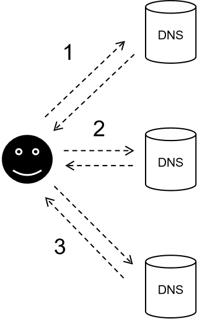
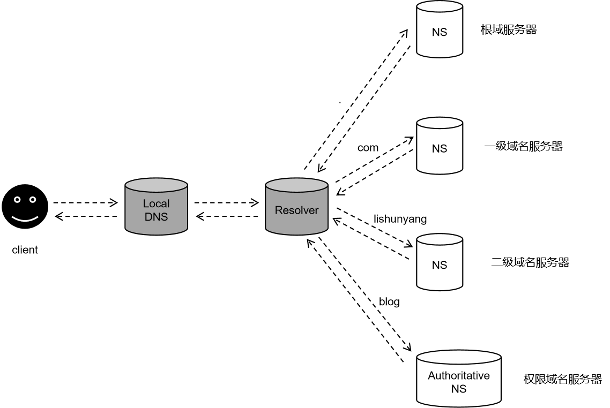

域名是一个非常常见的概念，但是你真的了解它吗？比如现在我问你几个问题：

> 1. https://blog.lishunyang.com，blog.lishunyang.com，lishunyang.com，lishunyang 这里面哪些是域名，哪些不是域名？
> 2. 域名的A记录、CNAME记录、MX记录是什么意思？域名供应商之间是什么关系？国外购买的域名在国内能用吗？
> 3. 什么是DNS劫持，什么是DNS污染？

怎么样？能回答上来吗？如果不能，就往下看吧。

# 域名的格式

域名是由多个部分组成的，每个部分用`.`连接，比如`blog.lishunyang.com`。右边的`com`是顶级域名（也叫做一级域名），剩下的`lishunyang`和`blog`都是子域名，从右向左依次是二级域名、三级域名、四级域名，等等等等，最多128层！

实际上，完整的域名在最后还有一个`.`，这是因为域名空间是一个树状空间，这个点代表所有空间的根，通常我们都会把这个省略，软件在进行DNS查询的时候会自动补上。

你有没有好奇过为什么是`blog.lishunyang.com`而不是`com.lishunyang.blog`？前者导致我们在寻址的时候不得不从右向左，似乎有点奇怪。网上有一种说法，说是在域名被发明之前已经有了email，当时网络上的机器还很少，所以大家都是直接用@host名字用来做邮件地址，比如@lishunyang，后来机器越来越多，人们认为有必要引入域名空间管理，为了兼容之前的邮件写法，就只好在原来的邮件地址后面追加域信息，于是就有了@lishunyang.com。不过我个人倒是有另一种看法，英语中我们描述一个地址，时间甚至姓名的时候，经常会按照分类从小到大或者层级从低到高的规则表述，比如“403房间，42楼，颐和园路5号”，“4月2日，1977年”，“舜阳，李”。如果按照“越重要越靠前”的规则看，符合西方文明所崇尚的个体、自由、主权等个人主义风格。而在东方文明中，集体、国家的地位高于个人，所以中文里前面一些概念的顺序正好是反过来的。

# 域名的各种记录

域名是全局唯一的（由一个叫ICNN的组织统一管理），意味着任何一个合法注册的域名在世界各地的解析结果都是一样的，所以如果你通过国外域名服务商注册了一个域名，国内也照样可以解析。域名采取注册制，任何名字，只要没有被其他人使用，就可以申请作为域名。

我们说注册域名，通常指的是注册二级域名，比如`blog.lishunyang.com`中间的那个`lishunyang`。一级域名（比如`com`，`org`，`edu`）是无法注册的，他们是ICNN固定发布的。另外，一旦注册了某个域名，那么也就天然拥有了该域名下所有子域名，比如注册了`lishunyang.com`，那么你可以随意添加`blog.lishunyang.com`，`www.lishunyang.com`，`app.lishunyang.com`的解析记录。

域名空间是一个树状空间，域名是树中的节点，域名定位的过程实际上就是多叉树的搜索过程。


域名不是网址或URL，有些人想当然地以为域名就是网址，实际上这只是域名的用途之一。你有没有思考过，当我们给别人发送email的时候，邮件是怎么找到对方的邮件服务器的呢？邮件地址中`@`之后的部分其实就是一个域名，只不过这个域名是专门用来进行邮件寻址的。在DNS中，一个域名下可以包含多个信息，被称作记录。比如常见的有：

1. A记录：域名最主要的用途，从域名映射到ip。
2. MX记录（也叫SMTP记录）：专门用于邮件服务，从域名映射到对应的邮件服务器ip。
3. CNAME记录：域名别名，从一个域名映射到另一个域名。
4. NS记录：如果设置了子域名需要特定的域名服务器解析，需要配置这个记录。
4. TXT记录：保存一些文本格式的数据，有什么用处可以自行灵活安排。比如SPF、DKIM、DMARC。

此外，还有PTR记录、AAA记录、SRV记录、SOA记录等，这里不一一列举了。

# DNS的查询方式

说域名就不得不提到域名系统（DNS，Domain Name System），负责存储和查询域名，通常我们把提供域名查询服务的server称作DNS服务器，但实际上是不严谨的。

据统计，2019年Q3，一共有3.6亿个域名被登记注册，如此庞大的数量，DNS必须被设计成分布式的，而且每个DNS只负责存储一部分域名。DNS的查询分为“递归查询”和“迭代查询”两种。

1. 递归查询

当DNS服务器本地没有查询结果时，继续递归查询其他DNS服务器，直到找到为止，然后一层一层递归返回给查询方。


2. 迭代查询

当DNS服务器本地没有查询结果时，不会递归查询其他服务器，而是告诉查询方，接下来你可以去哪个DNS服务器查询，然后查询方自己再去向其他DNS服务器请求。



而实际我们在DNS查询的时候，通常是这样：



其中：

- 左边的小人是发起DNS查询的查询方，例如Chrome浏览器
- Local DNS是本地的DNS服务器，指的是本地操作系统或路由器网关的DNS服务
- Resolver是DNS查询的反向代理服务器，代替查询方与后续的NS服务器通信
- NS是域名服务器，负责告诉查询方，你要的域名信息在哪里，注意NS并不直接返回域名数据
- Authoritative NS是实际存储域名信息的服务器

可以看到，client与Resolver的属于递归式的，而Resolver与NS的查询属于迭代式的。通常我们所说的8.8.8.8，114.114.114.114等，实际上是Resolver，他们可以是网络运营商提供的（比如电信、联通），也可以是一些公司提供的（比如阿里、百度、谷歌）。

可以使用`dig`命令进行DNS请求，dig命令非常强大，可以看到DNS查询中的完整链路，比如对`blog.lishunyang.com`进行DNS查询可得：

```
$ dig blog.lishunyang.com

; <<>> DiG 9.16.0 <<>> blog.lishunyang.com
;; global options: +cmd
;; Got answer:
;; ->>HEADER<<- opcode: QUERY, status: NOERROR, id: 45668
;; flags: qr rd ra; QUERY: 1, ANSWER: 5, AUTHORITY: 0, ADDITIONAL: 0

;; QUESTION SECTION:
;blog.lishunyang.com.           IN      A

;; ANSWER SECTION:
blog.lishunyang.com.    599     IN      CNAME   southerncross.github.io.
southerncross.github.io. 3600   IN      A       185.199.108.153
southerncross.github.io. 3600   IN      A       185.199.109.153
southerncross.github.io. 3600   IN      A       185.199.111.153
southerncross.github.io. 3600   IN      A       185.199.110.153

;; Query time: 463 msec
;; SERVER: 192.168.50.1#53(192.168.50.1)
;; WHEN: Sun Feb 23 01:17:05 CST 2020
;; MSG SIZE  rcvd: 138
```

具体细节可以看阮一峰老师有关DNS的科普（[这里](https://www.ruanyifeng.com/blog/2016/06/dns.html)）

## DNS的安全问题

DNS的查询协议是基于UDP协议的，UDP协议的特点是延迟小但是不可靠，缺乏认证机制，这使得伪造DNS查询和响应异常容易。

伪造DNS响应的结果就是发生DNS劫持。例如大名鼎鼎的GFW就会拦截特定域名的DNS查询，伪造DNS响应，随机返回某些错误ip，使部分海外网站无法访问。此外甚至一些网络服务商也会劫持用户的DNS请求，当DNS查询失败的时候将用户导向大有大量广告的站点。

DNS劫持通常会导致下游的整个DNS缓存都将被污染，这就是所谓的DNS污染（也叫DNS投毒攻击）。

- 如果被污染的ip是恶意的，用户就可能会被导向恶意站点引发钓鱼攻击。例如2018年黑客利用D-link路由器的漏洞，入侵路由器并将DNS请求重定向到恶意DNS，导致巴西银行大量客户被钓鱼，泄露账号密码。
- 如果被污染的ip是非恶意的，那么该ip的正常服务可能会因大量网络流量引入而瘫痪，导致拒绝服务攻击（DDoS）。例如GFW随机返回有效ip使得海外某些公司被DDoS，被迫屏蔽中国流量。
- 如果ip单纯是无效的，那么就会导致正常的web请求无法进行，令网站遭受损失。例如2010年，黑客入侵了中国大陆的DNS服务器，篡改了NS记录，导致百度域名无法正常解析，用户无法访问和使用百度页面。

而伪造DNS查询则会造成放大攻击，由于DNS请求的响应体积通常比查询的体积更大，就好像是一个放大镜将网络流量放大了，因此攻击者可以模拟大量虚假DNS请求，将其中的查询ip改为受害者ip，这些DNS请求经过DNS服务器的流量放大涌入受害者主机，实现放大攻击的DDoS。

# 参考资料

- [ICNN About Doman Names](https://www.icann.org/resources/pages/about-domain-names-2018-09-12-zh)
- [DNS域名解析中A、AAAA、CNAME、MX、NS、TXT、SRV、SOA、PTR各项记录的作用](https://itbilu.com/other/relate/EyxzdVl3.html)
- [DNS递归查询和迭代查询的区别](https://blog.csdn.net/wuchuanpingstone/article/details/6720723)
- [DNS 原理入门](https://www.ruanyifeng.com/blog/2016/06/dns.html)
- [What is a DNS Flood? | DNS Flood DDoS Attack](https://www.cloudflare.com/learning/ddos/dns-flood-ddos-attack/)
