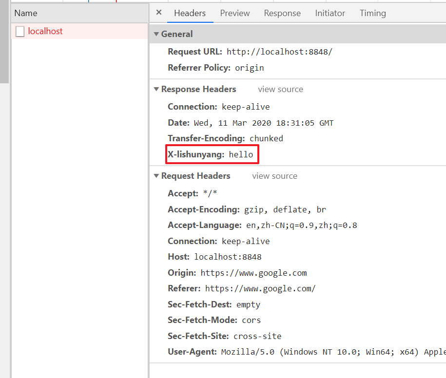
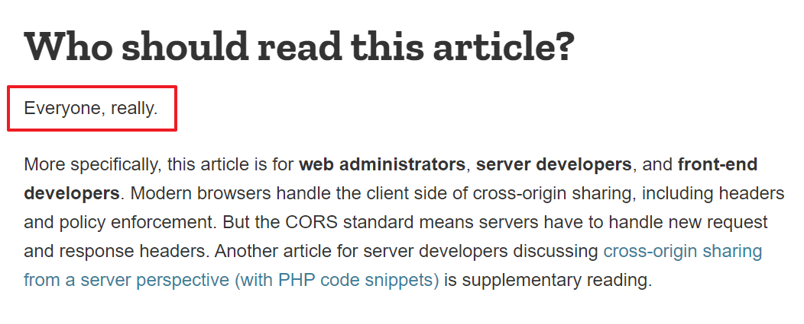
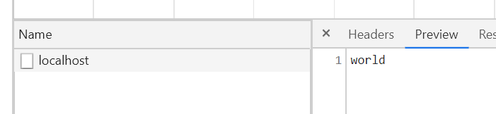
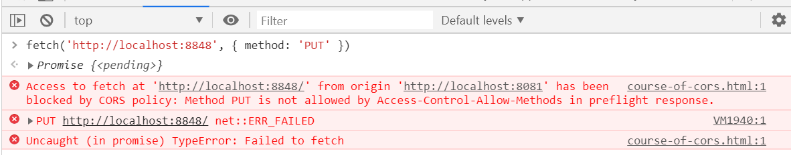
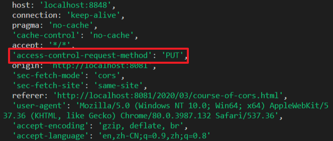
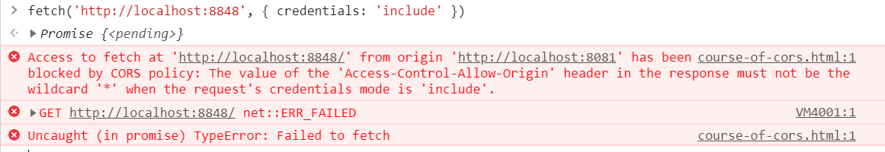
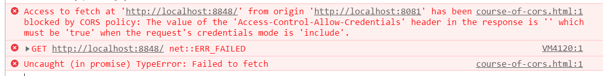
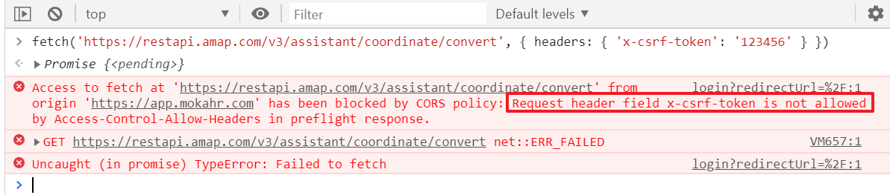

今天晚上跟团队里的小伙伴一起调查了一个非常诡异的问题，整个过程把CORS又重新梳理了一遍，正所谓“纸上得来终觉浅，绝知此事要躬行”，通过这一次调查，让我对CORS的理解一下子深刻了许多。

问题是这样的：有个功能需要在浏览器环境调用高德地图WebAPI（一个简单的GET请求），结果测试的时候发现，有的页面请求正常，有的页面请求竟然会报跨域错误。

这是什么道理 😅

# 跨域是什么

让我们先来回忆一下跨域是什么。

所谓`跨域`，自然是针对`同域`来讲的，而`同域`这个概念出自浏览器的[`同源策略`](https://www.w3.org/Security/wiki/Same_Origin_Policy)。注意了，只有浏览器环境才有同源策略，也就是只有浏览器环境才有跨域的情况，非浏览器环境发HTTP请求是不会遇到跨域的问题的。因此有些小伙伴尝试用curl或者postman等工具验证跨域问题多半是不会得到正确结果的，因为这种情况下就不存在跨域问题。

那么浏览器又是如何处理跨域请求的呢？假设现在我们在浏览器环境中尝试发送一个跨域请求，这个请求是会被浏览器截胡呢还是真的发出去呢？

这里不妨让做个实验，本地起一个http server：

```js
const http = require('http');

http.createServer((req, res) => {
  res.setHeader('X-lishunyang', 'hello');
  res.write('world');
  res.end();
}).listen(8848);
```

现在就在这个博客里，打开控制台，输入

```js
fetch('http://localhost:8848/', { method: 'GET' });
```

然后观察chrome的network面板，结果发现，请求不仅发出了而且也返回了，因为我们看到response里包含了我们设置的自定义header（红框内容），只不过response的body是空的（虽然server端的确返回了东西）。



所以即便是个跨域请求，chrome也会正常发出和收到响应，只不过chrome将response的body部分隐藏了起来，并且在代码中抛出异常，告诉你请求有跨域问题，请求失败了。

> 这种实际上发出了但是被浏览器隐藏了响应体的请求，有一个名字叫“透明请求”（opaque request）。

同样的动作，如果在firefox下，请求是发不出去的，而在edge下又是可以的。不同浏览器的行为不一致。

查询W3C的同源策略规范可以知道，同源策略其实不限制请求的发出，只是限制了获取响应数据。但我认为firefox的处理逻辑其实更好，因为更加安全。比如某个请求不需要响应体只要响应头就行了，甚至连响应都不行要，只要把请求发出去就行了，这种情况下，chrome和edge的同源策略会失去作用。

## 为什么跨域xhr是被禁止的

为什么跨域请求是被禁止的呢？我们知道在浏览器环境中a、img、script、link、iframe等标签发出的GET请求是不受同源策略影响的，甚至form表单发出的POST请求都是不受同源策略影响的，既然有这么多请求都是可以跨域的，为什么浏览器偏偏要限制跨域的xhr呢？

关于这个问题，我个人的理解是：xhr是由js发出而不是html标签发出，这意味着xhr的行为更加灵活（GET、PUT、POST、DELETE），携带的数据更加不可控（自定义header和body），更容易构造出恶意请求。比如CSRF攻击，因为有了同源策略的限制，只能是通过html标签的形式触发（否则也就不叫CSRF了，直接叫RF就行了）。

# CORS

跨域与翻墙不同，跨域其实是一种常见的业务需要，尤其是那些第三方开放web API（比如前面提到的高德地图），只要允许在浏览器环境下调用，那几乎全都是跨域请求。正因为如此，才会有CORS（Cross-Origin Resource Sharing），它是W3C所规定的合法跨域方式（[规范见这里](https://www.w3.org/TR/cors/)），所有浏览器和http server都会遵守，它到底有多重要？看看Mozilla MDN的说法：



记住下面三个概念对于理解CORS很有帮助：

1. 首先，是不是跨域，浏览器说了算。
2. 其次，能不能跨域，服务器说了算。
3. 最终，要不要跨域，浏览器说了算。

# 简单请求跨域

回到最开始的例子，如果想在当前博客域名下向localhost的http服务器正常发送GET xhr请求，怎么做呢？

显然是跨域了，允不允许跨域是由服务器说了算的。

这时我们只需要在服务器返回的响应头部加入一个header：`access-controll-allow-origin: *`即可。这个header的含义已经非常明确了，就是允许请求从任何域名发起。我们稍微修改一下之前的代码：

```js
const http = require('http');

http.createServer((req, res) => {
  res.setHeader('X-lishunyang', 'hello');
  res.setHeader('access-control-allow-origin', '*'); // 注意这里
  res.write('world');
  res.end();
}).listen(8848);
```

现在再从浏览器中发起请求`fetch('http://localhost:8848')`，可以看到请求成功返回，跨域解决了。



这里的`access-control-allow-origin`头部，就是允许来自哪些域名的请求跨域。除了*之外，还可以配置具体的源（origin），比如`http://localhost:8848`。

注意这里allow的是origin，根据同源策略的规定，origin是由`schema`，`domain`，`port`三部分组成。

比如我们可以将access-control-allow-origin改为`https://blog.lishunyang.com`。

哪些请求算是简单请求呢？简单来说就是：

1. 只能是简单方法，比如GET、HEAD、POST
2. 只能设置简单头部，比如Accept、Accept-Language、Cotnent-Language或者值是application/x-www-form-urlencoded、multipart/form-data、text/plain之一的Content-Type。

注意，第2点需要额外再说明一下，并不是说简单请求只能带有上述几个header，这里的意思是说，如果你想手动设置请求的header，那只能设置这几种。浏览器自动帮你设置的header不受这个限制。举个例子，浏览器自动帮你给request上添加了cookie这个header，仍然算是简单请求。

除了简单请求之外都算是复杂请求。请记住上面这两个条件，复杂请求的处理其实也就是围绕着这两个东西的处理。

# 复杂请求跨域

如果是复杂请求，情况自然也会复杂一点。此时浏览器会非常谨慎，服务器需要返回更多的信息告诉浏览器到底能不能跨域。

首先，浏览器会在正式请求发起之前先发送一个OPTIONS请求，用来先向服务器打探一下情况。这个OPTIONS请求被叫做预检请求（preflight request）。这个预检请求是浏览器自动发送的，无需开发者手动控制。

比如我们向local发起一个PUT请求：`fetch('http://localhost:8848', { method: 'PUT' })`，此时将看到浏览器报预检请求错误：



由于浏览器不会显示失败的OPTIONS请求的信息，所以我们可以在后端log出请求，可以看到这是个OPTIONS请求，且有一个`access-control-request-method: PUT`的header以及一个`origin: xxxx`的header。



对了，上面的例子展示的是我们发出一个非简单方法的请求，如果我们发出的请求还带有非简单头部，那么OPTIONS请求也会响应带上`access-control-request-header`。

服务器端收到预检请求后，可以根据origin、request-method、request-header三个信息决定是否允许浏览器跨域，如果允许则服务器必须在OPTIONS的响应头部包含`access-control-allow-methods`或者`access-control-allow-headers`。比如我们可以把server端代码改一下：

```js
const http = require('http');

http.createServer((req, res) => {
  res.setHeader('X-lishunyang', 'hello');
  res.setHeader('access-control-allow-origin', '*');
  res.setHeader('access-control-allow-methods', 'PUT'); // 注意这里
  res.write('world');
  res.end();
}).listen(8848);
```

如果每次复杂请求都要发预检请求，那岂不是太傻了，所以服务端还可以在OPTIONS的header里增加`access-control-max-age`，告诉浏览器在一定缓存时间内就不用再发预检请求了。

此外，服务器还可以通过`access-control-expose-headers`来告诉浏览器，允许哪些header被展示，哪些header不被展示。不过经过本人测试，这个似乎没用。

# 带有credential的请求

credential指的是用户认证相关的信息，比如cookie、auth header、tls证书等等。为了保证安全，浏览器默认是不会在跨域请求中包含credential信息的。因此你会发现前面的例子里，所有跨域请求的header里都没有cookie。

其实浏览器是支持开发者手动控制是否发送credentials的，比如`fetch('http://localhost:8848', { credendials: 'include' })`，让我们测试看看，等一下，怎么报错了？



观察错误信息，原来如果请求里带有了credentials信息，`access-control-allow-origin`就不能为*，仍然是出于安全考虑！所以让我们再次修改后端代码：

```js
const http = require('http');

http.createServer((req, res) => {
  res.setHeader('X-lishunyang', 'hello');
  res.setHeader('access-control-allow-origin', 'https://blog.lishunyang.com');  // 注意这里
  res.setHeader('access-control-allow-methods', 'PUT');
  res.write('world');
  res.end();
}).listen(8848);
```

再次尝试，等等，怎么还有报错？



仔细观察错误信息，原来如果请求中带有credentials信息，server端必须返回`access-control-allow-credentials: true`才行。让我们再次修改后端代码：

```js
const http = require('http');

http.createServer((req, res) => {
  res.setHeader('X-lishunyang', 'hello');
  res.setHeader('access-control-allow-origin', 'https://blog.lishunyang.com');
  res.setHeader('access-control-allow-methods', 'PUT');
  res.setHeader('access-control-allow-credentials', 'true'); // 注意这里
  res.write('world');
  res.end();
}).listen(8848);
```

现在测试一下，总算是可以了，总结一下就是，如果请求中带有credentials，那么CORS有一个特殊的规则：

1. 响应头部的access-control-allow-origin不能是*
2. 响应头部需要额外包含`access-control-allow-credentials: true`


# CORS与CSP的区别

你也许听说过“内容安全策略”，即：Content Security Policy，简称CSP。例如某些站点的响应里可能包含这样的头部：

```
content-security-policy: default-src 'self'
```

表示当前页面中的资源必须来自相同的origin。有关CSP的概念，这里不做详细展开，如果你不太清楚，可以看[这个MDN文档](https://developer.mozilla.org/en-US/docs/Web/HTTP/CSP)。

虽然CSP通常也有一定的阻止跨域的功能，但其实CSP侧重的是控制资源的来源，换句话说也就是**控制GET请求的来源**，这主要是为了阻止引入未知来源的资源，防止XSS攻击。而且**CSP会对页面中的所有GET请求生效**，不论是XHR还是a、img、script等html标签。这两点是CSP与CORS最大的区别。

另外，CSP和CORS二者是独立的，比如一个跨域的GET请求，既要通过CSP的检查，也要通过CORS的检查。

# 回到最初的问题

回到当初那个调用高德地图Web API请求跨域的问题，一个简单的GET调用报跨域的蜜汁问题。

因为这是个第三方开放API，access-allow-origin肯定是*，此时却出现了跨域，会不会是GET请求带上了credential信息呢（比如cookie）？

结果抓包发现请求并没有带cookie，这就非常迷惑了。后来团队中的另一个同学注意到抓包捕获到的请求是一个OPTIONS请求而不是GET请求。这说明这个GET请求被判定为是非简单请求，那么一定是人工设置了非简单头部。仔细检查发现，请求里确实多了一个`x-csrf-token`的头部，经过调查得知是原来是因为前两天团队的其他同学修复CSRF安全漏洞给xhr请求都添加了这个头部，而查看代码发现，这个注入逻辑只在某些页面生效，于是一切都解释的通了。

最后的解决办法就是，将高德地图API加入了白名单，此时不添加x-csrf-token，果然问题解决了。

最后，我在浏览器中尝试复现这个问题的时候发现，其实fetch给出的提示已经很清楚了：



然而碰巧我们的代码里的请求是使用了一个叫superagent的库发出的，它会把这个错误拦截掉，然后统一抛出一个非常general的CORS错误，害的我们调查半天。。

# 参考资料

- [W3C: CORS](https://developer.mozilla.org/en-US/docs/Web/HTTP/CORS)
