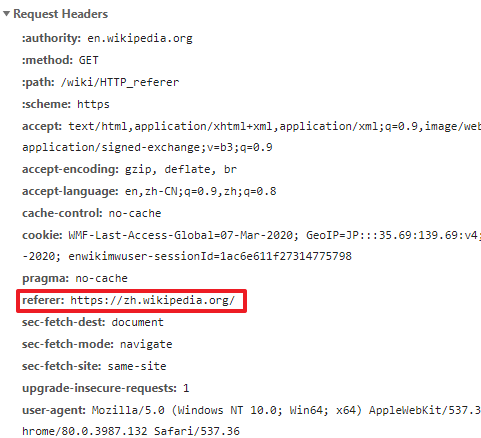

对于网站的运营人员来说，流量来源分析是一个非常重要的工作。你一定很关心用户到底是从什么地方来的，是通过搜索引擎主动搜索进入的？还是通过点击微信朋友圈转发的文章链接进入的？还是通过某个广告推广链接进入的？

# referrer

说到来源分析，那么自然要提到HTTP的一个header：`referrer`。

> referrer其实是一个错误的拼写，正确单词是referer

根据规范，referrer记录的是当前请求是从哪个页面发起的，比如当你在某个页面中点击一个a标签时，可以看到发出的HTTP请求头部就带有当前页面的url信息。



referrer是由user agent（也就是浏览器）在发起HTTP请求时自动加上的，而且几乎所有浏览器发起的HTTP请求头里都带有这个header，甚至是在浏览器的隐私模式下也是有referrer的。

当然如果你是直接在地址栏输入一个url打开一个页面，那么这个url的GET请求是没有referrer的，不过还有一些其他情况会导致没有referrer，后面会详细讲到。

现在有一个小问题考考你，看你对referrer的理解，假设在`http://example.com/`下有如下a链接：

```html
<a href="http://example.com/1">click</a>
```

访问这个链接server端会返回一个301跳转，Location为`http://example.com/2`，那么最终向`http://example.com/2`发出请求的referrer会是什么呢？是`http://example.com/`还是`http://example.com/1`呢？

分析整个流程可知，即使经过了301跳转，最后的请求仍然是在`http://example.com/`发出的，所以referrer自然是`http://example.com`。

```
http://example.com/               server
         |             /1            |
         |-------------------------->|
         |                           |
         |         301 to /2         |
         |<--------------------------|
         |                           |
         |             /2            |
         |-------------------------->|
```

你可以通过javascript的`document.referrer`在前端获取到当前页面的referrer信息。

# referrer的用途

referrer被发明出来的目的就是做流量来源分析，实际上它可以做很多事情。

1. 流量分析

这个就不多说了，本职工作

2. 图片防盗链、音视频防下载

后端服务器检查图片、音视频资源的HTTP请求的referrer，如果与站点url不同域，说明请求来自其他站点，此时返回一个错误信息。

3. 防止CSRF攻击

CSRF攻击是诱导用户去点击恶意构造的链接，借用户的手进行一些操作，这种链接通常来自一些钓鱼页面，发出的请求也自然带有钓鱼页面的referrer，服务端可以检测referrer有效发现和组织非法的请求。

4. 实现“后退”功能

`history.back()`的一个局限性是历史记录仅对当前页面session有效，如果页面跳转到一个新窗口，那么在新窗口里是无法用`history.back()`回去的，那么此时就可以用referrer实现后退功能了。

# 伪造referrer

因为referrer是客户端决定的，所以从服务器的角度看，referrer的真实性是不可靠的。比如你可以用curl命令添加referrer：

```sh
# -e 代表设置referer，-v打印header
curl https://www.baidu.com -e https://blog.lisunyang.com -v
```

可以看到referrer已经被设置成`https://blog.lishunyang.com`了:

```
> GET / HTTP/1.1
> Host: www.baidu.com
> User-Agent: curl/7.58.0
> Accept: */*
> Referer: https://blog.lisunyang.com
```

所以对于后端爬虫来说，referrer的限制通通都是失效的。

看到这里你也许会思考：在前端构造ajax请求的时候也指定referrer，岂不是可以为所欲为了？很可惜，浏览器早就料到了有人会这么干，所以所有请求在发出的时候，浏览器会按照正常规则覆盖referrer头部。所以这种方式是不可行的。

# Referrer-Policy

referrer主要的安全风险是信息泄露，当url包含有一些敏感信息时，这些敏感信息就可能会随着referrer被泄露到外部。

比如我们在重置密码的时候，通常是通过[bearer token](https://www.jianshu.com/p/8f7009456abc)进行身份验证的，此时token是放在url中的：

```
https://example.com/reset_password?access_token=65c36cfa-c1a9-44dd-bbe4-797571a1a341
```

当我们打开这个页面时，后续所有请求的referrer都会带上这个url。万一这个token不是一次性的而是在一定时间内有效，那这个就很可能造成安全风险。

于是W3C引入了Referrer-Policy的规范，用来指导客户端如何发送referrer。可能的值有：

1. no-referrer
2. no-referrer-when-downgrade（默认值，当HTTPS跳转到HTTP时不带referrer）
3. same-origin
4. origin
5. strict-origin
6. origin-when-cross-origin
7. strict-origin-when-cross-origin
8. unsafe-url
9. empty

具体的含义和细节这里就不罗嗦了，网上的资料到处都是。

> 说句题外话，你有没有注意到这个规范是W3C组织确定的？W3C和IETF（RFC）的区别在[这里](https://softwareengineering.stackexchange.com/questions/109517/how-is-ietf-different-from-w3c)

怎么使用呢？有以下几种使用方式：

1. 作为HTTP头部引入
   例如：`Referrer-Policy: no-referrer`

2. 由html的meta标签引入
   例如：`<meta name="referrer" content="origin">`

3. 作为html标签的referrerpolicy属性引入，可以用在a、area、img、iframe、link标签
   例如：`<a href="http://example.com" referrerpolicy="origin">`

4. 从context中继承
   例如：iframe的Referrer-Policy继承自浏览器context或blog URL

再具体的细节就不多讲了。

# referrer就够了吗？

现在再说回流量来源分析。有了referrer，我们就可以做来源分析了，但referrer还是有一些小缺点。比如：

1. 首次打开链接没有referrer，这种场景的来源信息无法通过referrer获取，比如打开邮件中的链接。
2. referrer只能统计从网站外部“进入”网站的行为，而网站内部的跳转行为是无法通过referrer进行统计的。比如从A渠道进来的用户会在网站内多次点击，B渠道来的用户进入网站后立刻就走了，这个信息无法用referrer分辨。
3. referrer会受Referrer-Policy的影响，容易丢失。

怎么办呢？于是就有了UTM参数。

# UTM参数

有时候你会看到一些url的query部分带有utm_开头的部分，例如：

```
https://www.example.com/page?utm_source=facebook.com
```

url里面的utm_source、utm_campaign等utm_开头的部分，就叫做UTM参数（UTM Parameters），首先申明，UTM参数不是必须的。

UTM的缩写是Urchin Tracking Module，这个名字来源自一个叫Urchin的公司，他们最早开始使用这种技术进行来源分析，后来Urchin公司被Google收购，但UTM这个名字渐渐普及并被沿用了下来。主流的流量分析工具服务都可以识别UTM参数，比如Google Ananysis、GrowingIO等等。

比较常用的有以下几种

1. utm_source：表示流量来源，比如是搜索引擎、渠道名或者什么来源
2. utm_medium：表示这个链接的媒介，比如是banner图，还是文本链接
3. utm_campaign：广告名称，比如这次活动的名字是什么
4. utm_term：关键字

如你所见，utm参数就是作为url的query存在，而且utm参数是人为设定的。比如我在百度上购买了广告，投放的链接地址是`https://blog.lishunyang.com/?utm_source=baidu`，那么当用户通过点击这个链接进入，GoogleAnalysis就可以帮我统计出这是来自于百度搜索引擎的流量。

让我们看看utm参数如何解决之前所说的referrer的问题：

1. 首次打开链接不受影响，**因为UTM参数是在url上的**
2. 站点内跳转也可以保留来源信息，**因为UTM参数是在url上的**
3. 不受Referrer-Policy影响，**因为UTM参数是在url上的**

太棒了，简直完美，但别高兴太早，UTM参数最大的问题也同样是因为**因为UTM参数是在url上的**，准确地说是存在于url的query部分，而url的query是很容易丢失的。比如下面两个链接，点击第一个链接UTM就丢失了，只能按第二种写法写。

```html
<a href="/info">info</a>
<a href="/info?utm_source=baidu">info</a>
```

这对web开发来讲是一个非常严峻的考验，你必须小心翼翼地构造每一个可能的链接，以确保query能够始终保持。这不是一个很稳妥的做法。所以有些人也会把UTM参数放在cookie中或者LocalStorage以便持久保存，但这又引入了cookie和LocalStorage何时失效的问题。比如当我跳转到一个不带UTM参数的链接时，我到底是应该使用cookie里的UTM信息呢？还是应该认为cookie里的UTM已经失效了，本次链接确实没有UTM参数？

# UTM参数的维护

碰巧前一段时间在帮市场部开发页面的时候就遇到了这个问题（这也正是这篇博客的由来），市场部的同事总是抱怨新开发的官网活动页经常性会丢失`utm_source`，因为开发人员在写页面的时候忘记处理这个事情，新写的跳转地址很容易就把query搞丢了。

怎么办呢？

这里给出我的解决办法，在页面加载时执行一小段js代码，方法非常简单，伪代码如下：

```
function utm_restore() {
  if (页面url没有UTM参数 && referrer有UTM参数) {
    提取referrer的UTM参数并加入页面的url中
  }
}
```

相当于是referrer和query双保险，确保UTM参数在网站内的跳转不会丢失。

# 参考资料

- [Wikipedia: HTTP Referrer](https://en.wikipedia.org/wiki/HTTP_referer)
- [Portswigger: cross-domain-referer-leakage](https://portswigger.net/kb/issues/00500400_cross-domain-referer-leakage)
- [W3C: referrer-policy](https://w3c.github.io/webappsec-referrer-policy/)
- [Wikipedia: UTM paremeters](https://en.wikipedia.org/wiki/UTM_parameters)
