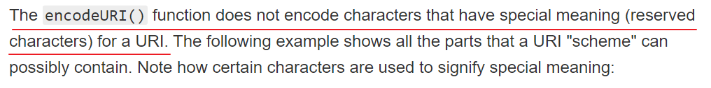
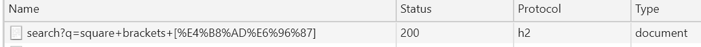
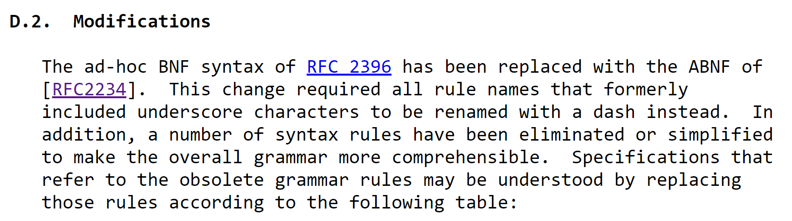

最近遇到一个跟URL编码有关的bug，简单来说是有这样一段代码：

```js
window.location.href = 'https://test.example.com?ids[]=1&ids[]=2';
```

本意是想将浏览器跳转到`https://test.example.com?ids[]=1&ids[]=2`这个地址，结果nginx报非法的URL错误。

怎么回事呢？问题出在了URL的`[]`上。

根据RFC3986对URI语法的[定义](https://tools.ietf.org/html/rfc3986#section-3)，URI的表现形式是这样的：

```
foo://example.com:8042/over/there?name=ferret#nose
\_/   \______________/\_________/ \_________/ \__/
 |           |            |            |        |
scheme   authority       path        query   fragment
```

上面的`scheme`，`authority`，`path`，`query`，`fragment`叫做**component**（也就是encodeURIComponent里面那个component）。规范还说component之间必须适用规定的符号相连。比如scheme和authority之间必须是通过`://`连接，path和query之间必须是通过`?`连接。这些用于分隔component的符号，被称作component delimiter（组件分隔符），规范里给出的名字是generic delimiter（通用分隔符），简写为`gen-delims`。此外还有一个叫`sub-delims`的概念，这个说的是在component内部的分隔符，不过这个不是重点。

为了避免分隔符与URI中的其他数据部分混淆，这些分隔符被定义为了保留字符（reserved）。“保留”是什么意思呢？规范是这样规定的：

> If data for a URI component would conflict with a reserved
   character's purpose as a delimiter, then the conflicting data must be
   percent-encoded before the URI is formed.

这句话其实很有深意的，需要细品。一会儿我们会提到。

保留字符有哪些呢？根据最新的URI语法规范[RFC-3986](https://tools.ietf.org/html/rfc3986#section-2.2)

- gen-delims：`:`，`/`，`?`，`#`，`[`，`]`，`@`
- sub-delims：`!`，`$`，`&`，`'`，`(`，`)`，`*`，`+`，`,`，`;`，`=`

我们看到了`[]`是属于保留字符的，而且还是保留字符中比较“高级”的gen-delims

javascript内置一个`encodeURI`这个函数，作用是将非URL字符集内的字符进行百分号编码，但它不会对保留字符编码。



我们来做个小试验：

```js
encodeURI(`?:/[]#@!$&'()*+,;=`)
// 输出 ?:/%5B%5D#@!$&'()*+,;=
```

奇怪，为什么`[`和`]`被百分号编码了呢？难道`[]`不是合法的URL字符集吗？显然`[]`是合法的URL字符，比如我们经常见到带有方括号的url，例如你可以在浏览器的地址栏里输入`https://stackoverflow.com/search?q=square+brackets+[中文]`，对应页面可以正常加载，并且从开发者工具上可以看到，浏览器发出GET请求时对里面的“中文”编码了，而`[]`确实是没有编码的：



说明`[]`不需要编码也能用，至少是合法的URL字符集。其实这段推理有点废话，因为既然都是保留字符了，怎么可能不在URL的字符集里面😑

但是`encodeURI`测试，方括号确实是会被转义的:

```js
encodeURI('https://stackoverflow.com/search?q=square+brackets+[中文]')
// 输出 https://stackoverflow.com/search?q=square+brackets+%5B%E4%B8%AD%E6%96%87%5D
```

其实还有一个问题一直困扰着我，既然`[]`是保留字符，还是gen-delims，但是怎么印象中没见过URL中有拿`[]`做特殊分隔符的例子？

查询规范才知道，原来`[]`只在表示ipv6地址时才作为gen-delims，即：

> IP-literal    = "[" ( IPv6address / IPvFuture  ) "]"

比如下面这些典型的ipv6的URL：

```
http://[1080:0:0:0:8:800:200C:417A]/index.html
http://[1080::8:800:200C:417A]/foo
http://[2010:836B:4179::836B:4179]
```

怪不得平时见不到，原来只在ipv6的地址时才出现啊。

因为v6地址使用`:`分隔地址段，而`:`已经是gen-delims了，总不能为了写个v6地址把`:`都换成`%3A`吧？这样也太傻了，不仅可读性下降而且编辑操作起来也麻烦，所以，干脆在外面包裹一个`[]`吧！为了以示区分，也把`[]`设计为保留字符吧！🤦

后来在仔细阅读MDN有关encodeURI的文档时，偶然间发现这里提到的URI的规范是RFC-2396，而我之前参考的规范是RFC-3986，从名字上就可以看出，RFC-3986是更新的规范。仔细观察发现RFC-2396发布时间是1998年，RFC-3986的发布时间是2005年，都已经是“古董”级别了。。

于是就翻了翻RFC-2396，果然发现在这一版规范里，`[]`是没有被设计成保留字符，而是被分类在了“危险字符”（unwise），规范里给出的理由是：这类字符可能被网关或其他网络代理无意间修改掉，所以这类字符没有算在合法的URL字符集里，其他的unwise字符还有`{}`，`|`，`\`，`^`等。也许是因为这个原因，encodeURI才会将`[]`编码了，因为在他看来`[]`不是合法的URL字符集。

为了验证这个猜想，又有了如下试验：

```js
encodeURI('{}[]|^')
// 输出 %7B%7D%5B%5D%7C%5E
```

果然，这些全都被转码了。

其实在RFC-3986的附录部分有一段关于规范升级的备注：



大意就是，原先的规范写得不严谨，问题和争议很多，现在这部分重新优化了一下云云。

所以，浏览器的行为是对的，因为按照最新的规范，`[]`已经是保留字符，是合法的URL字符集了，所以不需要转义。而encodeURI还是沿用了老的规范，认为`[]`不是合法的URL字符集，所以就给转义了。

到这里，文章最开始的问题答案算是出来了，浏览器沿用最新的规范认为`[]`是合法的URL字符所以没有对`[]`转码，而后端的nginx沿用了旧规范认为`[]`不是合法的字符，所以报了非法URL错误。最后问题的解决办法也是通过修改nginx配置解决的。所以，最开头的代码，不完全算错，只能说是兼容性不是很好。

对了，你可能会在想，上面的代码似乎有问题吧？比如这样写：

```js
window.location.href = 'http://test.exmaple.com/中文'
```

按理说非URL字符需要百分号编码，这样写出来的URL难道不是错的吗。其实多虑了，这样写跟你在浏览器的地址栏里直接输入中文URL是一样的效果，浏览器在发出请求前会自动帮你做一次“encode”。但是注意，这里的encode可不是直接调用了javascript自带的encodeURI（如果你没看懂这句话，我算是白解释了）。

那么，如果要保证兼容性，还是得把URL来个encodeURI靠谱（至少解决了`[]`的兼容性问题。但这里要注意了，encodeURI的内容如果包含了百分号，那么百分号会被再次encode，得到的结果可能并不是想要的。总之就是，encodeURL这个事情，有点麻烦。。
