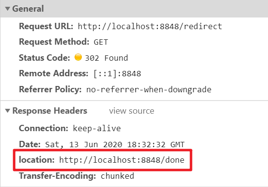
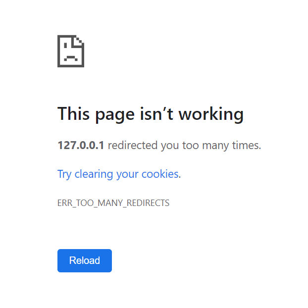
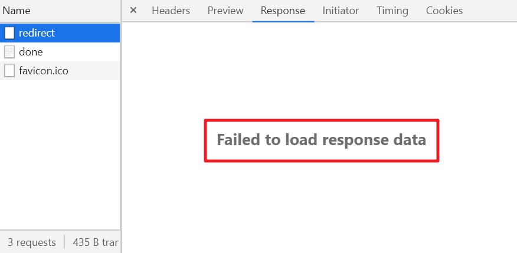
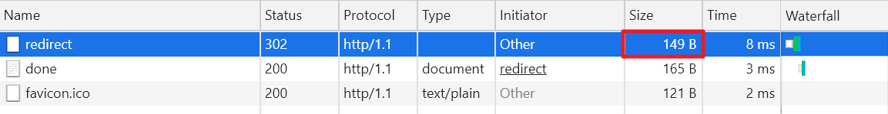
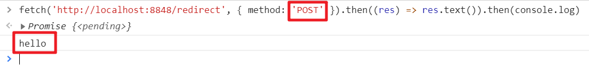
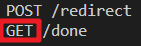
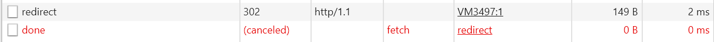
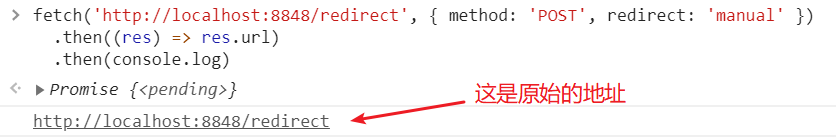

> 众所周知，重定向很简单🤥

3开头的HTTP状态码都比较有意思，比如与缓存有关的304，比如与重定向有关的301、302。正好最近做项目遇到了一些重定向有关的内容，稍微整理一下。

## 重定向的基本流程

重定向的流程是这样的（以302临时重定向为例，因为最常用，下同）：

```
client               server
  |      request       |
  |------------------->|
  |        302         |
  |<-------------------|
  |     new request    |
  |------------------->|
  |      response      |
  |<-------------------|
```

可见实际上是发了2次请求，第一次请求后，服务端返回302状态码，前端浏览器再朝着跳转目的地址发起一个新的请求。跳转的目的地址是在第一次请求响应的location头部指定的。



location没有限制一定得是同域的URL，因此跳转到其他域下面是可以的。

需要注意2点：

1. 要想能够成功重定向，状态码和location头部二者缺一不可。
2. 重定向这个操作是后端控制的，浏览器会自动识别跳转场景然后重新向跳转地址发起新请求。整个过程对前端是透明的，也就是在前端眼中就像是只有一次请求一样，仿佛前面的请求是空气。

## 可以多次重定向

重定向可以有多次，比如连续的302，此时流程大致就是这样：

```
client               server
  |      request       |
  |------------------->|
  |        302         |
  |<-------------------|
  |     new request    |
  |------------------->|
  |        302         |
  |<-------------------|
           ...
  |     new request    |
  |------------------->|
  |        302         |
  |<-------------------|
  |     new request    |
  |------------------->|
  |      response      |
  |<-------------------|
```

这是个什么场景呢？就是location对应的URL又返回了302和新的location，如此重复直到不再跳转位置。

当然，为了防止出现无限重定向的情况，重定向的次数是有上限的。经过测试Chrome浏览器的重定向次数是20，也就是一次请求如果超过20次重定向，就会报`ERR_TOO_MANY_REDIRECT`错误：



另外在实际测试的过程中偶然发现即使页面已经报TOO_MANY_REDIRECT了，chrome还是会“不死心”地过一段时间再跳转几次😂，如果新的跳转最终停下来了，页面就不再报TOO_MANY_REDIRECT，所以理论上这个重试的上限是其实并不是那么严格（这里只测试了Chrome）。

## 浏览器会忽略掉重定向请求的body

浏览器如果发现当前请求的响应要重定向，则会直接忽略掉response的body，无法在开发者工具中的network面板上看到body，这点跟浏览器对跨域请求的处理很像。



这里有一个比较迷惑的地方，如果你看network面板，会发现response的size很小，好像只有header一样：



最开始在测试的时候我也在想“会不会是后端没有返回body？”，然后用curl测试了一下，是可以拿到body的。所以说明这是浏览器给忽略了（或者说是丢弃了）

举一个实际中的例子：比如后端在GET一个页面重定向的时候除了返回302之外，还在body里返回了一个页面（希望做loading效果），实际上浏览器在最终的页面请求返回之前始终是白屏，那个中间页面是不会生效的，因为被浏览器丢弃了。不知道有什么办法能拿到body，反正我是没有找到。

仔细想一想，这样还是蛮合理的，你都重定向了，自然也压根不用关心返回了啥，只要告诉我新的目标地址就行了，少啰嗦。本身重定向就是对前端透明的，前端看来就像是一次请求一样。

似乎只要是3开头的HTTP响应状态码，浏览器都会忽略body？🤨

既然如此，在实现后端的时候，看到3开头的请求，也别返回什么body了，只返回header就行了。

## 不光普通的页面GET是可以重定向的，AJAX同样可以重定向

比如我们做个试验，启动一个node server：

```js
const http = require('http');
http.createServer((req, res) => {
  console.log(req.method, req.url);

  if (req.url === '/redirect') {
    res.writeHead(302, {
      location: 'http://localhost:8848/done',
    });
  } else {
    res.writeHead(200);
    res.write('hello');
  }

  res.end();
}).listen(8848);
```

在浏览器中发起一个AJAX请求：



可以看到返回的内容是`hello`。

如果你理解了上文提到的重定向的流程，那你应该就自然能够理解下面的几个问题了：

1. 如果AJAX请求在跳转期间也有数据返回（response body），最终的请求以哪个数据为准？
2. 如果AJAX请求是上传一个文件，那这个文件会被上传几次？
3. 既然location可以是不同域的，那么可以通过302实现跨域AJAX吗？
4. 对于GET页面的请求，重定向后第二次发起的请求里的refer是最开始的页面的URL还是第一次请求的URL？

答案是：

1. 跳转期间的body都会被浏览器忽略掉，只有最后一次的body是有效的。
2. 发了几次请求就会上传几次文件，因为浏览器会在跳转时发起同样的新请求。所以如果有这样的场景，千万别跳转，太蛋疼了😑。
3. 不能，因为跳转的本质上就是多发了一次请求，该有的跨域限制一样还是会有，如果跳转过程出现了跨域问题，那后面的请求也就不会继续了。
4. 是最开始的页面的URL，因为重定向相当于是重新发了一次请求，请求所属页面的URL并没有变化。

上面那个node的例子，如果你观察server端的log，你会发现:



哟嚯，原本是POST请求，怎么跳转后变成GET了？这可不是bug，这是302的正常逻辑。跳转相关的状态码一共有301、302、307、308，其中301和302是一组，他们只会跳转GET请求，而307和308则分别是在301和302的基础上保留了跳转的方法。所以如果你把上面的node例子改成307，就会发现跳转后的请求也是POST了。

不过好在通常我们用GET就够了，AJAX的重定向很少见。

## 临时跳转和永久跳转有啥区别

我们知道，301是永久跳转，302是临时跳转。那他们有什么区别呢？一种说法是缓存的区别。比如浏览器在看到301永久跳转后，会在浏览器中记住这个跳转逻辑，下次再打跳转前的地址就会直接把URL改成跳转后的地址。但是经过尝试，似乎没有体现出这个逻辑。还一种说法是说搜索引擎爬虫的缓存区别，这个就没有测试了。

那么什么时候该用哪个呢？个人觉得临时跳转和永久跳转对浏览器来说没啥区别，但保不准不同浏览器行为不一致。所以尽量按照字面意思来使用吧。

## Nothing is impossible，前端也是可以介入重定向的

前面说过，重定向是一个纯后端控制的行为，其实这句话不够严谨。在Fetch API中，默认情况下确实是会自动重定向的（透明跳转），但实际上你可以通过控制redirect配置项实现“手动”重定向。比如后端返回302后浏览器不会自动发起重定向的请求，而是就结束了，要不要发起重定向的请求由前端js控制。比如：

```js
fetch(
  'http://localhost:8848/redirect',
  { method: 'POST', redirect: 'manual' } // 注意这里的manual
)
  .then((res) => res.url)
  .then(console.log)
```

API文档上说，在`redirect`是`manual`的时候，浏览器只会发起最开始的请求，之后的请求可以由手动控制。实际情况确实如此，浏览器直接把后面的跳转请求给cancel掉了：



不过API文档上说，`response.url`表示跳转的目标地址，实际上经过测试并不是：



😓难道是浏览器bug了？总之很迷。

## 重定向请求可以用来种cookie

这是一个非常有意思的事情。虽然重定向请求的body会被浏览器忽略掉，但重定向请求响应的头部仍然可以发挥作用。这其中最重要的头部就是set-cookie了（种cookie）。

比如我访问某个页面，后端返回302的同时set-cookie，那么浏览器可以在发起跳转之前在当前页面的域下种上cookie（有种顺手做好事的感觉）。这个效果牛逼的地方在于，如果302跳转到其他域了，也仍然可以种cookie。比如：

1. 用户访问a域名
2. 后端返回302，location是b域名，同时set-cookie: cookieA
3. 浏览器在a域名下种上cookie: cookieA，然后向b域名发起请求
4. 后端返回302，location是a域名，同时set-cookie: cookieB
5. 浏览器在b域名下种上cookie: cookieB，然后向a域名发起请求

如果你觉得这有啥？没觉得有啥厉害的呀？那请站在前端的角度思考一下，这里相当于是实现了这样一种效果：一次请求即可向不同域名种下cookie（毕竟重定向是后端控制的，前端透明，相当于只有一次请求的效果）。如果不用重定向的话，你倒是给我找一个不用重定向的常规方法看看。。你可能会考虑配置CORS发一个跨域请求种cookie，但CORS一旦涉及到cookie这种credentials信息，就会出现各种各样的限制，实际很难发挥效果。现在知道这个方法的厉害之处了吧。

> 其实跨域种cookie还可以用浏览器的beacon API实现，当然也是有一些限制的

## 重定向都用来做啥？

说了那么多，总算说到重点的部分了，重定向到底有啥用？前端也可以直接改`location.href`来跳转，干嘛需要后端重定向呢？

首先，别忘了网络爬虫，很多爬虫是无法执行javascript的，所以前端重定向如果是通过javascript动态实现的，就不会生效。这里也许有人会抬杠：前端也可以在meta标签里实现重定向呀，比如下面这样：

```html
<meta http-equiv="refresh" content="0;URL='http://redirect.example.com/'" />
```

这么做确实不需要js也能前端重定向了，但有一个问题：前端跳转，务必得等前端资源加载完成后才触发跳转，html再小，也是需要一些体积的浏览器解析和执行也要花时间，而且还需要把html页面部署在某个server上，而后端的302跳转，可以只返回header，没有body（因为有body也没用），浏览器不需要解析直接跳转即可，也不需要专门托管某个html资源，无论是配置上还是性能上都真正做到了极简。因此在很多时候，后端302跳转都是比前端跳转更优的选择，毕竟前端透明，多一事不如少一事。

此外由于重定向是可以种cookie的，所以可以借助重定向功能实现跨域种cookie的工作，对于单点登录来说很有帮助。比如观察google的登录请求，就会发现它会先302到youtube种下cookie，然后再302回来到google种下cookie，以实现google和youtube的单点登录。

重定向的最常见应用场景就是OAuth2认证过程了。对资源的授权过程就是通过后端302跳转实现的，对前端透明，因而简化了OAuth2的对接逻辑。如果放在前端跳转，虽然可以但会让OAuth2的对接方每个人都要在前端实现一个跳转逻辑，增加了成本。

最后，后端302重定向也不是没有缺点。至少有一点是很头疼的，那就是hash路由问题。浏览器在发送请求的时候，会干掉url的hash部分，这对于一些使用了hash history的SPA来说就是灾难。即使location里的url完整地包含了hash，浏览器在发起新请求的时候，也不会带上hash。此时，前端重定向/跳转就是更好的选择了。

## 总结

服务端跳转这种场景，虽然看上去很简单，实际上还是有蛮多细节的。而且302跳转可以做的事情也很多，在服务端跳转和前端跳转方面，二者也是各有利弊。理清各个细节，才能更好地设计出技术方案。😎

## 参考资料

- [302 Found](https://developer.mozilla.org/en-US/docs/Web/HTTP/Status/302)
- [Fetch API](https://javascript.info/fetch-api)
- [HTML Meta Redirect](https://www.w3.org/TR/WCAG20-TECHS/H76.html)
