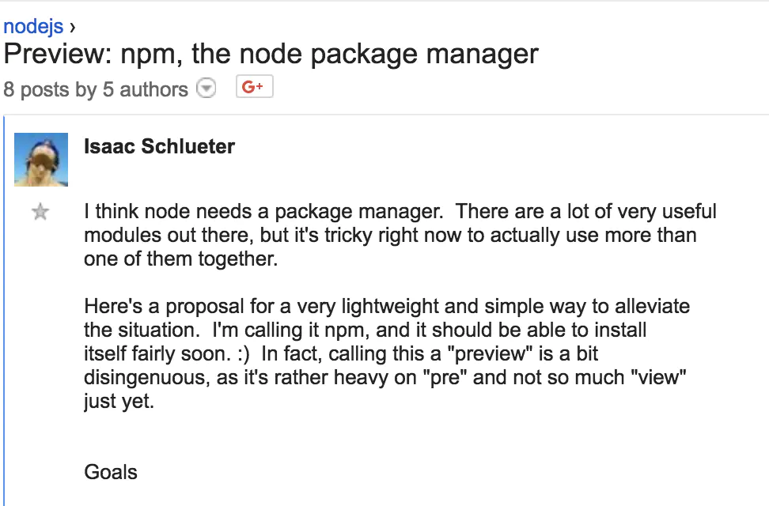
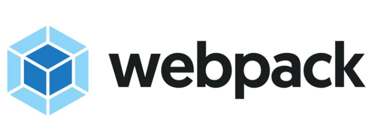
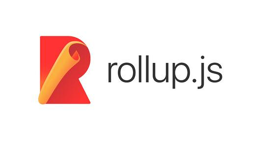
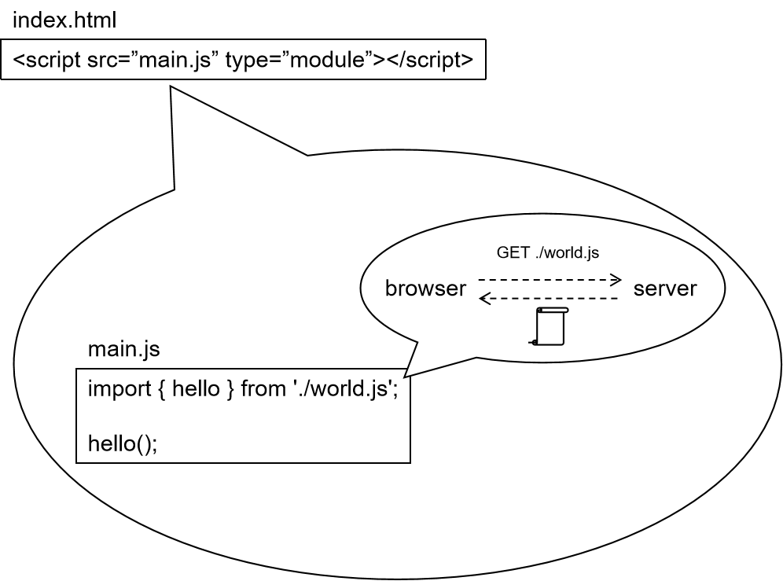
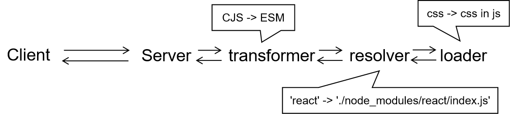
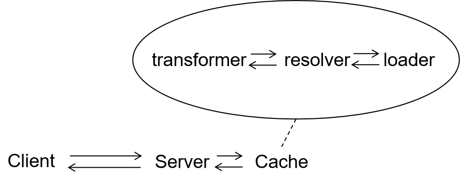

每当我们新启动一个前端项目的时候，无论大小，都需要配置好打包工具，比如最常见的webpack。

不知道你有没有想过，为什么我们需要webpack、rollup、parcel这些打包工具呢？🙃

下面进入考古（暴露年龄）时间

## 曾经我们是这样引入javascript的

```html
<script src="javascripts/jquery.min.js"></script>
<script src="javascripts/moment.min.js"></script>
<script src="javascripts/lodash.min.js"></script>
```

需要什么依赖包，就直接在html中添加一个script标签，简单粗暴。在我初学前端开发的时候，最喜欢干的事情就是网上找各种有趣的动效插件，然后引进html看效果。

这种做法的缺点自然非常明显，最直接的缺点就是所有依赖包都必须自己去官网下载到本地，如果某些包升级了，那么还得再折腾一遍（所以那个时候基本都不怎么升级）。

## 出现了包管理器

针对上面的问题，于是就出现了[Bower](https://bower.io/)，前端包管理器。


> bower的发音是“包儿”，不知道是巧合还是故意的

它的功能简单来说就是把手动下载的方式转移到了用github托管。比如你可以使用这些命令在项目中安装各种第三方库：

```sh
$ bower install jquery
$ bower install lodash
$ bower install moment
```

然后你就可以在项目中引入这些包了：

```html
<script src="bower_component/jquery/dist/jquery.min.js"></script>
<script src="bower_component/moment/dist/moment.min.js"></script>
<script src="bower_component/lodash/dist/lodash.min.js"></script>
```

当然，bower虽然让安装第三方库变得更简单了，有一个问题却仍然没有解决，那就是第三方库之间的依赖关系。比如有两个库a.js和b.js，当b.js依赖了a.js时，就必须保证先引入a.js再引入b.js。这个依赖关系的维护还是需要手动处理，自然也是很麻烦且容易出错。

产生这个问题的原因其实是彼时的javascript还没有标准的模块系统（Module System）概念，既然连模块系统都没有，只能靠加载顺序解决依赖关系了。😰

## Nodejs的出现以及CJS的兴起

2009年，Nodejs正式出现，与之一同被发布的还有node自定义的模块系统CommonJS，node自己的包管理器npm。



随后，Nodejs的蓬勃发展逐渐建立起了CommonJS和npm生态，短短时间内npm已经跃居为第一大包管理器。

既然都是javascript，前端工程师也自然想利用npm的生态，可问题是CommonJS只是Nodejs的模块系统，只能运行再Nodejs环境，浏览器并不支持，比如：

```javascript
// 浏览器会报错: require is not defined
const lodash = require('lodash')
```

## 打包工具（Bundle Tool）第一次出现了！

为了解决上面的问题，一个很直观的想法就是在发布前，分析一遍依赖图，把所有依赖的文件打包到一个文件里，于是出现了第一个打包工具[browserify](http://browserify.org/)


比如我们可以这样使用：

```sh
# entry文件是main.js，output是bundle.js
$ browserify main.js -o bundle.js
```

然后引入打包后的文件即可：

```html
<script src="bundle.js"></script>
```

## 打包工具百花齐放

此后又出现了webpack，第一个提出了非js文件的打包（通过各种loader和plugin实现更加高级的效果）



还有rollup，第一个提出了treeshaking的概念



以及后来的parcel，第一个提出做到0配置打包。


自此，打包工具逐渐成型，前端开发算是正式进入了现代社会。

## 打包工具的意义是什么

我们知道打包工具的作用就是把各种资源文件打包成一个文件，这样做有什么意义呢？有人说是引用起来比较方便，这的确是一个挺棒的理由，但我认为，**打包工具真正的意义在于自己实现了一套模块系统**，相当于是一个大补丁，补齐了浏览器中缺乏的模块系统。

打包工具并不是简单地将各种文件拼接在一起，如果你翻看browserify打包后的文件，你会发现依赖文件都是被包裹在一个一个函数中，browserify实现了require和module两个关键字让这些依赖文件能够正常执行，换言之就是browserify自己实现一套CommonJS。不光是browserify，其他所有打包工具也都是一样的原理。

> 还记得我最开始学习node的时候还思考过为什么后端开发不需要webpack打包一下。。

## 可是...打包太慢了😫

这个缺点，大家应该深有体会了吧，对于稍大一些的项目如果不加优化，冷启动dev server超过1分钟，hmr一次超过10s，build过程超过10分钟，这都太常见了。谁能忍受就为了看个css样式的调整要等个10秒？（经历过大型机开发的上古时代的老程序员也许会表示这已经很快了好吧）

所以才会有各种优化webpack的奇淫技巧出现，比如dll，比如cache，比如filter entry，比如exclude等等等等。

## 2015年，ES6带来了Javascript官方认定的模块系统😎

ECMAScript Module，简称ESM

```js
import React from 'react'
export default function App() {
  ...
}
```

2016年Chrome和Safari正式支持ESM，2017年Firefox正式支持ESM

那么既然现在Javascript有了模块系统，浏览器也支持了...是不是就可以不用打包工具了呢？🤔

## 那天，我做了一个梦

那天，我做了一个梦，梦见前端开发工程师可以想开发后端node应用一样写前端代码，无须使用打包工具，1s启动项目，天然动态懒加载...😍



## 然而，等我醒来...

然而，等我醒来，我发现理想很美好，现实很残酷，ESM在使用的时候主要有以下几个问题：

1. 问题1：无法引用非js文件

我们早已习惯的在js中引入非js文件（例如css）的写法不支持了，不但不支持而且还会导致问题。😕

```js
// 不支持
import styles from './style.css'
import avatar from './avatar.png'
```

因为浏览器对于ESM的支持只有javascript，如果返回的文件内容不是js，浏览器就会报错并停止执行剩下的部分。

2. 问题2：无法使用CJS

比如npm里一些前后端都可以用的CJS包，由于没有打包工具了，这些也都不能使用了🙁

```js
// 不支持
const BenchmarkPlugin = require('./BenchmarkPlugin.js')
```

3. 问题3：无法使用npm依赖

最要命的是，无法使用node_modules下面的包☹️

```js
// 不支持
import React from 'react'
import lodash from 'lodash'
```

如果我们这样写，Nodejs会自动去本地的node_modules下面寻找对应的包，但是浏览器可不知道，所以ESM引入的包的路径只能是`./`或`/`开头。

这个缺点太致命了，直接导致npm生态不能使用了，这不就又回到最初的起点了么。。

## 怎么解决这些问题呢？🤨

1. 解决问题1，非js文件内联入js🙂

比如css文件，我们可以使用css-in-js的做法，具体说就是找出js中的非js引用，然后替换成对应的内联做法


2. 解决问题2，提前把CJS转换成ESM🙂

我们知道，CJS和ESM二者互有不能替代的功能，不过整体上看是可以相互转换的，通常情况下都没有问题（动态require写法在有些极端情况可能有问题）


3. 解决问题3，可以改写node_modules引用路径🙂

把npm的包的引用路径都改写为node_modules的相对路径


当然，某些包的main入口文件不是index.js，这种特殊情况需要通过分析对应package.json。

## 完整架构图😎



实际运行起来发现，每次请求都要现处理，而node_modules里的文件是基本不变的，所以可以引入cache优化



这里我造了一个轮子，实现了上面的内容，感兴趣可以在这里：[unbundled-example](https://github.com/southerncross/unbundled-example)看到。当然时间匆忙，代码也比较简单，所以没有注释也没有处理所有情况。

## Unbundled Yes!

到此，我们看到了，不借助打包工具实现前端开发是可行的，这种方式也被称作“Unbundled”，当然，由于前面提到的种种问题，要想实现0配置的Unbundled还不太现实，比较有名的Unbundle工具有：

1. [snowpack](https://www.snowpack.dev/) 可用于React.js的unbundle工具


2. [vite](https://github.com/vitejs/vite) 针对Vue.js的unbundle工具（从logo也能看出来）


网上已经有很多人测试过，使用unbundle工具后，开发启动速度可以快20倍，原本要1分钟，现在只需要3秒，提升非常巨大，Ubundled Yes！

## Unbundled有什么缺点吗？

自然，马克思哲学告诉我们，事物都是有两面性的，那么Unbundled的问题有哪些呢？

1. 首先，目前工具链还很不成熟，老项目迁移比较困难😮

这主要是因为现在的打包工具的骚操作太多了，支持各种各样奇奇怪怪的写法，要想迁移老项目，需要兼容好以前的各种写法。我曾经想给一个3年的老项目迁移到snowpack中去，结果折腾了大半天一直在踩各种坑，报错信息很少，大多数时候不得不翻看snowpack的源代码定位问题，后来我放弃了。。

2. 其次，ESM有浏览器兼容性问题，通常无法适用于生产环境😦

IE浏览器是不支持ESM的，某些移动端android浏览器内核比较旧也是不支持的，如果业务环境需要覆盖这些浏览器，那肯定是不能用unbundled方案的，开发环境玩玩还行，真要上线部署还是得打包。

3. 最后，unbundled失去了静态分析的能力💩

这是最致命的问题了，因为代码只有被引用才会被执行，所以像语法错误这种非常基本的错误也只有到运行时才会被发现，这无疑大大增加了bug发现的成本和修复成本。动态特性越多越灵活，维护成本越高。

说到这里再提一个题外话，约定式路由的一个缺点也是失去了静态分析的能力，因为pages下面的默认都是有用的页面，有时候如果一个页面没用了但是有没有删除对应的文件，那么这个文件就会一直存在，无法通过静态分析的手段发现。而配置式路由就没有这个问题。

正因为第三个问题太要命了，所以unbundled只能存在于开发环境中，线上环境没人敢用。

## 总结

Unbundled终究无法取代Bundled😑
