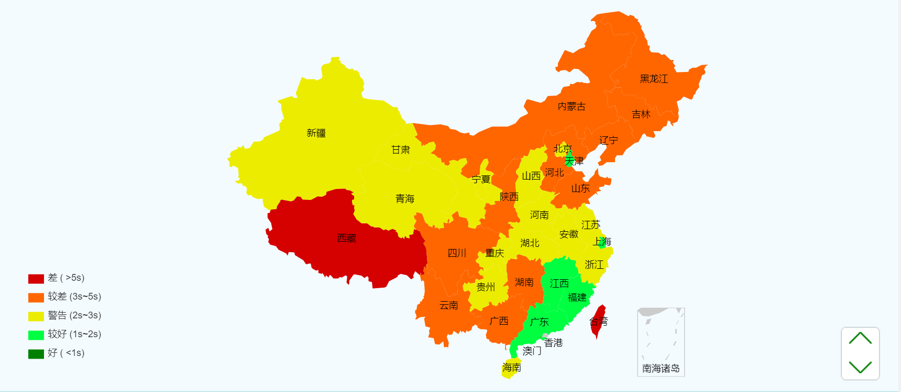

这几天跟团队小伙伴解决了一个因为缓存引发的线上事故，让我对缓存的理解又更深刻了一些，这里记录一下。

事件的起因是团队中的小伙伴在调查静态资源加载耗时的时候，无意间发现我们用的CDN弱爆了：



全国上下一片暖色，真是瞎了😓

之前CDN的缓存配置是`cache-control: no-cache`，也就是走协商缓存。由于我们每次上线的js和css都带版本号，比如：

```
umi.2020-09-27-15-30-02-00.js
```

文件变了版本号必然变化，走强缓存就可以了，没必要协商，所以优化的方案就是将cdn的缓存配置改成`cache-control: max-age=259200`，也就是缓存30天。

紧接着在观察线上nginx的配置时，发现nginx的返回header有一个`expires: -1`（等价于cache-control: no-cahce），于是就顺手也给注释掉了。

一顿操作以后，测试了一下，果然快了不少😁

结果没想到改nginx的操作引发了一个事故😵

## 正确的缓存配置

js、css等静态资源是在html中被引入的：

```html
<html>
  <head>
    <link href="https://static.lishunyang.com/main.css" type="text/css">
  </head>
  <body>
    <script src="https://static.lishunyang.com/main.js"></script>
  </body>
</html>
```

像这种情况，js和css文件名没有包含版本号，意味着每次发布新版本，请求是不变的。因此为了保证浏览器拿到的是最新的静态资源，只能关掉强缓存（本地缓存），开启协商缓存。文件没变化就304，有变化则请求新资源。

这种缓存策略的问题是每次加载资源都必须要发一个请求出去，要么是304，要么是文件内容。虽说304只有一个header没有body传输起来没什么负担，但至少也有一次请求，当网络环境比较差的时候，http的链接建立过程也是会比较耗时的。（比如上文中的CDN的那种情况）

所以为了进一步优化，势必要引入强缓存，在缓存未失效的时间内，不会再发出请求，直接使用本地缓存。但这样就必须要让js、css的请求地址加上版本号，否则发布新版本是不会生效的。也就是改成这样：（注意这里将日期2020-01-01-05-12作为了版本号，即YYYY-MM-DD-HH-mm）

```html
<html>
  <head>
    <link href="https://static.lishunyang.com/main.2020-01-01-05-12.css" type="text/css">
  </head>
  <body>
    <script src="https://static.lishunyang.com/main.2020-01-01-05-12.js"></script>
  </body>
</html>
```

这样，如果发布了新版本，比如版本号变成了`2020-01-01-06-38`，那么由于请求地址变了，强缓存肯定就失效了。

这里有一个很容易被忽略的问题，就是html本身的缓存策略。由于html的请求地址通常不会变化，比如https://blog.lishunyang.com，所以html文件**一定不能**用强缓存，只能用协商缓存。否则，一旦html被缓存了，请求的js和css地址也都会是旧的，即使js和css已经禁用了强缓存，实际上也相当于是被强缓存了。。而且强缓存一旦生效，除非主动清理客户端缓存，就只能等缓存慢慢过期了。

所以，html的强缓存非常可怕，一定不要让html强缓存！而前面修改nginx的配置的时候，去除了`expires: -1`，按理说这个也没有什么影响，因为如果没有任何缓存头部的话，也不会变成强缓存，可偏偏这里的场景是钉钉，像是钉钉、微信这种移动端webview的缓存策略通常都非常激进，如果没有设置缓存头部，则默认会走强缓存策略。于是乎，html被强缓存了！

## 如何解决

当我们得知用户的html已经被

## 参考文档

- [我想转行之----微信浏览器缓存](https://www.jianshu.com/p/cce9511c0914)
