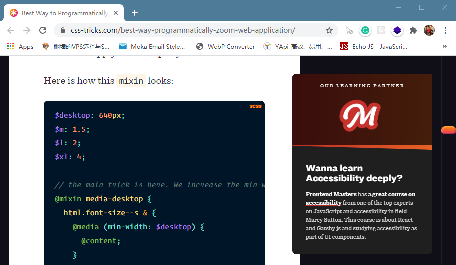

做网页开发的同学可能都遇到过这种问题：用户也许是嫌文字太小看不清，就用浏览器整体放大了页面，结果一放大页面的展示就乱了。


这个时候，产品经理或者是设计师可能就会幽幽地找上你，“能不能让咱们的页面也能在缩放时保持优雅呢？”，这。。。

显然，浏览器有一套专门的缩放渲染逻辑，可是这个渲染逻辑是怎样的呢？

## 浏览器是怎么放大（或缩小）的呢？

先来看一个有趣的现象。这是一个页面的原始大小：



这是将浏览器窗口变大为原来的两倍，同时将页面缩放为原来的200%的效果：


你会发现，这两个图片的展示效果几乎一样哎。也就是：

> 屏幕尺寸变大2为倍，浏览器缩放比调整为200%，显示效果跟原来相同（1倍屏幕尺寸，100%缩放倍数）

于是就有个大胆的猜测，那是不是有这样的一个公式呢？

```
显示效果 = 屏幕尺寸 / 缩放倍数
```

也就是说，如果当前页面缩放为120%，那么其展示效果等效于将浏览器窗口缩小为原来的1/120%。也就是放大其实等效于是在缩小！因缺思厅。

这也就解释了为什么那些有媒体查询的网站，如果你不停地放大，反而会触发小屏幕的媒体查询效果。比如你可以打开[CSS-TRICKS](https://css-tricks.com/)的首页放大试试。

比如这个页面放大到400%，可以看到已经变成移动端布局了：


那么事情是不是这样呢？这里做了一个实验。这是原始的页面，可以看到当前viewport的宽度是1280。


假如我们将页面缩放至150%，那么理论上就等效于是将viewport缩小为原来的`1/150%`即853.3333。

现在我们将页面缩放为原来的150%，可以看到此时viewport已经变成了853。


此外也测试了一下同样场景firefox的表现，也是一样的，只不过有一些误差罢了。所以到此就差不多就印证了那个猜想。

也就是说，所谓浏览器的放大，其实可以这样模拟：

1. 将viewport缩小至原来的1/x，其中x为浏览器缩放倍数
2. 渲染页面
3. 将渲染好的页面等比例再拉伸至真实的窗口大小

第三步中，svg、字体等矢量元素是可以无损放大的，显示效果依然锐利，只不过像位图一类的东西，放大以后就变模糊了。

ps：上面说的都是放大，缩小也是一样的。


熟悉SVG的同学可能突然意识到，这跟SVG的viewport渲染流程好像啊，没错。（不熟悉的同学可以看张鑫旭大佬的[这篇文章](https://www.zhangxinxu.com/wordpress/2014/08/svg-viewport-viewbox-preserveaspectratio/)）

## 如何写出兼容浏览器缩放的页面呢

知道了浏览器缩放的流程后，这个问题的答案也就呼之欲出了，其实跟适配不同屏幕尺寸的效果是一样的。比如你想看看用户如果放大到120%页面会是什么样子，那就把浏览器窗口缩小到原来的1/120%就行了。

## 参考文章

- [Best Way to Programmatically Zoom a Web Application](https://css-tricks.com/best-way-programmatically-zoom-web-application/)
