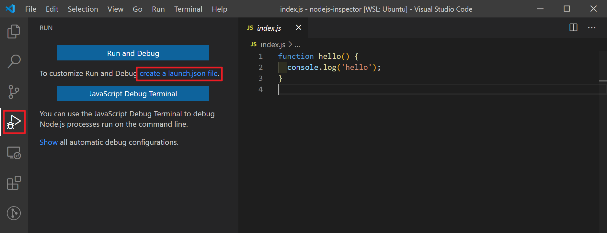
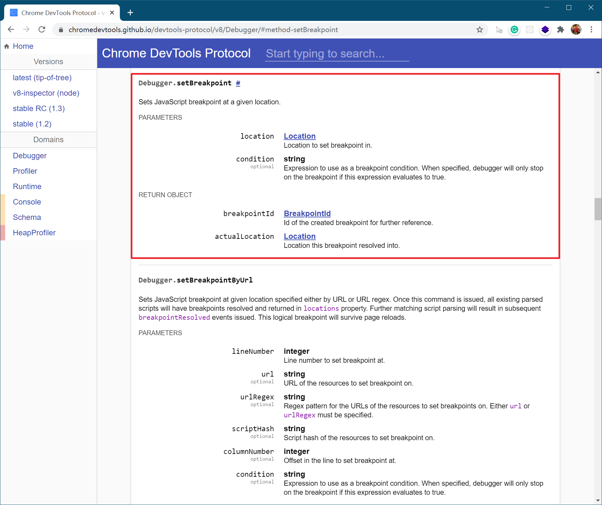

在开发node程序时，有些时候你需要频繁查看程序的运行状态，比如说开发babel-plugin的时候，你需要经常性地观察AST的结构，如果每次都是用console.log那也未免太低效了，这个时候就需要使用nodejs的调试技巧了。

## nodejs调试初探

要想开启调试功能，需要在启动nodejs程序时添加`--inspect`参数。此时nodejs会启动一个额外的http server用来与外部调试工具通信，默认监听的地址为127.0.0.1:9229，此时就可以使用调试工具进行调试了，例如：


注意到启动后会log出这样的信息：

```
Debugger listening on ws://127.0.0.1:9229/58290651-b1e0-4a6f-afad-05ac3e9d5af3
For help, see: https://nodejs.org/en/docs/inspector
```

其中，`ws://127.0.0.1:9229/58290651-b1e0-4a6f-afad-05ac3e9d5af3`就是监听的地址，后面的一段随机字符串代表当前node进程的uuid，有了这个地址，就可以使用外部调试工具（例如Chrome、VSCode之类）进行调试了。

比如有下面的一个nodejs程序：

```js
// index.js
function hello() {
  console.log('hello');
}
```

让我们用`--inspect`来试试：

```
> node --inspect index.js
```


可以看到，index.js输出了hello之后就退出了，进程也就存在了一瞬间，这怎么调试呢。。

没关系，可以使用`--inspect-brk`，它的作用就是等待调试工具连接后才执行，于是再试一下：


可以看到没有输出hello，node进程还在，那么现在就可以用调试工具开始调试了。比如我们可以使用Chrome的Dev-Tool：


点击inspect进入调试，接下来的工作就跟调试网页中的js一样一样了。

小结一下，nodejs在inspect模式下会启动一个额外的http server与外部调试工具通信，以实现调试的效果，下面是架构图：


## Launch vs Attach

上面提到的nodejs的调试方法叫做Attach，因为node程序已经启动了，第三方调试工具再附加到上面，常见的浏览器调试工具都属于这一类。还有一类调试方法叫做Launch，顾名思义，就是指通过调试工具直接启动node程序。其实本质上Attach和Launch没什么不同，只是应用的场景不一样罢了。不过理解Launch和Attach的区别能够对理解调试工具有一些帮助。

VSCode默认都是以Launch的方式调试的，比如我们打开VSCode的debug面板：



既然是Launch模式，那么自然需要告诉VSCode该怎么启动nodejs程序（不然我怎么知道你要调试的是a.js还是b.js呢）。所以使用VSCode调试nodejs程序的第一步是要创建一个launch.json配置文件（文件名已经暴露了它的企图）。下面是一个典型的launch.json的例子：

```json
{
  // Use IntelliSense to learn about possible attributes.
  // Hover to view descriptions of existing attributes.
  // For more information, visit: https://go.microsoft.com/fwlink/?linkid=830387
  "version": "0.2.0",
  "configurations": [
    {
      "type": "node", // <-- type代表调试器的类型，node是VSCode自带的调试器，也可以根据需要换成php、go等其他类型
      "request": "launch", // <-- 调试类型，这里是launch模式，另一个可选值是attach
      "name": "Launch Program", // <-- 配置文件的名字
      "skipFiles": [
        "<node_internals>/**"
      ],
      "program": "${workspaceFolder}/index.js", // <-- 要调试的代码是哪个
      "args": ["${env:USERNAME}"] // <-- 启动参数
    }
  ]
}
```

大部分参数都比较容易理解，详细的说明请参考VSCode的官方文档（[这里](https://code.visualstudio.com/docs/nodejs/nodejs-debugging#_launch-configuration-attributes)），写得非常清楚了。

创建好调试工具以后，接下来就是启动调试，点击播放按钮：


后面的操作过程也跟Chrome的调试工具差不多了，比如可以加断点看stack：


当然VSCode也是支持Attach模式的，比如可以将VSCode配置为自动Attach，那么如果是在VSCode的Debug Terminal启动nodejs程序，就会自动进入debug模式进行调试，当然篇幅有限，这里就不细讲了，感兴趣的同学可以自行阅读[这篇文档](https://code.visualstudio.com/docs/nodejs/nodejs-debugging#_attaching-to-nodejs)。

小结一下，调试方法分Attach和Launch两种，Attach模式不需要关心如何启动node进程，但是需要知道调试地址，Launch模式需要知道如何启动node进程，但是不需要知道调试地址。浏览器的调试工具都是Attach模式，VSCode默认是Launch模式。

## 深入Inspector

前面我们看到了，如果启动node的时候添加`--inspect`参数，就可以进入调试模式，那么这个调试模式到底是怎么启动的呢？

其实nodejs的调试模式是借助底层的V8引擎实现的，详细的架构图如下所示：


nodejs程序与外部调试工具通过tcp连接通信（通常是ws或http），完整的通信协议在V8官方的文档中有写明（[点击这里](https://chromedevtools.github.io/devtools-protocol/v8/)），比如这个是设置断点的描述：



因此，通过向调试server发送Debugger.setBreakpoint消息以及对应参数，就可以实现设置断点的效果了，其他功能类似。headless inspector的既视感。

Nodejs已经把V8 inspector相关的API接口封装好了，具体见[这里](https://nodejs.org/api/inspector.html)，所以我们除了使用`--inspect`参数开启调试模式外，还可以直接在代码中调用inspector的API进行调试，比如下面这个获取CPU信息的例子：

```js
const inspector = require('inspector');
const fs = require('fs');
// 启动调试session
const session = new inspector.Session();
session.connect();

// 向V8 inspector发送消息，具体格式见上文提到的协议
session.post('Profiler.enable', () => {
  session.post('Profiler.start', () => {
    // Invoke business logic under measurement here...

    // some time later...
    session.post('Profiler.stop', (err, { profile }) => {
      // Write profile to disk, upload, etc.
      if (!err) {
        fs.writeFileSync('./profile.cpuprofile', JSON.stringify(profile));
      }
    });
  });
});
```

## 如何调试webpack、npm、gulp、babel-node等

至此我们已经介绍了nodejs的调试原理以及常见的调试方法，不过实际使用中经常会遇到各种各样的问题，比如要调试的东西不是直接启动node，而是通过webpack、gulp、babel-node、npm命令等，这该如何调试呢？

这里以babel-node为例，比如启动命令为：

```sh
> babel-node app.js some-args
```

如果使用Attach模式，可以这样启动：

```sh
> node --inspect ./node_modules/.bin/babel-node app.js some-args
```

然后就可以用Attach的方式进行调试了。

如果想用Launch模式（以VSCode为例），因为启动的命令不是node了，所以需要配置`runtimeExcutable`和`runtimeArgs`告诉VSCode我要启动的是啥，比如这样：

```json
{
  "version": "0.2.0",
  "configurations": [
    {
      "type": "node",
      "request": "launch",
      "name": "Launch Program",
      "runtimeExcutable": "${workspaceRoot}/node_modules/.bin/babel-node", // <-- 注意这里
      "runtimeArgs": ["some-args"], // <-- 注意这里
      "program": "${file}" // <-- ${file}的意思是当前文件
    }
  ]
}
```

如果当前环境变量PATH中已经包含了babel-node，也可以把`runtimeExcutable`简化成`babel-node`。

此外VSCode内置了一些常用node工具调试配置模板，可以直接创建对应的配置文件，比如：


然后改巴改巴就可以调试了。

## 总结

1. 添加`--inspect`参数可开启nodejs的调试功能，此时node会启动一个websocket server用于跟外部的调试工具通信
2. 有Attach和Launch是两种调试模式，他们根本上是一样的，只是使用方式上有所不同
3. 如果是webpack、npm、babel-node等，也可以用node启动，或者通过runtimeExcutable配置

## 参考资料

- [v8 debugging protocol](https://chromedevtools.github.io/devtools-protocol/v8/)
- [Node Debug Tutorial](https://i5ting.github.io/node-debug-tutorial/#601)
- [Debugging Node.js with Chrome DevTools](https://medium.com/@paul_irish/debugging-node-js-nightlies-with-chrome-devtools-7c4a1b95ae27)
- [VSCode debugging](https://code.visualstudio.com/docs/editor/debugging)

