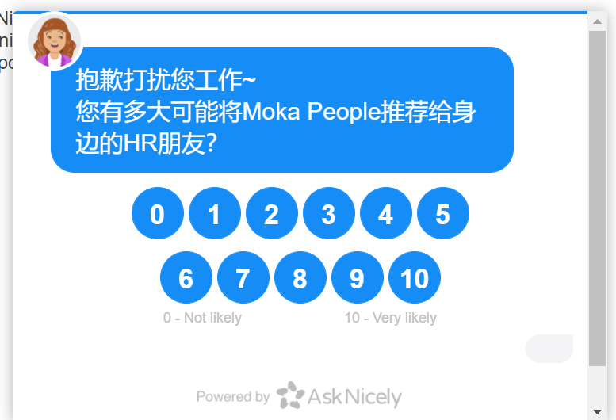

最近帮同事调查asknicely的一些问题，事后想想还是蛮有意思的，这里就记录一下。

## Asknicely，NPS

Asknicely是一个美国的NPS服务提供商，那么什么是NPS呢？

NPS全称是Net Promoter Score，翻译成中文叫净推荐值。它是由贝恩咨询公司客户忠诚度业务创始人在2003年提出的概念。

简单来说，NPS就是问用户一个问题：你到底有多愿意把这个产品推荐给其他人？1-10代表程度依次递增。

根据用户的回答，将结果分为两类，一类是愿意推荐给别人（推荐者），一类是不愿意推荐给别人（非推荐者），如果推荐者的比例大于非推荐者，那么可以认为产品具备了口碑，可以自发传播越滚越大，反之则认为产品没有口碑，最终会自行消亡。推荐者和非推荐者的差距决定了这个过程的速度。

那么什么样的回答算是推荐者，什么样算是非推荐者呢？NPS规定只有评分在9-10分的情况才算是推荐者，其他1-8分都算是非推荐者。这个标准看似很苛刻，细想起来很有道理。因为如果我们觉得一个东西比较一般的时候，通常也会出于情面给出一个6、7分，但你会推荐给其他人吗？通常不会。只有那些让你感到惊喜的东西，你才愿意推荐给别人。

NPS的计算公式为：(推荐者 / 总数 - 非推荐者 / 总数) * 100

最后的那个100主要是为了换算成百分比的值。理论上NPS得分最高不超过100分，最低不低于-100分。

NPS是衡量产品口碑的非常简洁的指标，只用看一个数字就够了。当NPS得分大于0时我们认为产品具备了口碑，反之没有口碑。

## 接入Asknicely

Web页面接入Asknicely非常简单，根据官方文档，引入js和css后，再下面的代码即可：

```js
document.addEventListener('DOMContentLoaded', function () {
    
  askNicelyConversation({
    config: {
      domain_key:    "domain_key", // Required
      template_name: "default", // Required - the survey template you wish to use
      alignment:     "center", // Optional - "left", "center" or "right"
      name:          "Your Name", // Optional - but nice to have
      email:         "your-name@example.com", // Required - if no email, this should be a unique id for this customer in an email-like format. But a real email address is more powerful for follow-ups
      email_hash:    "1c95da7da20b8db0e3ded2aca4930ba2a5721b31fb0edbdff8ebcaf4d584e78a", // Required - *security hash of this customers email - see below
      created:       1611984899 // Highly desired - unix timestamp when this customer joined your service.
    },
    customData: { // Optional - Send extra data about this customer for reporting and leaderboards
      a_custom_property:       "business", 
      another_custom_property: "New York"
    }
  });
});
```

这样，asknicely就会在页面加载完成后，蹦出一个弹窗，让用户打分了：



