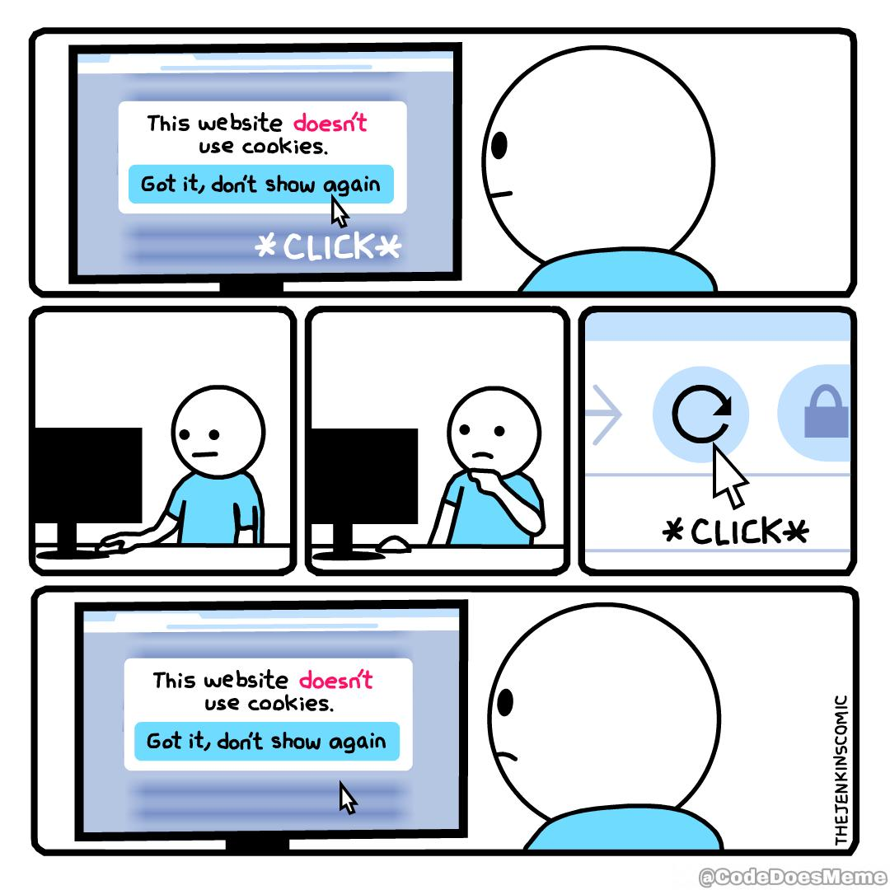
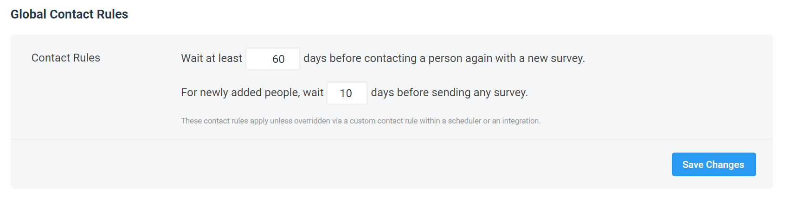
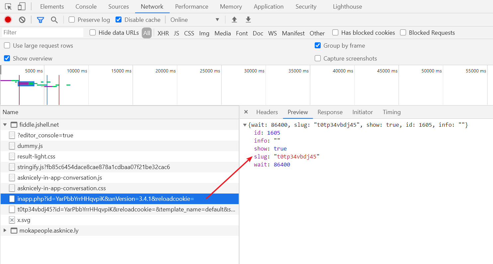
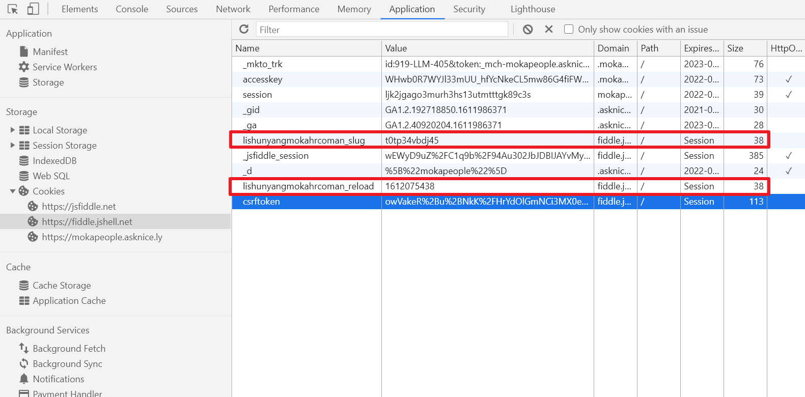
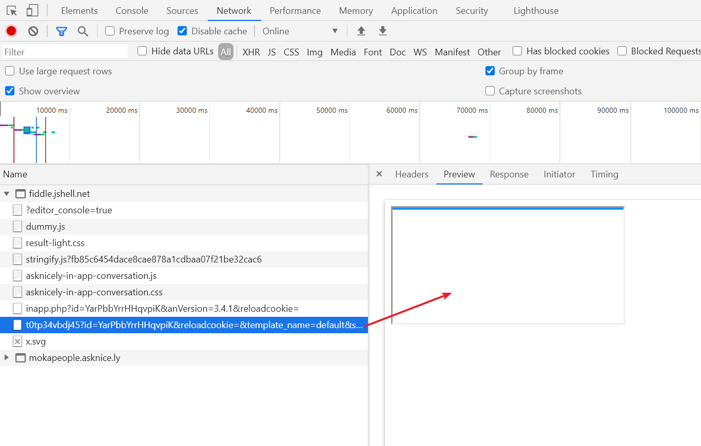
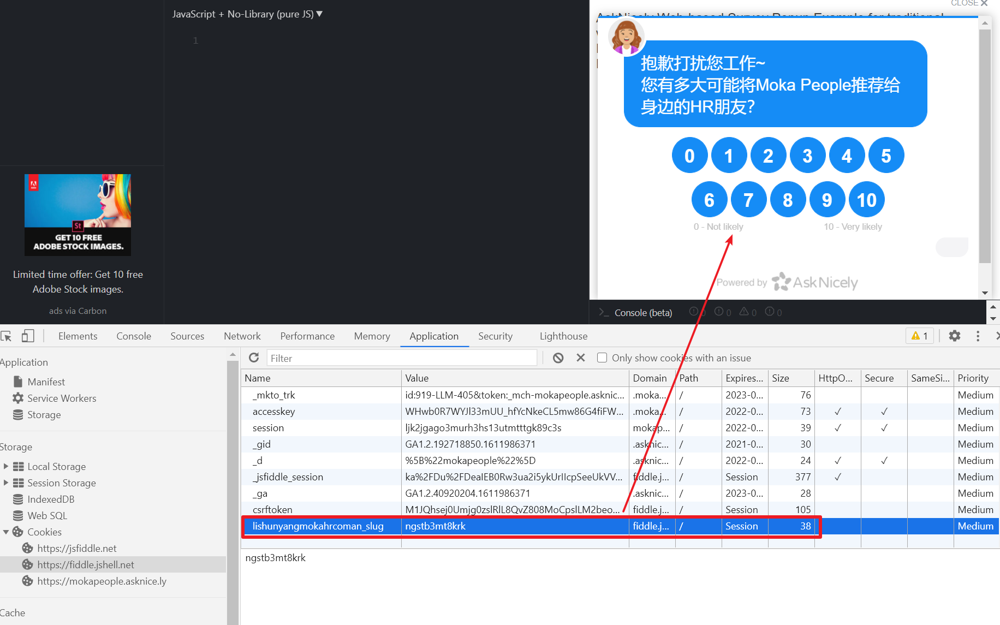
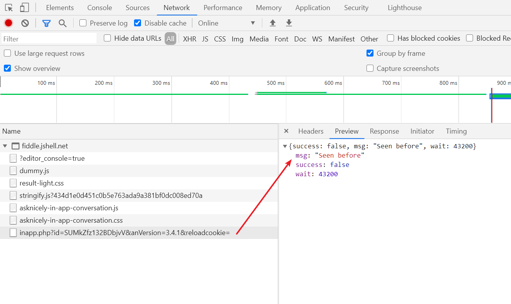

最近帮同事调查asknicely的一些问题，事后想想还是蛮有意思的，这里就记录一下。

## Asknicely，NPS

Asknicely是一个美国的NPS服务提供商，那么什么是NPS呢？

NPS全称是Net Promoter Score，翻译成中文叫净推荐值。它是由贝恩咨询公司客户忠诚度业务创始人在2003年提出的概念。

简单来说，NPS就是问用户一个问题：你到底有多愿意把这个产品推荐给其他人？1-10代表程度依次递增。

根据用户的回答，将结果分为两类，一类是愿意推荐给别人（推荐者），一类是不愿意推荐给别人（非推荐者），如果推荐者的比例大于非推荐者，那么可以认为产品具备了口碑，可以自发传播越滚越大，反之则认为产品没有口碑，最终会自行消亡。推荐者和非推荐者的差距决定了这个过程的速度。

那么什么样的回答算是推荐者，什么样算是非推荐者呢？NPS规定只有评分在9-10分的情况才算是推荐者，其他1-8分都算是非推荐者。这个标准看似很苛刻，细想起来很有道理。因为如果我们觉得一个东西比较一般的时候，通常也会出于情面给出一个6、7分，但你会推荐给其他人吗？通常不会。只有那些让你感到惊喜的东西，你才愿意推荐给别人。

NPS的计算公式为：(推荐者 / 总数 - 非推荐者 / 总数) * 100

最后的那个100主要是为了换算成百分比的值。理论上NPS得分最高不超过100分，最低不低于-100分。

NPS是反应产品口碑的非常简洁的指标，因为只用看一个数字就够了。当NPS得分大于0时我们认为产品具备了口碑，反之没有口碑。而且对于用户来说，1-10分打分也比写评价简单容易接受得多，参与率通常都比较高。因此，很多公司和产品都采用NPS调研的方法。

## 接入Asknicely

Web页面接入Asknicely非常简单，根据官方文档，引入js和css后，再下面的代码即可：

```js
document.addEventListener('DOMContentLoaded', function () {

  askNicelyConversation({
    config: {
      domain_key:    "domain_key", // Required
      template_name: "default", // Required - the survey template you wish to use
      alignment:     "center", // Optional - "left", "center" or "right"
      name:          "Your Name", // Optional - but nice to have
      email:         "your-name@example.com", // Required - if no email, this should be a unique id for this customer in an email-like format. But a real email address is more powerful for follow-ups
      email_hash:    "1c95da7da20b8db0e3ded2aca4930ba2a5721b31fb0edbdff8ebcaf4d584e78a", // Required - *security hash of this customers email - see below
      created:       1611984899 // Highly desired - unix timestamp when this customer joined your service.
    },
    customData: { // Optional - Send extra data about this customer for reporting and leaderboards
      a_custom_property:       "business",
      another_custom_property: "New York"
    }
  });
});
```

这样，asknicely就会在页面加载完成后，蹦出一个弹窗，让用户打分了：


有意思的地方来了，调查问卷的弹出时机应该是怎样的呢？

如果每次使用都弹一遍问卷，用户肯定会被烦死，甚至可能一怒之下给个差评然后卸载。



所以，两次调查问卷间隔时间不能过近，这是第一个要注意的事项。

此外，如果用户第一天使用产品就收到这样一份问卷，那么他大概率只能乱填，对最终的结果造成一定影响。

所以，对于新用户应该延迟一段时间再展示调查问卷，这是第二个要注意的事项。

asknicely在后台控制面板提供了上述两个注意事项的配置：



最后还有一个容易被忽略的地方，即上面两个注意事项应该在多台设备间共享状态保持一致。比如说一个用户已经在公司的电脑上填过调查问卷了，那么他在个人电脑上就不应该再填了。

那么asknicely在技术上是如何做到上述规则的呢？

## 如果是你来设计

首先，需要记录下上一次问卷出现的时间，用于判断当前是否可以再一次展示问卷了。

其次，要在多台设备间保持一致，那么上面的那个信息就必须统一持久化存储于后端。

那么我们的流程大概是这样：

1. 向后端查询上一次调查问卷出现的时间
2. 判断当前是否可以展示调查问卷（两次间隔时间不能过短，新用户要有一定延迟）
3. 如果可以展示，则展示问卷，同时向后端请求记录下最新的问卷出现时间，否则什么也不做

当然，判断问卷是否该展示的逻辑最好是挪到后端去，也就是这样：

1. 向后端查询下一次调查问卷该出现的最早时间
2. 如果当前时间大于该时间，则展示问卷，同时向后端请求记录下最新的问卷出现时间，否则什么也不做

当当当，问题解决了！

## 非原子性问题

上述方法的一个问题在于，判断是否展示和更新最新时间这两个过程不是原子的。假如第一步查询通过，成功展示问卷，而到了第二步通知后端更新的请求因为网络原因失败了。那么下一次用户打卡应用的时候，就仍然会展示调查问卷了。

其实非原子性问题在web应用里非常常见，但是缺乏经验的开发者在设计的时候往往容易忽略。此外还有一个特别容易被忽略的问题时多请求间的竞争同步问题，比如前面的请求反而在后面收到。以后有机会再聊聊这个话题（暂时挖个坑）

怎么解决非原子性问题呢？可以限制串行（例如加锁）或者想办法让操作本身变成原子的（例如事务）。

回到上面的问卷问题，这里可以引入令牌机制（token），令牌只能有一个，某个前端请求令牌如果成功了，那么其他前端就拿不到令牌了。令牌的有效期等于连续两次问卷展示的间隔时间。

所以我们的逻辑变成了这样：

1. 前端向后端查询**令牌**
2. 如果后端现在没有任何有效的令牌，则会新生成一个并返回给前端，如果后端此时有一个合法令牌，说明其他前端已经捷足先登，那么就返回失败
3. 前端拿到令牌，展示调查问卷

这样经过优化后，就不会再有原子性问题了。

## 充分利用缓存优化性能

上面的流程有个小缺点：前端每次都会向后端去请求获取令牌，但大部分情况下都会返回失败。对服务端的性能来说也是一个负担，我们可以充分利用前端缓存来优化这个场景。

具体的做法就是在前端缓存一个到期时间，如果`当前时间<到期时间`，则不再发送请求。这个可以在第一次请求令牌的时候后端顺便返回。

那么最终我们的逻辑变成了这样（增加了第一步检查到期时间）：

1. 前端检查到期时间，如果还未到期则直接退出，什么也不做
2. 前端向后端查询**令牌**
3. 如果后端现在没有任何有效的令牌，则会新生成一个并返回给前端（同时把到期时间也返回），如果后端此时有一个合法令牌，说明其他前端已经捷足先登，那么就返回失败
4. 前端拿到令牌，展示调查问卷，同时记录下到期时间

## asknicely是怎么做的？

现在我们看看asknicely是怎么做的吧。

首先，第一次加载的时候，我们看到asknicely发了一个请求用来获取令牌：



（注意其中的slug和wait，分别对应的是token和等待时间）

然后，asknicely会偷偷添加两个cookie：



（上面的slug结尾的cookie就是token，reload结尾的cookie就是过期时间）

在之后asknicely会再次发送一个iframe请求加载出问卷：



上面初次加载的正常流程。之后，如果我们再次刷新页面，不会发送请求了，因为不符合过期时间的条件。

此时如果我们把过期时间的cookie手动删除，然后刷新页面，则会看到问卷可以正常加载了（满足了过期时间的限制）。



如果我们把过期时间的cookie手动删除，再把token的cookie也删除，再次刷新页面，可以看到此时拿不到token了：



（这个Seen before的意思就是，token已经给别人啦，你拿不到了）

啧啧啧，看来跟我们想的一模一样。

## 后记

asknicely自称是NPS调研的top1服务商，产品本身确实还是不错的，但这里不得不吐槽一下，文档实在是太烂了，或者说没有文档。上面你看到的引入demo就是全部文档了，我猜asknicely是觉得demo里的注释就是文档了吧。由于没有文档，导致很多参数不知道是什么含义，其中有一个created字段，一开始我们不知道是什么意思，然后就填了一个最新时间`Date.now()`，结果问卷总是出不来，最后跟客服沟通才明白那个字段如果是当前时间，就会被asknicely认为是“新用户”，怪不得总是出不来。。

## 参考资料

就是asknicely的文档，哦对了asknicely没有文档，所以这里啥也没有
