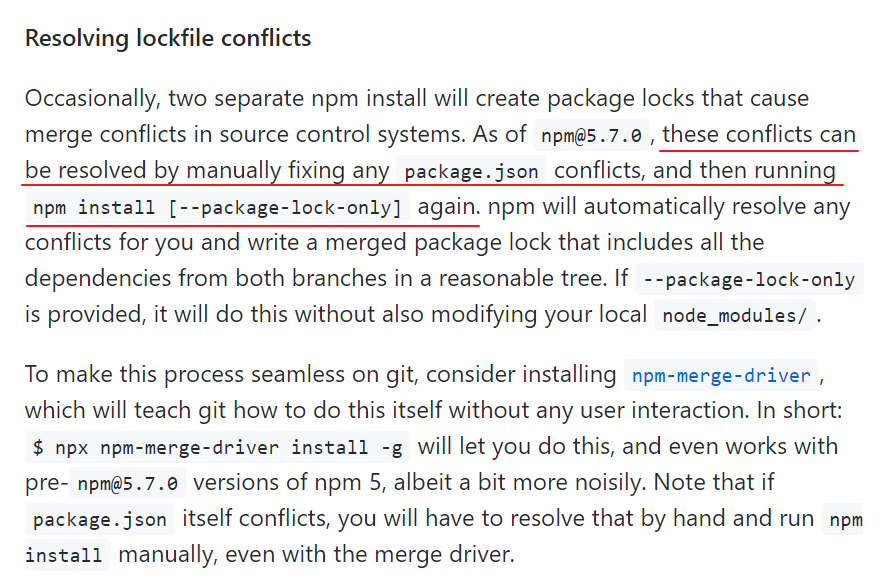

很多使用npm管理依赖的同学对package-lock都是一知半解，包括我自己也是，只知道这是个能够帮你锁住版本的东西，有时会莫名其妙地变化，多人协作时还可能产生冲突，跟shrinkwrap似乎有点类似，仅此而已了。

这篇文章就简单小结小结，其实大部分内容都可以在npmjs的官方文档中找到答案，如果你没看过，还是强烈推荐去看看，不过我知道你是不会去看的。


## npm和语义化版本

在讲package-lock之前，我们得先搞懂语义化版本（Semantic Versioning）的概念，因为它对npm的install过程，package-lock的维护工程很重要。

完整语义化版本的规范在[这里](https://semver.org/)，只有短短一页。

简单来说就是：

1. 版本号由三部分组成`X.Y.Z`。

- X：major version，不兼容之前的大版本
- Y：minor version，兼容之前的小版本
- Z：patch version，兼容之前的修复bug的版本

2. 版本号之间的大小关系，这个小白都知道就不罗嗦了。

npm基于语义化版本增加了对版本范围的支持能力。通常我们用`npm install`命令安装一个依赖包的时候，比如我们执行`npm install lodash`，package.json的版本号是这样的：

```json
{
  "dependencies": {
    "lodash": "^4.17.20"
  }
}
```

这里的`^`代表这是`caret version`，它实际上表示的不是一个具体的版本而是一个版本的范围。简单总结通常是这样：

> 从左数第一个非零版本固定不变，剩下的版本可以自由增加

还拿刚才的例子`^4.17.20`，从左数第一个非零版本是4（major version），那么4不能变化，而之后的版本可以随意增加。所以：

```
^4.17.20 等价于 大于等于4.17.20，小于5.0.0
```

再举一个例子，`^0.2.1`，还是按照之前的规则，从左数第一个是2（minor version），那么2不能变化，之后的版本可以随意增加。所以：

```
^0.2.1 等价于 大于等于0.2.1，小于0.3.0
```

除了caret version之外，还有tilde version，X version， * version等概念，这里暂时不涉及，感兴趣自己去看npm文档吧。

回到上文，如果package.json中的依赖版本是一个范围（例如caret version），在执行`npm install`的时候，npm会自动从符合的版本范围内选择一个最新的包安装，也就是所谓的自动升级。自动升级版本的好处在于可以顺带把修复bug的版本也装上，不然只要某个包修复了一个小bug，就需要通知所有引入这个包的项目更新版本，在快速发展的javascript生态中，想想就知道这是一件几乎不可能的事情，所以npm默认的策略就是`caret version`。

> 需要特别强调的是，自动升级只会发生在新安装一个包的时候（即当前node_modules里没有可以直接拿来复用的包）。这跟npm本身的install算法有关，下文会提到。

如果你不想这样，可以去掉`^`，这样相当于使用了固定版本，那么`npm install`的时候就一定会安装你所指定的版本了。

> 小提示：可以用`@`显式指明版本号，例如：`npm install lodash@1.2.3`

## 自动升级导致的问题

根据语义化版本的规范，只要不是major版本的变动，其他都应该是向前兼容的，因此自动升级这种策略应该是安全的。但实际情况是，相当一部分npm包的贡献者都无法很好地保证语义化版本的前向兼容的条件，甚至很多人都不知道语义化版本的具体含义（其实之前我也是这样）。结果就是，如果一个包的作者在minor version的变动中引入了一个不兼容的breaking change，npm的自动升级就会把这个breaking change悄悄地引入项目中，然后就出问题了。

这种问题有时候是非常隐蔽的，比如在开发环境和测试环境npm install安装的都是正常的版本，偏偏到了生产环境发布的时候npm install赶上了一个依赖包的不兼容升级，于是一个bug就被带到了线上。。这个风险对于那些非强强调稳定性的项目来说是不可接受的。

既然npm会自动升级，那么我直接把package.json里的所有依赖都改为固定版本是不是就可以了呢？实际上也是不行的，因为你虽然可以锁住当前项目的package.json里的版本，但架不住依赖的依赖没有锁版本呀，npm install的时候，遇到依赖的依赖是范围版本，该自动升级还是会自动升级。

## 锁住node_modules

上面的问题如果抽象来看就是因为前后两次npm install的结果不同，那么如何让前后两次npm install的结果相同呢？

一种思路就是给当前项目的node_modules做一个快照，去掉具体的文件内容，仅保留其中的版本信息，下次在安装的时候，完全按快照的版本信息来，这样不就可以了吗？

对的！npm确实是这样做的。从npm 6开始，每次npm install，就会在本地自动生成一个`package-lock.json`的文件，它就是本次安装的node_modules的快照。举个例子，找一个空项目，执行`npm install lodash`。

此时的package.json文件的内容是：

```json
{
  "dependencies": {
    "lodash": "^4.17.20"
  }
}
```

node_modules目录下多了一个lodash的依赖目录。

然后观察产生的lock文件：

```json
{
  "name": "npm-lock",
  "version": "1.0.0",
  "lockfileVersion": 1,
  "requires": true,
  "dependencies": {
    "lodash": {
      "version": "4.17.20",
      "resolved": "https://registry.npm.taobao.org/lodash/download/lodash-4.17.20.tgz",
      "integrity": "sha1-tEqbYpe8tpjxxRo1RaKzs2jVnFI="
    }
  }
}
```

其中，dependencies代表当前node_modules下的所有依赖，里面的lodash又包含了`version`，`resolved`，`integrity`三个信息。`version`表示node_modules里安装的lodash的版本，`resolved`表示这个lodash是从哪里安装的（我这里是使用了淘宝源），`integrity`签名用于校验完整性。

此时，就算你删除了node_modules目录，再次执行`npm install`，也会得到跟刚才一模一样的node_modules，问题完美解决了！

完整的package-lock的文档在[这里](https://docs.npmjs.com/cli/v6/configuring-npm/package-lock-json)还有[这里](https://docs.npmjs.com/cli/v6/configuring-npm/package-locks)。

## package-lock的问题

package-lock的引入虽然解决了前后安装node_modules不一致的问题，但是也引入了一些新的问题，比如多人协作的时候，大家的package-lock文件经常容易冲突，而lock文件十分巨大，几乎不可能靠人肉解冲突，每次遇到总是很头疼，久而久之大家就会对lock文件产生厌恶，觉得这是个“坏东西”，经常会产生麻烦，甚至选择加入`.gitignore`里面。

实际上npm文档在一开头就已经说了（见[这里](https://docs.npmjs.com/cli/v6/configuring-npm/package-lock-json#description)）：


至于package-lock遇到冲突怎么办，很多人的做法是删掉package-lock，然后重新npm intall生成一个（我之前也是这样做的）。

实际上npm文档在最后也给出了正确的做法（见[这里](https://docs.npmjs.com/cli/v6/configuring-npm/package-locks#resolving-lockfile-conflicts)）：



所以你看：


为什么package-lock总是出问题呢？

根据我的观察，问题的根源在于package-lock总是变化！package-lock总是变化就导致了总是冲突。那么package-lock到底受什么影响而变化呢？

## package-lock什么时候变化

你可以这样粗略地认为package-lock是这样产生的：

```
package.json -> node_modules -> package-lock.json
```

需要注意的是：相同的node_modules总会得到相同的package-lock（他俩可以互相生成），但是相同的package.json并不总是会得到相同的node_modules（其实这正是引入package-lock想要解决的问题）。这就是为什么同样的package.json，在没有package-lock.json的时候，连续两次npm install得到的package-lock.json可能不同。什么情况下相同的package.json会产生不同的node_modules呢？

上文中提到的“自动升级”是一种原因，已经提到过了，这里就不再啰嗦了。实际上还有其他的可能性，根据npm官方文档，npm install的算法如下：

```
load the existing node_modules tree from disk
clone the tree
fetch the package.json and assorted metadata and add it to the clone
walk the clone and add any missing dependencies
  dependencies will be added as close to the top as is possible
  without breaking any other modules
compare the original tree with the cloned tree and make a list of
actions to take to convert one to the other
execute all of the actions, deepest first
  kinds of actions are install, update, remove and move
```

可以看出，npm在install的过程中会尽可能复用已有的node_modules，这其实是一个优化，但这也会导致node_modules的不稳定。

举个例子，假如package.json里lodash的版本要求是`^1.0.0`，张三的node_modules里现在已经有一个版本是`1.1.0`的lodash了，且node_modules里的lodash与package.json里lodash版本相容，所以`npm install`的时候就会略过lodash，最终张三安装完成后得到的lodash版本仍将是`1.1.0`。而李四的node_modules里有一个`1.2.0`的lodash，同理最终李四安装得到的lodash就是`1.2.0`。看到了吧，相同的package.json，安装得到的lodash版本不同了。

上面说的例子即使是同一个人也有可能出现，比如master上的lodash版本是`1.0.0`，你新建了一个分支专门用来测试新版lodash，将版本升级到了`1.1.0`，随后你又切换回master，此时node_modules里的lodash版本已经“偷摸”升级到了`1.1.0`，此时即使执行npm install也不会发生任何变化。

而有了package-lock以后，install算法就变了：

```
The presence of a package lock changes the installation behavior such that:

The module tree described by the package lock is reproduced. This means reproducing the structure described in the file, using the specific files referenced in "resolved" if available, falling back to normal package resolution using "version" if one isn't.

The tree is walked and any missing dependencies are installed in the usual fashion.
```

大概意思是说，原来的包安装可能遇到“自动升级”和“复用现有版本”的问题，现在都统统按照lock文件中记录的版本来，这样就可以保证只要是`相同package.json` + `相同package-lock.json`，每次安装都一定能得到相同node_modules！而只要node_modules不变，那么package-lock.json也不会变，这样即使多次install，结果总是稳定的。前面的流程修正一下就是这样：

```
package.json + package-lock.json -> node_modules -> package-lock.json
```

也许你会有一个小疑问，既然package-lock.json已经包含了完整的node_modules信息，那npm install的时候干嘛还要package.json呢？只看lock文件不就好了吗？确实如此，但实际场景中可能会遇到package.json和package-lock.json出现版本信息无法兼容的情况：例如某人新增了一个包，但是忘记更新lock了。为了解决这种场景，npm的做法是当package.json和lock文件版本不兼容时，优先以package.json里的版本为准生成node_modules，然后更新package-lock，从而达到修正lock文件的效果。遇到这种情况时，就会出现有package-lock.json，package.json也没变，但是npm install完了以后，package-lock.json仍然发生了变化的情况。

当然，还有一种可能也会导致上述诡异的情况。少数情况下，按照原package-lock.json中的resolved信息无法下载安装（比如resolved是npmjs官方的源地址，但是因为网络原因下载失败），npm会fallback到其他源（比如正好npm配置了taobao源，于是就fallback到这个）继续尝试安装相同版本。安装完毕后，npm会更新package-lock，将resolved更新成最新安装的地址，从而达到修正lock文件的效果。

## 使用package-lock的正确姿势

首先，一定要将package-lock.json添加到代码仓库里。

其次，如果package.json没有变化，但是npm install后lock文件发生了变化，务必要仔细检查一下lock文件变化了什么内容。npm官方也建议这样做：


如果是某个人操作失误使得package.json和lock版本不兼容导致的变化，那么可以放心采用最新的lock，如果是源出了问题导致的变化，则最好能切换到一个稳定的源上去。

最后，如果package-lock.json文件产生冲突，千万不要无脑删除lock文件install重新生成。应该采用npm推荐的做法，先手动解package.json的冲突，然后运行`npm install --package-lock-only`，让npm自动帮你解冲突。

## 后记

npm引入package-lock是为了解决一个大问题，结果反倒引发了很多吐槽，这个事情本身值得琢磨。我觉得这事儿npm肯定是很冤的，因为他做的每一步看似都是正确的，无论是install的算法，还是package-lock文件的更新修正。npm的问题在于，它想解决所有问题。有个特殊情况没有考虑，那就出一个补救方案，结果补救方案又导致了另一个问题，那就继续再追加一个补救方案，如此下去导致整个方案异常复杂难以理解，直到让用户产生吐槽的想法。对于用户自己造成的错误（不规范的行为），强制报错退出，让用户自己去解决问题，能够极大降低系统复杂程度，系统因此也会变得更稳定，有些时候这是一个更优的选择方案。

## 参考文章

- [package-locks](https://docs.npmjs.com/cli/v6/configuring-npm/package-locks)
- [package-lock-json](https://docs.npmjs.com/cli/v6/configuring-npm/package-lock-json)
