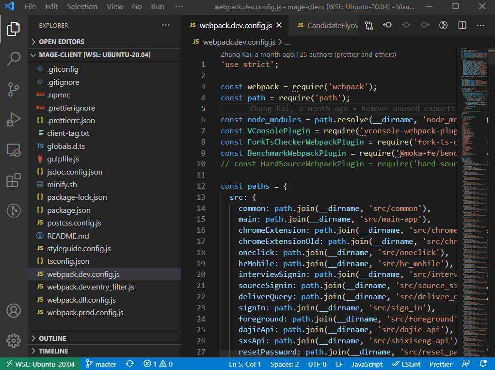
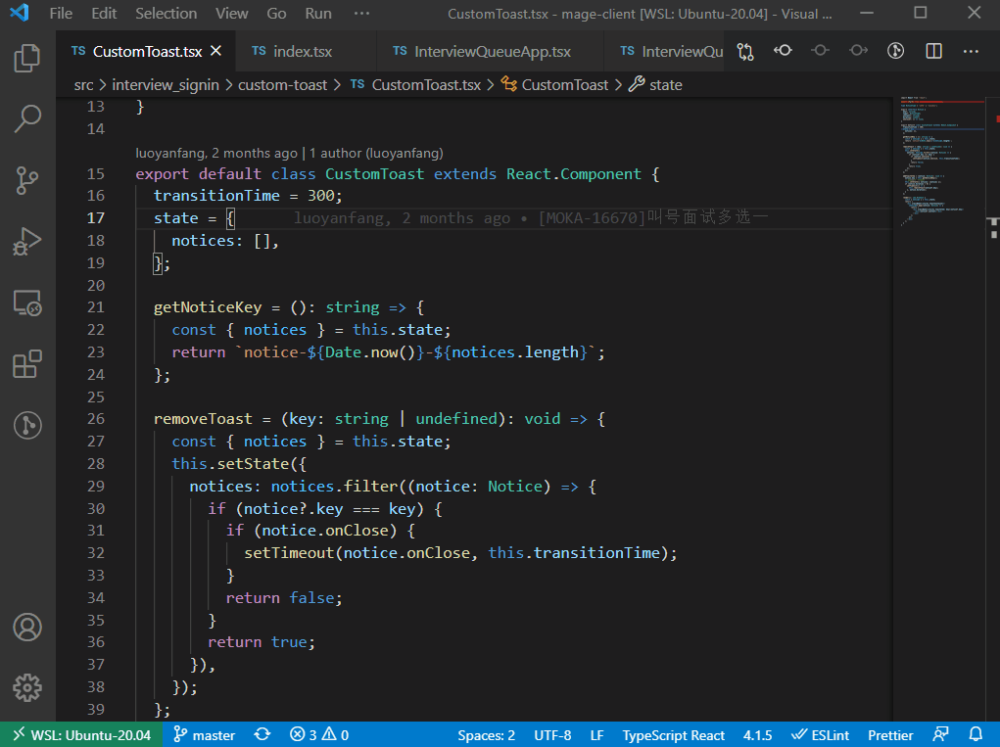
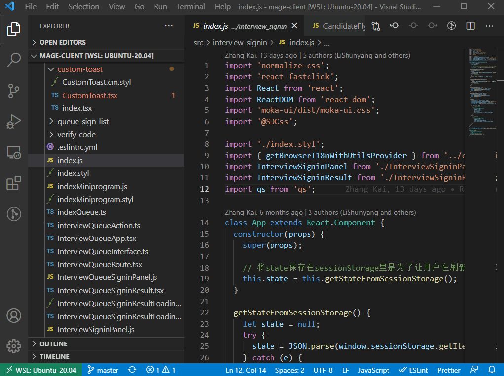
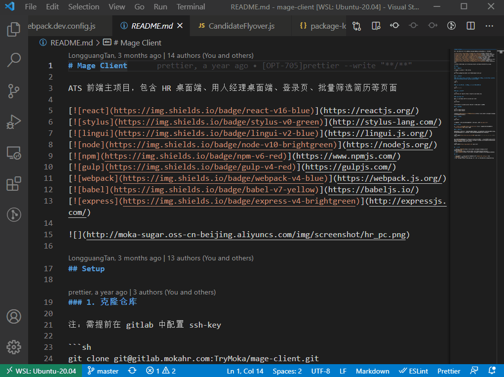
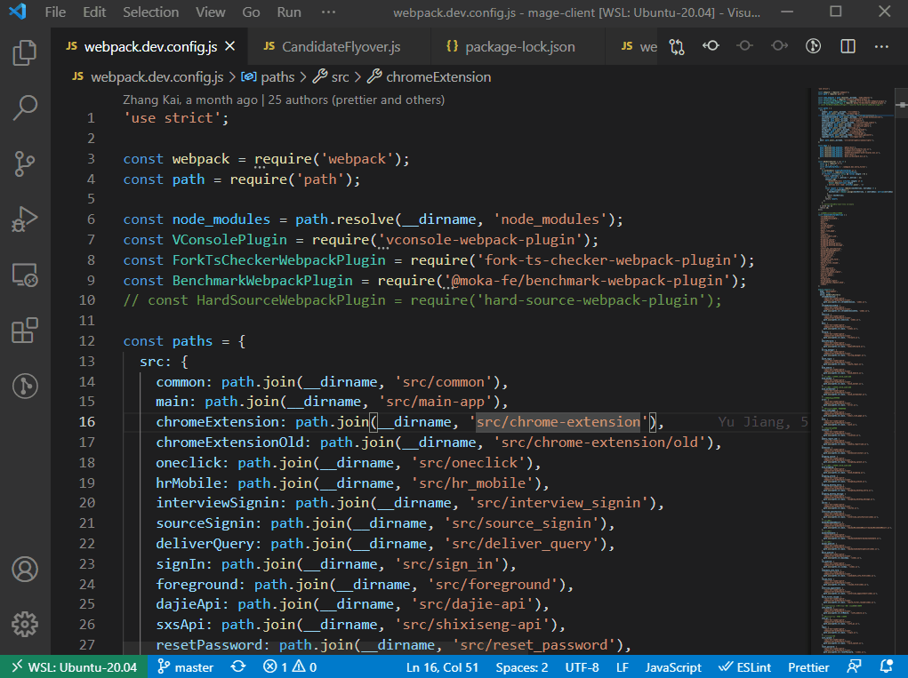
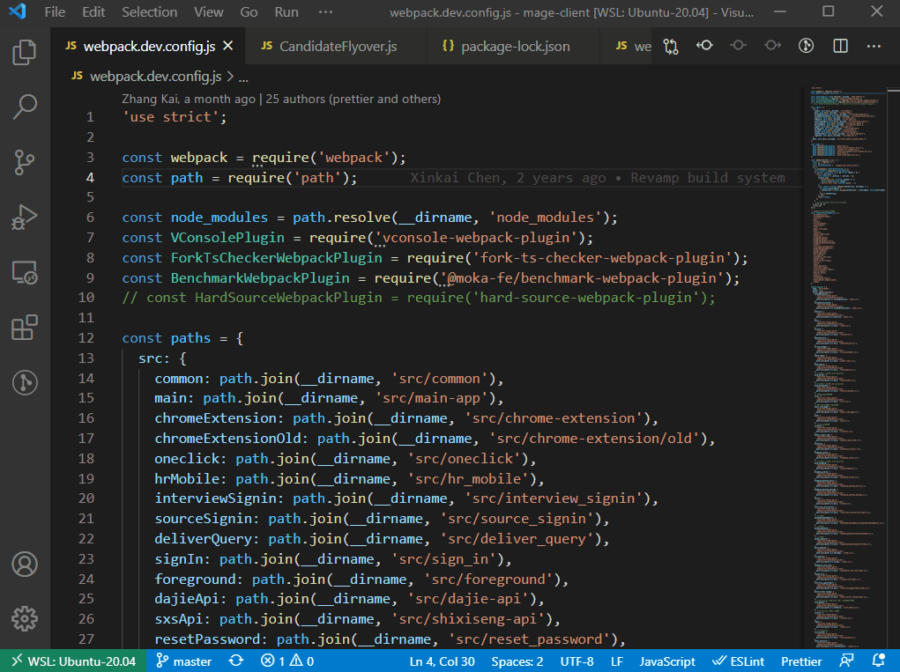
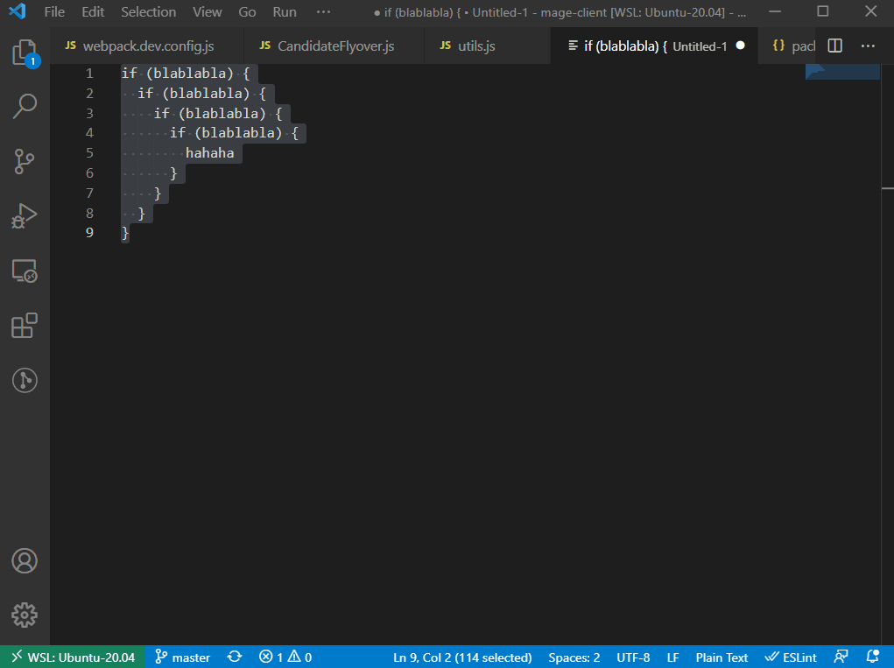
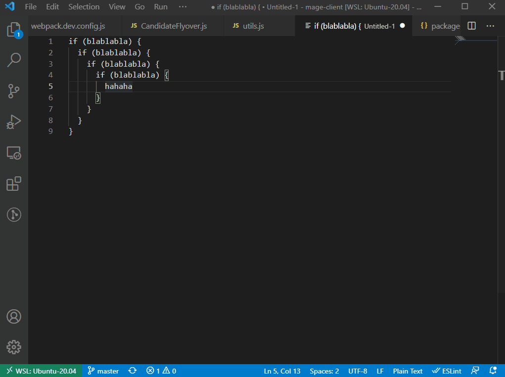
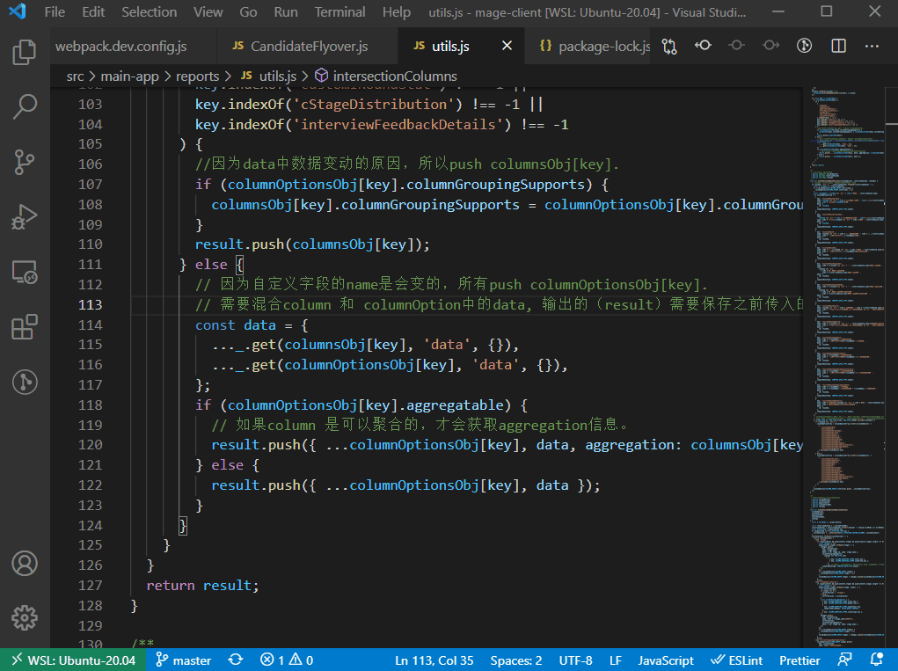

记录了一些大家可能不知道的VSCode使用技巧，很多来自于twitter上vscode官方账号，如果你还知道哪些技巧，欢迎留言补充。

## 在屏幕上显示按键

当你需要做分享的时候会很有用

## 快速转换成snake_case

同理还可以转换成其他格式，比如全大写，但是唯独没有驼峰。。

## 文档对比

VSCode内置了diff功能，偶尔用用很方便

## 保存搜索结果

你可以把搜索结果保存成文件，二次加工处理或者发送给别人

## 在替换文本的时候可以使用正则变量

正则变量的名字是$1、$2等等依次类推

## 快速在分割窗口中打开文件

当你在文件中跳转的时候，可以快速在分栏模式中打开文件，可以节省一丁点时间

## 按scope范围选择代码块

选择一些if条件啊，小段代码块啊，还是比较方便的

## 按scope范围折叠代码块

当浏览一些大段的代码时，折叠一些无关逻辑能够方便梳理思路

## 主题颜色跟随操作系统

VSCode可以跟随系统的颜色来自动设置主题颜色

