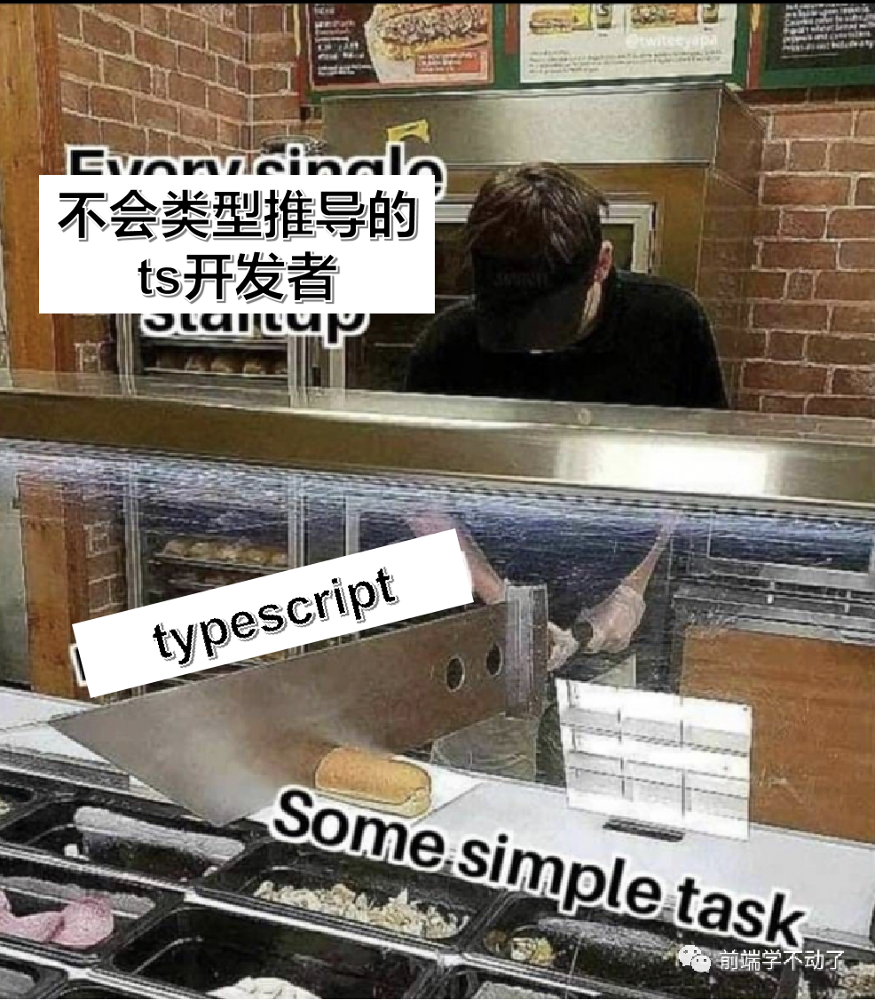
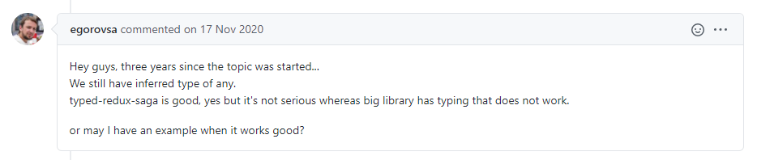
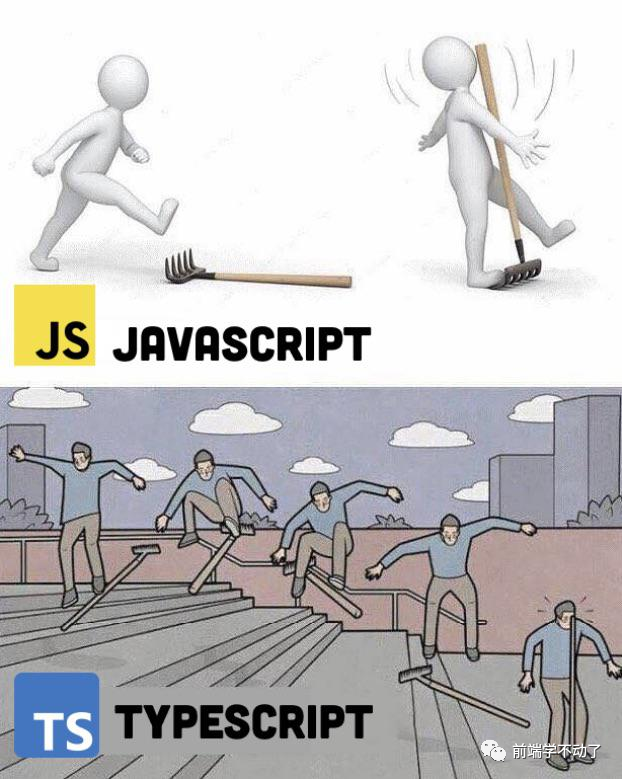

> 2021.9.13 更新：完整的类型代码已上传 github，见[这里](https://github.com/Moka-FE/dva-types)

最近一直在捣鼓一个事情，就是将一个基于 Dva 的 React 项目从 js 迁移到 ts，踩了很多坑，决定分享一下。

## 前置动作

> 问：把大象装进冰箱分几步？

最直观的想法是“渐进式迁移”，即：新代码尽量用 ts 写，老代码慢慢重构成 ts。这也是很多大规模重构首选的策略，比如国际化。但在实际执行的时候你会发现一个大问题，类型推导特别麻烦。类型推导，类型推导，它是基于已有的类型推导，如果没有类型那是推不出来的。而项目迁移刚开始的时候这部分恰恰是缺失的（比如 API 返回的数据类型、redux 全局状态中的类型），巧妇难为无米之炊。没有充分利用类型推导能力的 ts 代码，就好像这样：



因此，迁移大项目到 ts，首先要做的第一步应该是**手动补全关键类型定义**，这一步完成了，才可以进行后续的迁移动作。

那么什么样的类型需要补全呢？

其实这个问题的答案也不难想到，有些类型是可以通过类型推导得到的，那么这样的类型就不必手动补全，而有些类型无法通过类型推导得到，这些类型就是我们需要手动补全的类型。什么样的类型是无法通过推导得到的呢？一路顺藤摸瓜向源头找，通常你会发现这些东西来自外部 API，然后以全局状态的形式留在了 redux 这样的地方被各处引用。

答案呼之欲出了，迁移老项目，应该先从迁移全局状态开始。当你把全局状态的类型定义都补充得差不多的时候，此时就可以开始正式的 ts 迁移了。

那么接下来就来聊聊 Dva 迁移到 ts 的一些坑。

## 摸着自己过河

react-redux 官方文档中有一篇[Usage with TypeScript](https://react-redux.js.org/using-react-redux/usage-with-typescript)提到了 react-redux 的 ts 用法，如果你只用到了 react-redux，那么参考这一篇就基本足够了，基本不会遇到大问题。

如果你的项目使用了 redux-saga，那么很不幸，对 generator 的处理会非常蛋疼，redux-saga 官方也没有给出推荐的做法，你只能依赖于社区经验，比如这一篇[Redux-saga and Typescript, doing it right](https://tech.lalilo.com/redux-saga-and-typescript-doing-it-right)，还有这一篇[How To Use Redux Saga/Typescript Like a pro!](https://enetoolveda.medium.com/how-to-use-redux-saga-typescript-like-a-pro-523b97143303)。总的来说，写起来会比较蛋疼，勉强可以接受。

而如果你的项目使用了 Dva，除了上面提到的 redux-saga 的问题之外，你还将遇到 Dva 特有的一堆问题。Dva 官网至今都没有给出 ts 的指南（实际上是给不出，后面会分析），Umi 官网倒是给了一个小例子，但那个例子可以说是“毫无诚意”，基本上就是手动添加了各种类型让 ts 编译不报错而已，几乎没有任何参考价值。不仅官网不给力，dva 社区也同样不给力，基本上找不到有用的社区实践经验，即便找到了，通常都是玩具级别的 demo，糊弄小孩呢。

没办法，那就只能自己摸索了，摸着自己过河吧。

## 社区的解决方案

给 Dva 补全类型，本质上就是给 model 添加类型，该怎么做呢？我们先看看社区的解决办法。

第一种办法，利用 dva 内置的一些通用类型：

```ts
import { EffectsCommandMap, Model } from 'dva';
import { AnyAction, Reducer } from 'redux';

type Effect = (
  action: AnyAction,
  effects: EffectsCommandMap & { select: <T>(func: (state: StateType) => T) => T },
) => void;

type State = {
  value: number;
}

interface TestModel {
  namespace: 'test';
  state: State;
  reducers: { // reducers里几乎没有类型限定
    foo: Reducer<State>;
  };
  effects: { // effects里几乎没有类型限定
    bar: Effect;
  };
}

// 最后是具体model实现
export default testModel: TestModel = {
  ...
}
```

这种写法的类型限定太宽松了，对 reducer 和 effect 函数几乎就没有限制，除了让 ts 类型检查不报错以外实用价值很低，跟直接用 javascript 写没什么区别，属于自欺欺人式的写法。

还有一种社区方案是这样，简单来说就是在第一种的基础上把 reducer 和 effect 函数的类型写得更详细了：

```ts
type TestState = {
  value: number;
};

type TestModel = {
  namespace: 'test';
  state: TestState;
  reducers: { // reducers里的函数起码有了参数和返回值的限定
    foo(state: TestState, action: { payload: number }): TestState;
  };
  effects: { // effects里的函数起码有了参数和返回值的限定
    bar(action: { payload: string }): void;
  };
};

// 最后是具体model实现
export default model: TestModel = {
  ...
}
```

这种写法，reducer 和 effect 函数内部至少能做一些类型检查了，但也就仅此而已了，在触发 reducer 和 effect 的地方仍然是没有类型检查的，下面这种错误是无法检查发现的，比如：

```js
put({
  type: 'tset', // test拼写错误
  payload: 1,
});

put({
  type: 'test', // 忘记写payload
});
```

## 约定式之殇

仔细想想，reducer 或 effect 都是通过 dispatch action 触发的，因而导致上述问题的根本原因在于我们还缺失了 action 的类型。如何得到 action 的类型呢？等等！我们在 Dva 里似乎从来没有定义过 action 呀！比如下面是一个非常典型的 dva model，里面的 action 只在 reducer 和 effect 函数中作为参数出现，action 是什么压根就没有定义过。

```js
export default {
  namespace: 'test',
  state: { value: 1 },
  reducers: {
    foo(state, action) {
      ...
    },
  },
  effects: {
    *bar(action) {
      ...
    },
  },
};
```

其实 action 并不是没有定义，只是这个定义 action 的过程被 Dva 给封装起来了，它会在运行时对 model 类型做处理，动态生成 action 的定义，这是一个约定的行为。这种写法也就是常说的约定式编程。

约定式编程最大好处就是写起来省事儿，可以省略很多样板代码，让开发者把精力放在重要的事情上面，开发者也很喜欢这种做法（毕竟懒是天性）。但约定式编程也有很多缺点，其中最大的缺点在于**约定式写法无法获得完整的静态检查**，这是因为“约定的东西”是运行时生效的，而静态检查发生在编译时，君生我未生，我生君已老。

在 javascript 时代，这个缺点还好，因为 js 代码总是充满各种运行时的 hack，但是到了 typescript 时代，这个缺点就很严重了。因为 ts 的核心价值“静态类型检查”它是静态检查，前面说过了，约定式享受不到静态类型检查的福利，而 ts 编译器又无法理解约定写法的含义，结果就是这些约定式写法在 ts 编译器眼中大概率会变成各种编译错误 😂

在 typescript 时代，约定式的写法越多，越蛋疼，这就是所谓的约定式之殇。

Dva 会很贴心地根据 model 中的 reducers 和 effects 自动生成 action。比如还是之前的例子：

```js
export default model = {
  namespace: 'test',
  reducers: {
    foo(state, action) {
      ...
    },
  },
  effects: {
    *bar(action) {
      ...
    }
  }
}
```

Dva 会在运行时自动生成`test/foo`和`test/bar`这两个 action key。（甚至为了方便开发者，在当前 model 内部可以省略 namespace）

除了 action 外，Dva 还会帮你把所有 models 目录下的 model 文件合并到一起，组成一个 global state（在 react-redux 中，开发者必须自己写一个 combine 过程）。这也是一个约定式的写法，所以在 Dva 中，完整的 state 类型也是很难得到的。当然这是后话了，后文会再次提到这个缺陷导致的一些影响。

## 如何正确得到 action 类型

虽然 Dva 的 action 是约定生成的，但这并不妨碍我们补全类型，最简单粗暴地，你可以直接手撕 action 类型，比如这样：

```ts
type TestAction = {
  type: 'test/foo';
  payload: number;
} | {
  type: 'test/bar';
  payload: string;
} | ...;
```

千万别这么干，太傻了。

我们想要的是更聪明的生成 action 类型的办法，比如可以编写一个工具类型，像是这样：

```ts
/**
 * N: namespace
 * S: state
 * R: reducers
 * E: effects
 */
type GenerateAction<M extends { namespace: N; state: S; reducers: R; effects: E }> = {
  [k in keyof R]: {
    type: `${N}/${k}`; // 拼接namespace和key
    payload: SecondParams<R[k]>; // 取reducer函数的第二个参数为payload类型
  };
}[keyof R] | {
  [k in keyof E]: {
    type: `${N}/${k}`; // 拼接namespace和key
    payload: FirstParam<E[k]>; // 取effect函数的第一个参数为payload类型
  };
}[keyof E];

// 构造得到TestAction类型
export type TestAction = GenerateAction<TestModel>;
```

当然实际的代码要比这个复杂一些，因为需要增加一些泛型限定，此外还要考虑某些没有 payload 的 action 类型（过滤掉 payload 属性）。

有了 action 类型后，我们就可以干很多事情了。比如给 effect 的 command（比如 put）增加类型限定：

```ts
type Commands<Action> = {
  put: (action: Action) => void;
};

// 我们给TestModel类型的effect函数增加了新的类型约束
type TestModel = {
  ...
  effects: {
    // 这里对bar的第二个参数commands做了类型限定
    bar(action: TestAction, commands: Commands<TestAction>): void;
  };
}
```

这样在具体使用的时候就可以检查出前文所说的错误了：

```ts
export default testModel: TestModel = {
  ...
  effects: {
    *bar(action, { put }) {
      // 这里会报类型错误，因为test拼写错了
      yield put({ type: 'tset', payload: 1 });
      // 这里会报类型错误，因为payload没写
      yield put({ type: 'test' });
    }
  }
}
```

如果是在 model 外部触发 action，则可以这样写，也可以达到一样的效果：

```ts
// dispatch本身支持一个泛型参数
dispatch<TestAction>({ type: 'test', payload: 1 });
```

不仅是报错检查，在输入 type 的时候，IDE 还能自动提示和补全，简直不要太爽。

## generator 的问题

Dva 是基于 redux-saga 封装的，effect 的写法是 generator，这会导致一个小问题。比如我们有这样一个 generator：

```ts
function* bar() {
  const result = yield call(fetchSomething);
  return result;
}
```

假设我们已经给出了 call 和 fetchSomething 的类型，ts 能推导出`result`的类型吗？答案是不能，它的类型会被推导成 any。这是由于 generator 的用法决定的，yield 返回的类型跟 call 和 fetchSomething 没有关系，yield 返回的类型是外部调用 bar.next 时传入的类型，比如：

```ts
const b = bar();
b.next(1); // 传入的这个1才是result的值
```

你可以回顾一下 yield 的[用法](https://developer.mozilla.org/en-US/docs/Web/JavaScript/Reference/Operators/yield)。

也就是说，ts 无法自动推导出 generator 的 yield 类型，因而**类型推导在 generator 的 yield 处会断开**。

上面的例子在实际编码中非常常见，从 2017 年开始就有人在 redux-saga 的 github 仓库中提出对应的 issue，希望 saga 官方能够改进这个问题，见[这里](https://github.com/redux-saga/redux-saga/issues/884)。不过如前文所说，受限于 generator 本身的调用方式，改进的理论可能性是 0，也就是只能这样了。



有一些民间解决办法，比如上图中提到的[typed-redux-saga](https://github.com/agiledigital/typed-redux-saga)，它是魔改了`call`方法外加新的`yield*`语法实现的类型推导。当然魔改这种东西要引入新的 babel 插件，而且这些都不是官方的方案，大家都不太敢用。

个人认为相对合理的做法是下面这种，注意多出来的`SagaReturnType`工具类型：

```ts
*getUnreadMsgCount(_, { call, put }) {
  const response: SagaReturnType<typeof getUnreadMsgCount> = yield call(getUnreadMsgCount);
  return response.data;
}
```

既然无法做到类型推导，那就打一点补丁吧。虽然需要手动增加类型，但好歹算是把类型推导给接上了。这就好比一个人骨折了，无法自行愈合，于是医生给你打上钢板帮你愈合。具体细节可以参考[这篇文章](https://spin.atomicobject.com/2020/08/06/redux-saga-call-effect/)。

## 没有全局的 state 类型

组件里访问 redux 的 selector 写法是这样的（这也是 react-redux 官方推荐的写法）：

```ts
const { value } = useSelector((state: GlobalState) => state.test.value);
```

注意那个 GlobalState，前面在讲约定式的时候有提到过，Dva 会按照约定拼接所有的 state，所以完整的 state 类型是无法靠 ts 推导出来的，换句话说，我们得不到 GlobalState。

如果不加 GlobalState 的类型限定，下面的写法就会报错

```js
// state默认是any类型，这里的写法会报类型错误
const { value } = useSelector((state) => state.test);
```

同样地，想要得到 GlobalState 也不是不可以，有以下几种做法：

第一种方法是手写代码引入所有 state 然后 combine 在一起得到 global state。这种做法的最大问题在于增加了代码的维护成本，新增 model 或者删除 model 都需要对 combine 代码做处理，而且这段代码没有实际效果，唯一的作用是让 ts 推导出类型，也现得有些鸡肋。

第二种方法是将手写代码的过程自动化，魔改 dva 内部实现自动构造 combine 的代码。这种做法看似节省了维护成本，但实际上维护成本反而可能更高。因为自动生成的 combine 代码得进入代码仓库，多人协作时这种自动生成的代码很容易产生冲突，而且也不好处理（即使不进入代码仓库，那你本地多个分支间切换的时候也容易报冲突）。本质上这种做法是将项目的生命周期拆分出了一个预编译阶段，多了一个阶段，管理和维护成本其实要大很多。

第三种做法是编写一个 vscode 插件，将第二步中的自动构造 combine 代码的过程放到插件里做，只要插件检测到是一个 dva 项目，就在后台自动构造产生 combine 代码。这样可以做到开发时无感知，也不用担心在什么时机触发预编译动作。当然，这种做法成本是比较高的，毕竟要开发一个 vscode 插件，如果团队里有人不用 vscode 而是要用 webstorm 怎么办，难道还要写一个 webstorm 插件吗？总之这种方案不是很靠谱。

第四种做法是魔改 ts server，通过 ts 插件的方式增加新的报错检查和提示的能力（就像 css modules 的处理那样）。这种办法想想就知道成本很高，而且魔改了 ts server 对以后迁移和升级 ts 可能也会带来阻碍。所以这种方案简单调研了一下就毫不犹豫放弃了。

最终，关于 global state 的问题，我是没有找到合适的方案。最后的写法是在 selector 处手动引入对应的 state，就像这样：

```ts
const { value } = useSelector(({ test }: { test: TestState }) => test.value);
```

写起来虽然不如 global state 那样简洁优雅，但是起码类型检查还在，也只能这样了。

## 自动推导 model 类型？

总结一下上面的点，最终关于 model 的类型补全，大致长这样：

```ts
// 推导出action的工具类型
type GenerateAction<M> = ...

// 推导出commands的工具类型
type Commands<A> = ...

// 单独写state的类型方便下面引用
type TestState = {
  ...
};

// 完成model的类型定义
type TestModel = {
  namespace: 'test';
  state: TestState;
  reducers: {
    foo(state: TestState, action: { payload: number }): TestState;
  };
  effects: {
    bar(action: { payload: string }, commands: Commands<TestAction>): void;
  }
};

// 完成action的类型推导
export TestAction = GenerateAction<TestModel>;

// 最后是model的具体代码
export default testModel: TestModel = {
  ...
};
```

（完整的代码太长了这里就不贴出了，如果感兴趣可以留言）

这个写法有个不足的地方，那就是需要手动先把 model 的类型写出来。能否把这个过程直接省略了呢？比如像这样：

```ts
const testModel = {
  ...
};

type TestModel = GenerateModel<typeof testModel>;
type TestAction = GenerateAction<TestModel>;
```

起初我觉得可以参考 vue 的类型推导那样，利用函数泛型实现 model 的自动类型推导，比如：

```ts
// 一个工具类型
type Model<N, S, R, E> = {
  namespace: N;
  state: S;
  reducers: R;
  effects: E;
};

// 利用函数泛型的推导效果自动推导出namespace、state、reducers、effects的类型
function descModel<N, S, R, E>(namespace: N, state: S, reducers: R, effects: E): Model<N, S, R, E> {
  return { namespace, state, reducers, effects };
}

// 利用descModel函数构造model的同时也构造出了model的类型
const testModel = descModel(
  'test',
  {
    // 在这里写清楚reducer和effect的类型定义
    foo(state, { payload }: { payload: number }) {
      ...
    }
  },
  {
    *bar({ payload }: { payload: string }, commands: Commands<typeof testModel>) {
      ...
    }
  }
);
```

实际上这里是有问题的，`bar`的 commands 参数的类型依赖于 model 的类型，而 model 的类型又依赖于`bar`的类型，于是产生了类型递归。ts 在一定程度上允许递归类型，但这种显然过于复杂无法支持，结果就是类型推导崩溃了，最后 fallback 到了 any，ts 的报错是这样描述的：

```
has type 'any' because it does not have a type annotation and is referenced directly or indirectly in its own initializer.
```

我尝试了很多种写法想解决这个问题，但都失败了，也许从根本上来讲，这种递归类型确实是无法实现的。如果确实是这样，那么自动推导出 model 的类型这个想法也是无法实现的。

如果你有好的办法，欢迎告诉我。

## 后记

整个迁移过程遇到了很多坑，这里只是把印象比较深刻记录了一下，其实还有蛮多小问题的。比如有个 eslint 的报错：`Missing return type on function.eslint@typescript-eslint/explicit-module-boundary-types`，这个问题查到后面发现原来是 eslint 的一个 rule 的 bug，至今也没有彻底解决，最后只得把这个规则给 disable 掉了。

总的来看，Dva 的 ts 迁移体验一点也不爽，主要是因为两点吧，一是 Dva 使用了约定式写法，这导致很多 ts 的静态检查很难发挥作用，所有采用约定式写法的框架都会遇到这个问题。二是 Dva 底层依赖 redux-saga，generator 的问题注定了类型推导无法平滑实现，只能打补丁。

而以上两点，都是从原理上注定了无法体面地改善和优化。所以我想这也是为什么 Dva 官方至今一直没有给出 ts 参考实践的一个原因吧，不是不想弄，而是确实弄不了。


