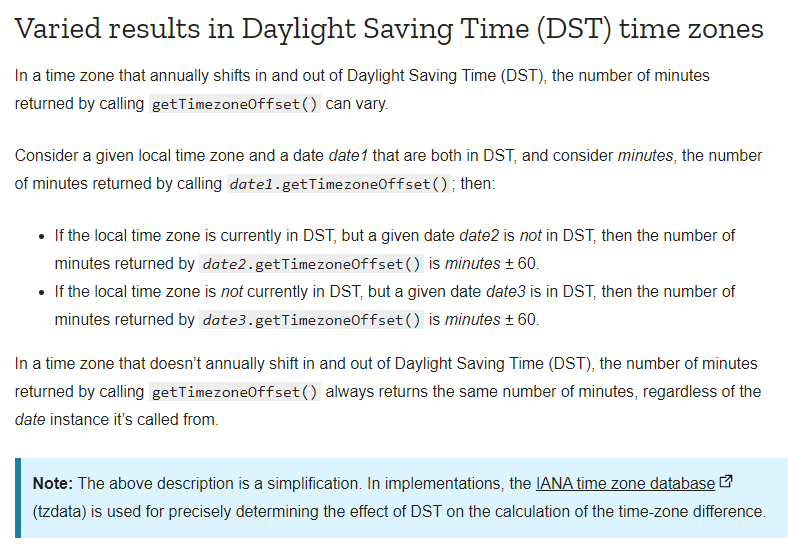
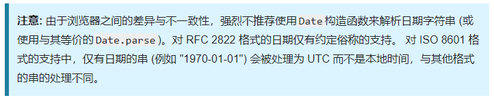
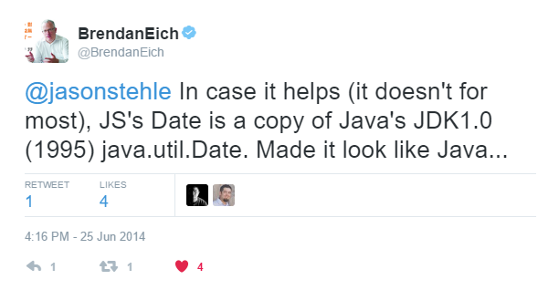
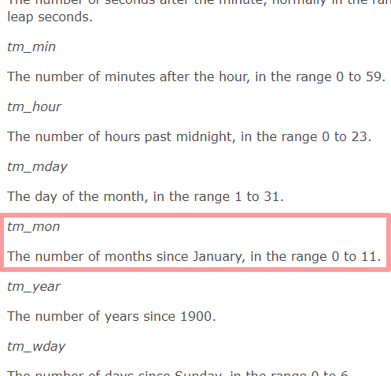
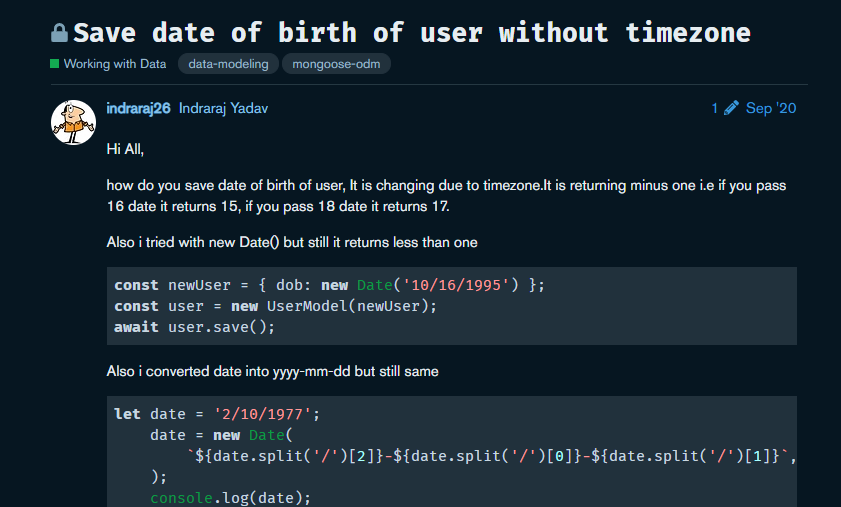

## 日期和时间的问题

我们是做HR系统的。

### case #1

有一天我们接到了一个客户投诉，他说他给候选人安排了一场上午10点的面试，但是候选人直到第二天下午才收到通知，结果就是面试黄了，客户很生气😡。

经过调查发现，这个客户和候选人他们都身在美国，而我们系统中存储的时间默认都是北京时间，所以他创建的面试时间实际上是北京时间的上午10点，自然后续的通知就错乱了。至于为什么之前大家都没有发现这个问题，因为国内都是统一的北京时间，感谢祖国感谢党。

经过这个事件后，我们决定将系统中所有的日期和时间都更换成带有时区的格式，这样HR在创建面试的时候，我们就知道这是美国时区的上午10点，后端服务在做时间比对的时候也能正常识别。

### case #2

但很快我们又接到了一个用户投诉，他说自己明明是在12月31号入职的，但是系统中显示的却是第二年的1月1号，因为入职时间差了一年导致自己享受不到很多公司的福利政策，客户很生气😡。

经过调查我们发现，此人的入职办理地点是在中国，而随后他就前往了美国办公，系统中存储的入职时间是北京时间12月31日0点0分，在美国境内展示的时候转换到当地时区就变成了第二年的1月1日，结果导致当地的HR把他算作了第二年入职。

经过这个事件后，我们决定将系统中有关日期和时间的逻辑调整为：**颗粒度精确到天的时间不保留时区，颗粒度精确到天以内的时间保留时区**。对于上面的例子，入职日期只是精确到了天，因而要按照没有时区的时间处理，以确保在全世界任何地方展示都是相同的。

### case #3

这样就可以了吗？精确到分钟的时间一定需要带时区吗？

假设你每天早上8起床，所以你的闹钟会在每天早上8点叫醒你，假设这个时间是带时区的，那么如果你被派往美国出差一周，你将生气地发现这个闹钟只在晚上响😡。

好吧你可能觉得闹钟比较特殊，不应该带时区。是吗？

因为挖矿的原因显卡很紧缺，作为一个臭打游戏的你很是苦恼，你预定了一个每天上午10点抢购显卡的闹钟。假设这个闹钟不带时区，那么如果你被派往美国出差一周，你将生气地发现闹钟响起的时候秒杀早就结束了😡。

🙄😨😵

以上只是涉及到时区的问题，实际上在开发过程中，还存在各种实现层面的问题。比如日期应该采用什么样的格式，应该用本地时区还是UTC，应该用时间戳还是字符串等等。

## 一些概念

先从一些日期/时间相关的概念开始说起吧。

- **timestamp**：时间戳，这个应该都能理解，是相对于0时区的1970年1月1日0点0分0秒的**秒**偏移量。时间戳是一个时间点（瞬间），它同时包含了时间（秒偏移）和时区（0时区）两个信息，而且本身就是一个数字，便于存储和计算。缺点是对人的可读性很差，而且无法表示不带时区的时间信息。

> 不知道你有没有好奇过，对于1970年1月1日0点之前的时间，该怎么用时间戳表示呢？

说到时间戳，需要注意的是时间戳的单位是秒。有一些编程环境对时间的最小单位是毫秒，比如在javascript中，很多人以为`Date.now()`得到的是当前时间的时间戳，这是错误的，这个方法得到的是自从Unix纪元开始的毫秒数（见[这里](https://developer.mozilla.org/zh-CN/docs/Web/JavaScript/Reference/Global_Objects/Date/now)），你需要`Date.now() / 1000`才可以得到秒单位时间戳。这个小问题需要留意一下，有时候会有坑，不过大部分情况下不影响逻辑表达，本文后面不论是秒还是毫秒都一律用`时间戳`来表示这种概念，不然太罗嗦。

如果时间戳是用32位无符号整型存储的，那么可以算出来时间戳的上限大概是：

```
2^32 / 60 / 60 / 24 / 365 = 136年
```

如果是32位有符号整型存储，则上限大概是：

```
2^31 / 60 / 60 / 24 / 365 = 68年，大概是2038年
```

也就是说到2038年的时候，所有采用32位有符号整型存储的时间戳都会溢出，好刺激，这就是著名的2038时间戳危机。

因为这个问题的存在，现代计算机程序的时间戳都是用64位存储了。

- **GMT**：格林尼治标准时间，也就是0时区的时间，它是基于地球自转的天文观测得出的。
- **UTC**：协调世界时间，也是0时区的时间，他是基于原子钟校准得到的。

这两个概念比较类似，`GMT`之于`UTC`就好`土豆`之于`马铃薯`，如果你不是较真的科学家，你完全可以认为GMT和UTC两者是相同的，可以相互替换，因为二者都表示的是0时区的时间。

> javascript里`Date.prototype.toUTCString`和`Date.prototype.toGMTString`其实是一个函数

不过还是更建议使用UTC而不是GMT，因为从定义上说UTC是更精确的，这也是科学界都使用UTC而不是GMT的主要原因。UTC的全称是Coordinated Universal Time，至于为啥缩写成了UTC而不是CUT，其实还有一个故事。。如果你感兴趣可以看[这里](https://zh.wikipedia.org/wiki/%E5%8D%8F%E8%B0%83%E4%B8%96%E7%95%8C%E6%97%B6#%E7%B8%AE%E5%AF%AB)。

此外，你也可以认为**UTC等价于时间戳**，二者包含的信息是完全相等的。

- **DST**：夏时制，这个跟时区无关，指的是某些地方会在夏天把钟播快一小时（夏令时），到了冬天再拨回去（冬令时），主要是为了节省照明资源。DST其实是一个可以叠加在原有时区规则上的buff，决定是否将时间拨快或者拨慢一小时。

我国曾经在1986年到1991年期间短暂实行过夏令时和冬令时。结果发现省电效果并不是很显著，反而给人们生活带来很多不便，不适用于我国国情，随后就废弃了。美国至今仍然是夏时制，所以这些地区在换算时间的时候还需要额外考虑DST的影响，什么是糟粕？这就是糟粕。



幸运的是运行时环境通常会自动帮你做好转换，而且这个东西国内见不到，所以就不仔细介绍了。

最后是两个日期格式规范：

- **ISO8601**：一般长这样`2021-05-16`、`2021-05-16T15:10:37+08:00`或`2021-05-16T15:10:37Z`。ISO8601是目前最主流的表示日期的规范格式，也是最推荐的日期格式，详细的定义见[这里](https://en.wikipedia.org/wiki/ISO_8601)

- **RFC2822**：一般长这样`Sun, 16 May 2021 08:21:33 GMT`，这也是javascript中Date默认的toString的格式，详细规范见[这里](https://datatracker.ietf.org/doc/html/rfc2822#section-3.3)。RFC2822是非常老的一个格式规范，这种格式主要是便于人类阅读，而且设计之初只考虑了英文语言环境，对于代码解析的场景或者非英语国家的人用起来挺麻烦的，所以现在不推荐使用这种格式了。

## Javascript

在Javascript中，表示日期的类是Date，它是有时区的，不信你把一个Date对象log出来：

```js
console.log(new Date()); // Sun May 16 2021 18:00:00 GMT+0800 (中国标准时间)
```

可以看到，Date的输出格式是RFC2822，为什么不是ISO8601呢？这主要是因为兼容性的考虑，毕竟ISO8601是很久之后才出来的新规范，其实不仅是javascript，很多编程语言自带日期类型默认日期输出格式都是RFC2822，而新引入的API的输出格式通常都是ISO8601。Javascript提供了其他格式的输出方法，比如：`toUTCString`、`toGMTString`、`toISOString`、`toLocaleString`等等。

Date的构造方法支持RFC2822和ISO8601两种格式的日期时间表达式：

```js
new Date('2021-05-20T18:00:00+08:00');
new Date('Sun May 16 2021 18:00:00 GMT+0800 (中国标准时间)')
```

如果初始化Date对象的时候传入的是不带时区的格式，就会被按照本地时区解析：

```js
// 会被当成是本地时区
new Date('2021-05-20T18:00:00');
```

但是据MDN文档（见[这里](https://developer.mozilla.org/zh-CN/docs/Web/JavaScript/Reference/Global_Objects/Date/parse#parameters)）说不同浏览器之间存在差异，我没有详细考证，因此上面这种场景要格外注意。



这里还有个好玩的东西，我们知道javascript的Date有一个非常怪异的行为：天是从1开始计数，而月是从0开始计数，比如：

```js
const date = new Date('2021-01-01 00:00:00');
date.getDate(); // 1
date.getMonth(); // 0，实际表示的是1月
```

很多人以此嘲笑javascript，但实际上javascript的Date逻辑最初是从Java的`util.Date`抄过来的，这其实是Java的行为。。



（原文在[这里](https://twitter.com/BrendanEich/status/481939099138654209)）

但是你也别急着喷Java，因为Java是按照POSIX C的标准实现的：



（原文在[这里](https://linux.die.net/man/3/localtime)）

POSIX C之所以这么设计，主要是因为月的范围很固定，就是1-12，设计成0开始计数会有利于数学计算，而天的范围不固定，可能是1-28、1-29、1-30、1-31，无法单纯使用简单的数学计算，因而就设计成了从1开始计数迫使你放弃纯数学计算的想法。POSIX C中除了月以外，星期、小时、分、秒也都是从0开始计数的，原理同上。

## Java

在Java中，与日期和时间相关的类有`Date`、`LocalDateTime`、`ZonedDateTime`。看似很多，其实很好区分：`Date`是旧API，本身不带时区信息而且存在线程安全问题，所以Java 8引入了`LocalDateTime`和`ZonedDateTime`，二者的区别正如名字所说，一个不带时区，一个带时区。

因此，在Java中建议使用新的`LocalDateTime`和`ZonedDateTime`来处理日期时间逻辑，不建议使用旧API，网上也有很多文章告诉你如何从旧的Date迁移到新的API，比如[这篇](https://hackernoon.com/going-on-a-date-with-java-9bdac2c950b3)。

## MySQL

在MySQL中，主要的日期和时间的格式有DATE和DATETIME两种。其中，DATE类型的格式是`2021-05-16`（精确到天），DATETIME的格式是`2021-05-16 18:00:00`（精确到秒）。

当然DATE和DATETIME除了精度的区别外，另一个重要的区别就是**DATE与时区无关，DATETIME与时区有关**。那这里就有一个问题了，DATETIME的格式是`2021-05-16 18:00:00`，看上去没有包含时区信息啊，它是怎么做到跟时区有关的呢？

MySQL其实是在数据库实例内部维持了一个时区的配置，DATETIME实际表示的是在这个时区下的时间。比如在东八区，那么你看到数据库中所有的DATETIME都是东八区下的本地时间。如果这个时区的配置发生变化，MySQL会自动将所有DATETIME类型的时间转换到新的时区。

而从MySQL中直接查询得到的DATETIME输出格式默认并不携带时区信息，你需要手动将其转换成带时区的格式，比如使用`DATE_FORMAT`这样的日期转换函数，或者手动在外部代码中处理。同样的，在insert或者update的时候，传给MySQL的DATETIME类型也都只能是不带时区的格式例如`YYYY-MM-DD HH:mm:ss`，如果你想直接insert一个ISO8601格式的字符串，就需要借助`STR_TO_DATE`这样的日期转换函数。

## Mongo

在Mongodb中，时间是统一使用Date类型管理的（见[BSON](https://docs.mongodb.com/manual/reference/bson-types/#date)的定义），底层存储使用的是64位的时间戳，换言之，你可以认为Mongodb里的日期都是UTC。

当你想储存不带时区的日期时就会遇到麻烦了，比如生日这种东西。stackoverflow上搜索"How to save birth date in mongodb"你会看到各种各样的方案，比如：



大多数的做法都是将生日转换成UTC时间保存然后查询后按照UTC时间解析，其实本质上还是得靠特殊约定+额外代码兼容，并不是很方便。当然也可以选择当成普通的字符串保存，但这样会损失格式校验和一部分的操作能力。

## 我该怎么做呢？

对于Web项目，日期/时间的规范应该遵从以下几个原则（重要性从高到底排列）：

1. 信息完整且够用。不能出现歧义或者信息缺失。
2. 开发维护成本低。比如写法简单，不容易写错，对人可读性好，对不同情况能够良好兼容。
4. 性能好。比如存储效率和计算效率等。

带时区还是不带时区，这是一个问题。文章一开头的例子其实已经充分说明了不同场景对时区的需求是不同的，很难找到一种一刀切的做法（至少我目前还没找到）。所以，很不幸，要想保证信息完整且够用，只能具体情况具体分析。😑

当然，前面说的那些经验，比如“精确到天不带时区，精确到天以内带时区”、“表示瞬间带时区，表示一个时间范围不带时区”这些规则还是有一定参考意义。此外，你也可以用如下的检验法则来验证：

```
若时区发生变化，时间是否也应该发生变化？
如果是，那么你应该用带时区的时间。
如果不是，那么你应该用不带时区的时间。
```

在时间的表示上，建议使用时间字符串而不建议使用时间戳，因为时间戳无法表示不带时区的时间信息，可读性不好，而且还存在单位不统一的问题（有的是秒，有的是毫秒）。

```js
const date = 1621763406615; // 不推荐
const date = '2021-05-20T18:00:00+08:00'; // 推荐
```

对于时间字符串，必须符合ISO8601规范，并且严格规定，带时区的时间一定要有时区，不带时区的时间一定不能有时区，不存在省略时区的情况。这样就能确保当你看到一个日期/时间字符串不会产生歧义：

```js
// 不允许非ISO8601规范的日期格式
'Sun May 16 2021 18:00:00 GMT+0800 (中国标准时间)' // 禁止，不符合ISO8601规范

// 不带时区的时间，表示与时区无关的时间
'2021-05-20' // 允许，精确到天
'2021-05-20T18:00:00' // 允许，精确到时间

// 带时区的时间，表示与时区有关的时间
'2021-05-20T18:00:00' // 禁止，不能省略时区
'2021-05-20T18:00:00+08:00' // 允许
```

确定好有无时区以及时间的表示方法，还有一个时区的选择问题。有些人建议系统中的所有日期/时间都统一采用UTC时间，这样做确实可以一定程度简化代码，但我个人不建议唯UTC论，因为设想这样一个场景：5月的一天下午，你坐在办公室（北京）里摸鱼，看到基金又跌了，你心情有点沉重，于是问旁边的人：“现在几点了？”，如果他回答告诉你，“现在是UTC时间4点”，你可能会觉得他脑袋有问题，我们在北京，你告诉我UTC时间干嘛？

使用本地时区时间，这是最符合直觉的策略。开发和理解起来是容易的，而且这种做法可以兼容以前没有考虑时区的历史遗留数据。不用担心使用本地时区会造成混乱，只要带有时区信息，时间的解析、处理就是统一的逻辑，不会造成歧义。即使是系统间的通信（比如API），也建议尽可能返回本地时区的时间。比如服务器在美国，那么API中返回的时间就是美国时区的时间，服务器在中国，API返回的时间就是中国时区的时间。这样做还有一个好处是这些时间还额外包含了时区信息，呃，我的意思是“时区的信息”。比如当你看到从客户端发来的数据是一个美国时区的时间，那你就知道了哦这个用户当前在美国呢，如果都是使用UTC时间，你就无法得知这个信息了。这个信息有时在调查一些bug的时候很有用。

当然，使用本地时区的时间会给开发带来一定成本，因为很多编程语言和库默认在输出ISO日期格式的时候都是输出成UTC。所以这一点看情况吧，总之：

```
优先选择本地时区（需要注意开发成本）
其次使用UTC（需要注意兼容历史数据）
```

## 参考资料

- [Javascript Date.now()](https://developer.mozilla.org/zh-CN/docs/Web/JavaScript/Reference/Global_Objects/Date/now)
- [为什么叫UTC而不是CUT](https://zh.wikipedia.org/wiki/%E5%8D%8F%E8%B0%83%E4%B8%96%E7%95%8C%E6%97%B6#%E7%B8%AE%E5%AF%AB)
- [ISO8601](https://en.wikipedia.org/wiki/ISO_8601)
- [RFC2822](https://datatracker.ietf.org/doc/html/rfc2822#section-3.3)
- [不建议使用字符串构造Date对象](https://developer.mozilla.org/zh-CN/docs/Web/JavaScript/Reference/Global_Objects/Date/parse#parameters)
- [Javascript的Date行为来自Java](https://twitter.com/BrendanEich/status/481939099138654209)
- [POSIX C localtime](https://linux.die.net/man/3/localtime)
- [如何在Java中处理日期](https://hackernoon.com/going-on-a-date-with-java-9bdac2c950b3)
- [MongoDB BSON date](https://docs.mongodb.com/manual/reference/bson-types/#date)
