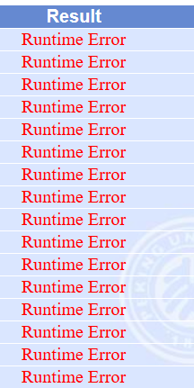

## 你知道编译时和运行时吗

编译时（compile-time）和运行时(runtime)，这两个概念在计算机编程中非常非常重要，很多问题或者特性都与他们有关。如果你还不知道这两个概念，那赶紧去网上查阅相关资料，一定要弄懂。

很多小伙伴都能正确理解，但是他们并不会使用，或者说没有将这两个概念融入到思考问题的过程中。

例如，面试的时候我经常问的一个问题是：

> babel-loader和babel-polyfill的区别是什么？

很多人都能回答上来：babel-loader负责将es6/7/8语法转换成es5，babel-polyfill负责实现一些低版本浏览器没有的API，例如Array.prorotype.includes。

紧接着我会再问一个问题：

> 为什么要分bebel-loader和babel-polyfill呢？能不能合并成一个呢？

到这里就有不少候选人卡住了。对啊，为什么要分两个呢？是因为一个工具只干一件事情吗？不是的。根本的原因就在于他俩一个是作用在编译时，一个是作用在运行时，没法合并呀。

记得我最开始学习编程的时候，经常遇到的一个错误叫做runtime error。



看着很可怕对不对，同宿舍的竞赛大佬告诉我，别怕，大概率就是数组越界了。单步调试后发现果然如此。当时青涩的我只是默默在心中将runtime error和数组越界划上了等号，直到后来我学会了compile-time和runtime再回想起这个事情，才恍然大悟。

## 静态与动态

编译时和运行时听上去过于学术了，其实粗略来看，他们最大的区别是“是否依赖代码的运行”，就像一辆车，当车静止的时候，你看到的特性都是编译时的，当车跑起来的时候，此时你看到的特性才是运行时的。

所以，“编译时”和“运行时”，通常也对应着“静态”和“动态”。

## 静态万岁

考虑下面的例子，定义了两个常量：

```js
const ACTIONS = {
  GET: 0,
  CREATE: 1,
  UPDATE: 2,
  DELETE: 3,
};
const ACTION_NAMES = ['GET', 'CREATE', 'UPDATE', 'DELETE'];
```

有些人可能会觉得上面的代码产生了冗余，于是给`ACTION_NAMES`重构成这样了：

```js
const ACTIONS = {
  GET: 0,
  CREATE: 1,
  UPDATE: 2,
  DELETE: 3,
};
const ACTION_NAMES = Object.keys(ACTIONS); // 重构成这样了
```

这种写法是没错的，但这样产生了一种微妙的变化，即，原来`ACTION_NAMES`的定义是编译时可以确定的，现在要到运行时才能够确定了。假设出现了下面的代码：

```js
const name = ACTION_NAMES[4];
```

如果`ACTION_NAMES`是第一种方式定义的，那你就可以推断出这里的name是不存在的（因为ACTION_NAMES长度是4），而第二种方式的定义是做不到的（因为ACTION_NAMES只有在代码执行的时候才知道是什么）。

显然，静态写法更有利于代码的分析和检查，尽早暴露一些错误，避免上线了运行的时候才发现，从而能够极大地降低开发成本。

我们所熟知的typescript就是基于强大的静态分析能力才会被大家评价为真香，原本javascript编译器只具备语法层面的检查（syntax），而typescript通过引入类型系统为其增加了语义检查（semantic）。

## 动态万岁

凡事都是有利有弊的，静态写法最大的问题就是缺少灵活性。前面举的`ACTION_NAMES`的例子其实也可以反向说明静态写法的问题。假如我们想要增加一种action，那么就需要同时修改`ACTIONS`和`ACTION_NAMES`两处代码，实在是太蠢了。

```js
const ACTIONS = {
  GET: 0,
  CREATE: 1,
  UPDATE: 2,
  DELETE: 3,
  OPTION: 4, // 新增一种
};
const ACTION_NAMES = ['GET', 'CREATE', 'UPDATE', 'DELETE', 'OPTION']; // 这里也要修改
```

这里再举一个更有代表性的例子。前端项目在编译的时候有一个相当重要的概念叫做“public path”，什么意思呢？就是当你想访问一个资源的时候，应该去哪找这个资源。比如下面的test.js这个资源的publicPath是`https://blog.lishunyang.com/`。

```html
<script src="https://blog.lishunyang.com/test.js"></script>
```

现在有个需求，要求代码部署在测试环境的时候publicPath是源站，部署在线上环境的时候publicPath是cdn域名。

如果选择静态方案，那么你就需要为测试环境和线上环境各build出一份“专用”的代码。

```js
// 这是测试环境的test.js的引用，走的是源站地址
const bundle = 'test.js';

// 这是线上环境的test.js的引用，走的是cdn地址
const bundle = 'https://static.lishunyang.com/test.js';
```

如果选择动态方案，那么可以公用一份代码，将publicPath暴露在运行时动态调整，例如:

```js
const publicPath = await fetchPublicPath(); // 这里调用一个接口动态获取
const bundle = publicPath + 'test.js';
```

显然动态方案更好，因为不需要每个环境都单独build一次，而且如果cdn突然挂掉了，要临时切换，也不需要改代码，只需要调整`fetchPublicPath`接口的返回值就可以了。

> 打包工具都支持运行时的publicPath，例如webpack的`__webpack_public_path__`就是干这个事情的。

## 从静态和动态的角度思考问题

> 我个人更推荐使用“静态”和“动态”而不是“编译时”和“运行时”的说法，因为“编译时”和“运行时”容易让人局限在编译器或者代码层面。

任何一个有实际功能的应用程序，都是既有静态的部分和静态的部分。静态的部分至少要包含符合语法规范的代码，而动态的部分至少会包含运行时的外部环境。为了实现所需的功能，静态的部分多一些，动态的部分就相应少一些，反之亦然，二者是相互补充的，就像势能和动能之合总是守恒一样。

有关编译时（静态）和运行时（动态）的例子还可以举出很多。但这篇文章不是用来告诉你什么时候应该用哪个。因为通常你都需要结合具体上下文分析和折衷。这篇文章是希望你能重视起这两个概念，当你遇到一个新方案或者新问题时，试着从编译时和运行时的角度分析一下，也许有不同的发现。

比如依赖注入（DI），其实就是将模块依赖的管理方式从编译时转移到了运行时，从而实现了更灵活的代码复用。

比如CSS变量（variable），其实就是给CSS增加了一定运行时能力，以实现动态改变CSS效果（例如CSS主题）。

比如SSG（Static Site Generate），其实就是提前将运行时渲染的页面提前渲染成静态页面，从而加速了页面生成和渲染的速度。

比如JamStack，其实就是把前端应用静态化了，因而可以去掉web server层，通过oss直接托管页面。

比如treeshaking，其实就是利用静态分析能力去除dead code，毕竟是静态分析，对写法有一定要求，无法做到100%去除无用代码。

最后，不要过分迷恋或者追求某一种能力，静态和动态二者是相辅相成的，要两条腿走路，不要偏科。
