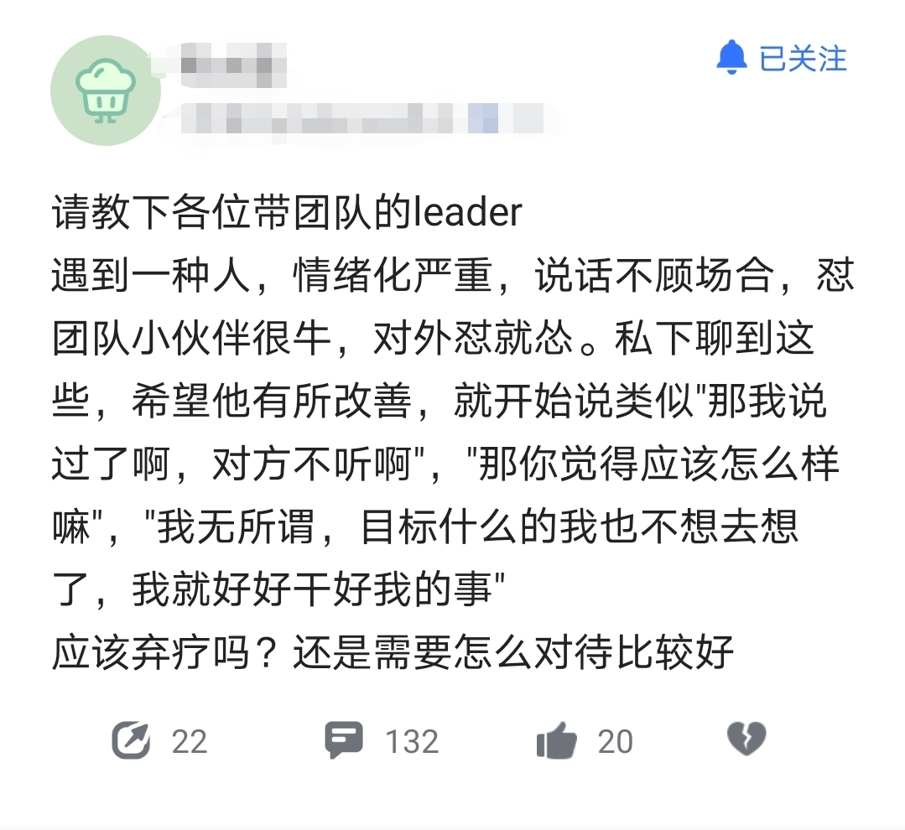

## 一个例子

前几天在脉脉上看到一个问题：



在我最初做管理的时候，也遇到过一个类似的同学，他的能力和产出都很优秀，唯一的缺点不太听话，喜欢怼人，比较难配合。怎么讲呢？例如你在团队里宣布一件什么事情，如果他不高兴，就会公开怼，而且表现得很不配合，语气很冲，带着情绪，严重了直接撂挑子。有一部电视剧叫《山海情》，跟里面的大友叔特别像。


由于个人能力强，他在团队中也有一定的影响力，有时候他的情绪也会影响到团队，因此，跟他沟通或者分派事情，通常都会比较费劲，需要额外花费比较多的精力做解释和疏通，效率特别低，而我也很难受。

怎么办呢？沟通疏导也做了，改进效果比较有限。要淘汰吗？说实话他个人工作能力确实挺强的，有点舍不得。看上去沟通成本高一些罢了，好像也不是什么严重的问题，于是他就一直这么待在团队里。

直到后来有一天他离职了，跳槽去了其他公司。然后我就突然发现，团队工作变容易了。跟大家同步事情或者安排工作都变得非常顺畅，对比太强烈了，似乎跟换了一个团队似的。

## 管理成本也是用人成本

其实在面试的时候也会遇到类似的情况，比如某个候选人能力很好，但是在软性素质上有点问题，比如固执己见、骄傲自大、喜欢否定他人等，总之就是沟通起来比较累。这样的候选人，我会倾向于挂掉，因为他们的管理成本很高，拉高了总体用人成本，降低了招聘的性价比。我会用下面的公式考察一个候选人的用人成本：

```
用人成本 = 薪资成本 + 管理成本
```

那么什么叫管理成本呢？这很容易理解，管理成本就是管理者为了维持团队成员的正常产出不得不投入在他身上的时间成本。比如一个管理者时薪300块，每个月需要花大概10个小时在某位员工身上，那么这名员工每个月的管理成本就是：

```
300 * 10 = 3000 元/月
```

所以你看，对于那些能力强产出很好的员工，假如他们的管理成本也比较高，综合一盘算，可能也会变得毫无性价比。

## 管理者应该警惕管理成本

因为一个人的精力是有限的，在一些事情上投入更多的精力，就一定会导致投入在另一些事情上的精力变少。在管理岗位上，你必须搞清楚自己应该做什么，不应该做什么，权衡取舍。有一种说法是管理者最多只能集中精力做好3件事情，因此管理者的精力是非常宝贵的。

而高昂的管理成本，会过多耗费管理者的精力，让管理者原本应该去做的事情没有做好。管理者可能被迫陷入解决一些鸡毛蒜皮的小事之中，反而在团队发展培养、未来方向的规划思考上投入不足，导致团队做不出好成绩，发展不起来，辜负大家的期望。坦诚地讲，一个团队成功或者失败，管理者都应该负主要责任。

作为团队管理者，你必须注意团队的管理成本，要警惕过高的管理成本。别以为自己累点辛苦点也没什么，你这是对团队不负责任。

## 员工也应该警惕管理成本

管理成本，其实根本上是职业素养的缺失导致的。什么是职业素养呢？这个就很虚了，通常就是我们所说的软性素质，包括开放的心态、仔细认真、诚信、坦诚沟通、情绪管理能力，共情能力等等。一个人的职业素养有缺陷，结果就是必须要有外部的输入来填补，其中的一部分就来自于管理者的投入。比如前面的例子，如果一个人自我控制能力很差，经常把个人情绪带到工作中，就容易导致跟他人配合上的矛盾，就需要占用管理者的时间去协调解决。

职业素养这个东西主要是靠工作中不断打磨积累而成的。对于一些工作难度和门槛不是太高的岗位来说，一个有十年工作经验的老员工跟应届毕业生相比最大的区别，可能不在于职业技能，而是在于职业素养。

很多人在职场发展道路上只看见了专业技能的提升，忽视了职业素养的提升。显然这是有问题的，管理成本太高，会稀释你的个人价值。

你觉得自己的管理成本怎么样呢？

## 总结

管理成本，是一种很容易被忽略的隐形用人成本。别让它影响了你或者你的团队发展。
