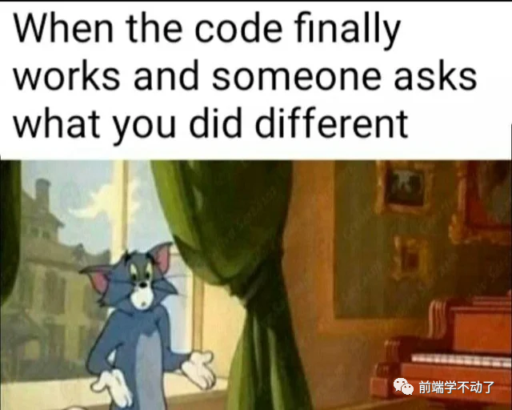

一个软件开发工程师水平怎么样，看看他是怎么修 bug 就知道了。最近，我们团队里要求大家在修 bug 的时候在 MR 描述中回答 7 个问题，简称 Bug7 问。这里都列出来，欢迎大家讨论。

## bug 调查

除了 chrome 开发者工具，你还会使用其他什么调试工具和方法吗？

你会去看错误信息日志吗？会移动端真机调试吗？会配置代理吗？会抓包吗？会脱离浏览器环境发送验证请求吗？

即使是 chrome 开发者工具，你又使用过哪些功能呢？能够在没有 sourcemap 的情况下去代码中定位问题吗？会根据点击事件定位代码位置吗？会打断点并且修改变量的值吗？知道 profiling 的各项指标是什么含义吗？看过堆快照里面都是什么东西吗？

能够在本地模拟线上环境吗？能够在不了解源代码的情况下定位白屏问题吗？能够模拟特定用户的登录吗？

## 确定修复方案

你知道这个 bug 引入的根本原因是什么吗？

你知道当初是谁在什么时候引入的这个 bug 吗？当初为什么会写成这样呢？

你思考过哪些修复方案？为什么选择这一种？

你改动了公共的方法吗？改动了公共组件吗？你思考过修复方案的影响范围是什么吗？

你确定你的改动方案一定可以解决这个问题吗？

你思考过这个 bug 会不会还出现在其他地方吗？

你思考过这个 bug 是否值得分享给其他人吗？

## 三个阶段

1. 初级阶段：自己都不知道在做什么

不知道到底是什么原因引起的，看上去是这里出了点问题，那就这里改改，然后验证一下，好像没问题了，哦？哪里好像又坏了，再改改，好像都没问题了，嗯 bug 修好了，上线吧。

初级阶段可能都不一定能保证 bug 真的被解决了，属于碰运气，可能解决了，可能没解决，还可能引发更大的 bug。

2. 中级阶段：就是修 bug 而已

知道 bug 的根本原因是什么，经过个人的思考和斟酌，在若干方案中选择了一个，修复完本地自测没问题，上线，问题解决！

中级阶段，可以基本保证 bug 确实是被解决了，而且修 bug 的效率很快方案也可维护，但是呢，也就仅限于此了（对比高级阶段）。

3. 高级阶段：不仅仅只是修 bug

知道 bug 的根本原因是什么，此外还通过 git blame 等方式追本溯源到最初引入的时刻，以及当时做什么引入的，尝试思考和理解当时写下这段代码的人是怎么考虑的。确实是漏考虑了？还是有一些特殊原因特意写成这样？在修复方案上反复斟酌，不但得把 bug 修复了，而且在写法上可以避免相同的问题发生，同时对代码的侵入性尽量小回归范围尽量可控。修复完成后在项目中又搜一搜看看还有没有其他类似的可能出 bug 的地方，如果有，则看情况一并修复还是记录优化任务单独再修。不但本地自测，还会去测试环境验证，最后上线了总觉得不放心还得再去线上环境亲自验证一下。典型的问题沉淀到文档中，分享给团队其他人，帮助大家一起进步。

可以看到，高级阶段是经历了大量的思考过程，不但完成了 bug 的修复，还同时加固了项目的整体质量，沉淀了文档对外输出分享，对个人而言也是一种经验的积累，修一个 bug 产生的个人思考和经验积累鼎别人修 10 个。

你在什么阶段呢？
