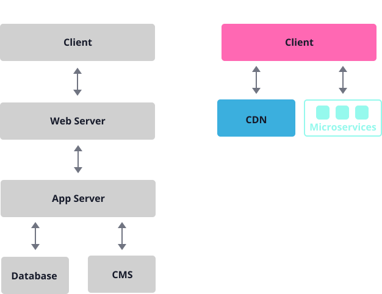

最近趁着十一假期，把博客从腾讯云服务器上迁移到了对象存储和 CDN 上，算是实现了 jamstack。很久没折腾了，突然挺感慨，不得不说相比于过去，现在要想搭建一个站点实在是容易太多了。这里就简单记录一下迁移的过程。

## 自己搭建博客

在开始之前，我还是想再啰嗦几句为什么要自己搭建一个博客。

自己搭建博客最大的意义在于，它可以让你对 web 应用的开发、部署、发布等整套流程有一个非常深刻的了解。这个过程涉及到网络、后端、运维、安全等多个领域的知识，它们非常重要，了解这些知识对于排查和解决疑难问题，设计前端应用架构都很有帮助。而且，这些东西平时在日常开发的时候很少会接触到。

此外，自己搭建博客意味着你对博客有着 100%的控制权，你可以用任何你喜欢的技术将它改造成任何你想要的样子。

唯一的缺点嘛，就是可能要多付出一点儿银子。

## 博客架构变化史

和很多人一样，我的博客最早是用 github pages 托管的，用 hexo 做 SSG（Static Site Generation）。这其实并不能算是自己搭建博客，因为大部分工作都是 github pages 帮你做完了，怎么发布的，怎么托管的你都不用操心。能做的事情充其量就是 cname 一个自己的域名和配置一个 ssl 证书，不过正因为此你才可以专注于写作。

github pages 最大的问题就是网络环境不稳定，原因大家都懂。博客应用最大的业务诉求不就是能够尽可能被更多的人访问到吗？因此后来我只好把博客迁移到了腾讯云服务器上。用 vuepress 做 SSG，nginx 做 web server ，github issue 做博客留言，google analatics 做埋点分析，从开发到部署发布一气呵成。需要注意的是，域名解析到国内服务器必须要备案，好家伙。此时的博客访问非常稳定了，一切似乎都很完美。

腾讯云服务器好是好，就是有点儿贵。我就托管一个博客，每个月微不足道的流量，即使购买最低配的腾讯云服务器一年也要大几百，有点儿冤。那会儿 serverless 开始流行起来，按需付费的概念深得我心，于是我又将博客迁移到了腾讯云函数计算上面（serverless），用 serverless 的 node 服务托管静态资源，顺便把 serverless 给折腾了一遍。具体见[这篇博客](https://blog.lishunyang.com/2020/03/migrate-to-serverless.html)。

不过腾讯云当时的 serverless 还是挺难用的，文档不全，bug 也多，后来我又迁移回了腾讯云服务器。

最近一次架构调整就是此次的 jamstack 了，其实像博客这种偏静态的应用场景是非常适合用 jamstack 架构的，于是就趁着假期折腾一把。

## 什么是 jamstack

jamstack，原来叫做 JAMstack，其中的 JAM 三个字母分别指是 Javascript，API，Markup。

jamstack 的第一个特征是前端静态化。通过 SSG 的方式生成纯静态前端应用，去掉后端 html 模板渲染过程，将前端项目与后端解耦，实现前后端分离。当然前后端分离不是 jamstack 特有的，任何静态化的前端项目都可以做到前后端分离。

jamstack 的第二个特征是没有 web server。过去的前端应用总得有一个 web server 来托管静态资源，通常都是 apache 或者是 nginx 实现的，而现在我们可以把静态资源直接扔到 oss（对象存储） 上托管用 cdn 加速，前端应用就好像图片、音频一样。

> jamstack 的更多信息见[这里](https://jamstack.org/)

jamstack 有什么好处呢？

最大的好处就是架构更简单了，链路更短，更可靠。这里直接引用 jamstack.org 上的一幅图：



此外，借助 oss 和 cdn 的高可用特性，无缝横向扩容，运维 0 成本。而且由于没有 web server，妈妈再也不用担心改线上 nginx 配置改出 bug 了。

那 jamstack 有什么限制呢？

最大的限制就是前端必须要完全静态化（ssg），会丧失服务端动态能力（ssr），对于新闻这种充满大量动态内容或者想做到千人千面个性推荐显然很吃瘪。

其次就是 api 必须跨域，某些情况下很难受。

## 算一笔账

其实 jamstack 还有一个好处就是便宜，当然这只是针对个人博客类的项目而言的。

如果使用腾讯云服务器的方式，最丐版的主机（1 核 1g 内存 1M 小水管带宽）目前包年的价格大概是 660 大洋（见[这里](https://buy.cloud.tencent.com/cvm?tab=custom&step=1&devPayMode=monthly&regionId=8&zoneId=800005&instanceType=SA2.SMALL1&vpcId=vpc-1qtljxia&subnetId=subnet-02bcuszf&platform=TencentOS&systemDiskType=CLOUD_PREMIUM&systemDiskSize=50&bandwidthType=BANDWIDTH_PREPAID&bandwidth=1&timeSpan=12)），其他云服务器价格大同小异。holy crap😱


而如果使用 jamstack，不需要租用服务器了，oss 和 cdn 都是按需付费，价格看上去相当便宜。

比如这是 oss，假设存储空间 1G，每月 100 万次读，1 万次写，回源流量 1G，算下来一个月只要不到 2 块钱（计算器在[这里](https://buy.cloud.tencent.com/price/cos/calculator)）：


cdn 的费用计算相对复杂一些，不过看这个表一个月就算有 10G 流量也就 2 块钱多点儿（详情见[这里](https://buy.cloud.tencent.com/price/cdn)）。


所以对于一般的个人博客来说，用 jamstack 后每个月也就几块钱，成本远低于服务器，是笔划算的买卖。

## 迁移过程

这里以腾讯云为例，阿里云华为云类似。

**这里需要注意：国内 cdn 服务商要求自定义域名必须经过备案才可以使用，如果没备案，得先去给域名备案才可以。如果选择海外 cdn 服务商就没这个限制了**

1. 创建 bucket。

进入腾讯云的对象存储服务（cos），创建一个新的 bucket（桶），专门用来存放我们的前端构建产物，这里需要注意的是权限要选择公有读私有写（毕竟要给 cdn 回源用）：


2. 配置静态网站。

进入刚才创建的 bucket，在基础配置中开启静态网站功能，非常傻瓜。如果不开启，访问 oss 里的 html 资源会被当成普通的文件下载，开启后才可以被浏览器正常按照 html 解析。


3. 添加 cdn 加速。

去“域名与传输管理”中，添加一个自定义 cdn 加速域名：


4. 配置自定义域名。

添加完自定义 cdn 域名后，会自动给你一个 cname 域名，你需要把这个域名配置到你的域名上：


5. 配置 ssl 证书。

在做完 3 后，系统应该会在内容分发网络下自动给你创建好对应的 cdn 服务：


这里点编辑配置，在 https 一栏配置好你的 ssl 证书，顺便开启 http2 和强制 https 跳转：


另外还有一些其他配置，比如缓存策略啦，流量封顶啦之类的，默认的就可以了，也可以自己去折腾折腾，这里就不详细介绍了。

做完以上这些，就算是正式迁移到 jamstack 上了，以后每次发布的时候，只需要把构建出来的静态资源一股脑扔到对应的 bucket 里就可以了。当然这个过程可以通过 github actions 实现自动部署。

比如我的 workflow 是这样：

```yml
name: Deploy Tencent COS

on:
  push:
    branches: [master]
  pull_request:
    branches: [master]

  workflow_dispatch:

jobs:
  build-and-deploy:
    runs-on: ubuntu-latest

    steps:
      - name: Checkout source code
        uses: actions/checkout@v2

      - name: Setup node enviroment
        uses: actions/setup-node@v2
        with:
          node-version: '14'

      - name: Install dependencies
        run: npm install

      - name: Build static site
        run: npm run build

      - name: Upload to TecentCloud COS
        uses: TencentCloud/cos-action@v1
        with:
          secret_id: ${{ secrets.TENCENT_CLOUD_SECRET_ID }}
          secret_key: ${{ secrets.TENCENT_CLOUD_SECRET_KEY }}
          cos_bucket: ${{ secrets.COS_BUCKET }}
          cos_region: ${{ secrets.COS_REGION }}
          local_path: docs/.vuepress/dist
          remote_path: /
          clean: true
```

其中`TENCENT_CLOUD_SECRET_ID`、`TENCENT_CLOUD_SECRET_KEY`、`COS_BUCKET`、`COS_REGION`是 repo secret，对应的含义可以看[这里](https://github.com/marketplace/actions/tencent-cos-action)

做完上面这些，每次写完博客，只需要 push 到 github 上，就会触发 workflow，自动构建并上传到 oss 上，实现自动发布了。

## 一点感受

这次的迁移过程比原来迁移到 serverless 简单多了，从上手到完成一共就折腾了不到 1 个小时，大部分配置都可以看懂，个别地方查查文档就够了。而且 oss 本身就支持静态资源类型，看来是早有打算。不得不说腾讯云这一年来迭代了不少东西，感觉搭建个人博客越来越傻瓜了，体验真的不要太爽。从体验这个角度上看，jamstack 确实是一种先进的架构。

但凡事都是两面的，jamstack 这种博客搭建的方式，虽然傻瓜方便了不少，但也从此跟云服务商深度绑定在一起了，具有基础设施依赖。假如某一天想迁移到其他云上面，还是得再折腾一遍，而传统的服务器方式是不存在这个问题的。这个问题也许会比想象的严重一些，因为国内的服务商似乎都比较喜欢干跑马圈地的事情，本来没事儿愣是搞出一些恶心的限制，强行增加用户的迁移成本，目的是给自己的产品增加壁垒。

另外一个遗憾，就是失去了对底层的控制（oss、cdn），变得黑盒起来。假如未来人人都是用这种方式搭建博客，黑盒的部分没什么知识储备，如果出了什么问题就只能抓虾了。从学习的角度看，其实是不利于开发人员系统地学习全栈流程的。不过这个遗憾也不是很严重，就好比原来大家都是开手动挡的车，自从出现了自动挡，大家都去开自动挡了，手动档的车反倒不会开了。

emmm，从学习的角度上看，云服务器还是不能退掉，还是得继续折腾才行。（怎么好像反而比原来花的钱更多了）
