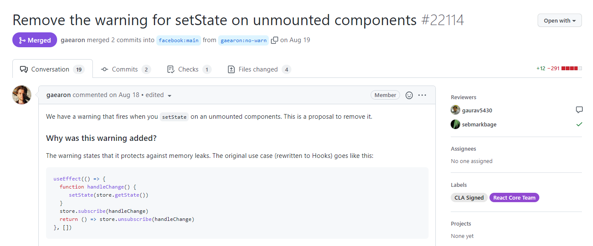

我们团队里之前有这样一个同学，从事前端工作 3 年多了，做过不少项目，有一定的工程经验积累；对技术也很有热情，一直在坚持自学，技术广度很深度都很好。

从技术的角度上看，这个同学确实挺不错的（当然这也是我们把他招进来的一个重要原因），但他有一个致命缺点：写代码 bug 比较多。甚至都不需要分析统计数据，跟他配合过的测试同学没一个不吐槽的，甚至测试同学拒绝上线他的 hotfix。

是他写代码不够细心吗？对代码不够重视吗？跟他聊过以后我否定了这些猜想。这到底是什么原因呢？

后来 review 了几次他的代码，我想我大致找到了原因。

## 恶魔之手

你身边是否有人经常把东西搞坏呢？比如手机进水了，杯子摔了，拉链松了，衣服划破了。我表哥就是这样的，小时候我借给他的任何东西（玩具、文具、书本等等），等还给我的时候基本没有一件是完好的，总会出现各种各样的问题。

我发现总有一类人特别容易把东西搞坏，同样的东西，别人用着好好的，一到他手上没多久就坏了。仿佛他的双手是一双恶魔之手，碰到哪里哪里就坏掉。

类似地还有一类人，他们总爱丢东西。比如我以前的室友，他的手机从来没有用着超过一年的，要么是被偷了，要么是不知道丢在哪了，总之用着用着就丢了。

这是为什么呢？我曾经特别仔细思考过这个问题，根据我的观察和推测，问题的原因可能跟他们的成长环境有关。

比如我小时候家里并不是十分富裕，买来的玩具我都非常珍惜，因为我知道一旦玩具弄坏了或者弄丢了，我就没得玩了。但那些家里有钱的小朋友就没有这个顾虑，玩具弄坏了弄丢了那就再买一个好了，几乎没有任何影响。长此以往，我从潜意识里对待每一件经手的东西都会格外认真仔细，而那些家境富裕的小朋友就不会有这样的潜意识。当我们长大以后，就表现为上面说的情况了。

小时候受过痛遭过罪，未尝不是一件坏事呢。因为痛苦可以加速成长的过程，**痛苦 + 反思 = 成长**。

回到之前的那个同学，也许就是因为他刚开始工作的时候，没有经历过正规严格的代码规范，或者没有经历过大型复杂项目，总之代码怎么写都行，放飞自我，然后从潜意识里养成了一种粗糙的编码习惯。他也很苦恼，不是故意要写出 bug 的，只是他可能压根没觉得自己哪里有问题。

## 别怕纠结

以前我写代码的时候总是会各种纠结。比如到底应该用这种写法还是那种写法呢？应该这样命名呢还是那样命名呢？有时候我会纠结好几天，甚至可能推翻原来的代码重写一遍。

在我们没有足够编程经验的时候，纠结是很正常的现象，甚至是一种好的现象。因为纠结的根本原因是有多种选择，这说明你找到了多种解决方案，证明你解决问题的能力强。相反，如果你似乎从来没有遇到过那种特别纠结的情况，或许说明你还比较菜。其次，纠结伴随着思考。团队里经常有一些同学找我聊一些编码上纠结的点，这是一种非常好的行为，说明他们思考了很多东西。还记得前面提到的成长公式吗？**痛苦 + 反思 = 成长**，根据我的观察，在写代码上纠结的同学，确实提升的更快。

我记得我最早接触到设计模式这个东西就是因为写代码感到纠结，总觉得怎么样都不好，然后就去找资料，发现原来还有一种东西叫设计模式，打开了一片天地。

## 多思考

以前我在做 code review 的时候，会遇到这样一种同学：你说怎么改他们就怎么改，非常听话，但是也完全没有互动。review 这样的同学的代码，总会让我觉得不放心，因为我感受不到他们的思考过程，就好像全都是在靠 reviewer 做决策和兜底，显得一点也不专业。

为了转变这种情况，后来我改进了一下自己的 review 的方法。简单来说就是多问问题。比如：“这里为什么要这样写？”，“有其他设计方案吗？”，“为什么要做这个调整？”，“其他地方是怎么处理的？”。好的 code review 不光是要告诉你代码哪里不对该怎么改，而且更应该引发思考。带着思考去写代码，跳出具体编码环境总结沉淀出一些通用的观点，这才是最大的提升。

code review 最生气的时候，是遇到一些完全不动脑子的代码，专治低血压：

- 无脑仿写。比如看到原来的代码这样写，新的代码也仿照之前的结构去组织，但实际上原来的代码结构并不适合新的逻辑，应该重新设计。尤其是一些代码底子比较烂的历史项目，你对着屎仿写，写出来的也只能是屎。

- 无脑瞎试。通常发生在修 bug 的代码中，哪里看上去不对就哪里打个补丁，补丁落补丁，直到测上去没问题了。这种代码，测试用例也跑了通过了，但到了正式测试阶段还是各种 bug 不断，文章一开头提到的那个同学就是这种。

- 无脑修改。比如我给了一个建议，指出某个地方的写法不好需要调整，过了一会儿对方说已经按照修改意见改完了，我一看，就把我说的地方改了，代码当中其他类似的需要修改的地方，因为我没说就没改。

这几种情况就是非常典型的没有思考的表现。思考非常浅，就停留在表面上，可表面上能有多少东西呢？如果仅停留在表面，很快你就学习不到新东西了，之后的工作真的只是在“搬砖”而已。

## 不要重复犯错

我还清楚得记得我正式工作第一次被别人 code review 的场景。当时我的代码写完了，愉快地提交了一个 PR，reviewer 指出了我的代码里残留了一些`console.log`没有删除。我当时感到特别羞愧，因为这个问题实在是太不应该了，但凡我在提交 PR 之前自己先过一遍，就能发现这个问题。从此我给自己定了一条规矩，提 PR 之前一定自己先 review 一遍，确保不要再次发生这种低级错误。

遗憾的是，我发现不是所有开发同学都会严格要求自己，很多犯过的错误还是会反复出现。很明显的就是体现在 code review 的内容上，review 的时候总是会反复发现各种违背代码规范的问题。以前我的小学数学老师贼凶，如果昨天刚讲的题今天又做错，他直接把作业本上这一页撕下来揉成团摔到你脸上。如果 code review 的代码是打印在纸上，不知道我会不会也这样。

很多人都说，不要犯低级错误。在我眼中最大的低级错误就是重复犯错，如果你经常犯重复的错误，那在我看来就是一个很初级的同学，哪怕在团队中资历老，哪怕对项目和业务都很熟悉。

## 远离骚操作

我发现小团队里总有一些人喜欢用一些炫技的骚操作，看上去写出来的代码非常简短而且难以阅读。令人感到气愤的是，这种人往往在团队中特别容易被大家尊称为“大神”，被大家膜拜和模仿。WTF？

这些人往往容易觉得自己真的很牛逼，总觉得周围人都不如自己，孤芳自赏，然后待不了多久就跳槽去其他公司了，留下一坨难以维护的屎，让后面的人给他擦屁股。

如果你是一个刚入行没啥经验的小白，被忽悠了不怪你，但以后千万不要变成这样，或者千万不要以这样的人为榜样，答应我，好吗。

真正的高手，写出来的代码可能看上去非常幼稚。“就这？就这水平？”你可能时不时有这样的感慨，只能说明你跟高手不在一个层次上。比如借用我们的代码规范里关于是否需要代码复用的描述：

> 代码复用的境界：
>
> - 第一重，狗屁不懂，照猫画虎，全是复制粘贴。
> - 第二重，知道 DRY 原则（dont repeat yourself）并且尝到了甜头，见到重复代码就想合并。也许是因为接触到的项目规模都不大一个人就能 hold 住，或者是项目历史比较短，所以倒也没遇到什么大问题。
> - 第三重，因为过于追求代码复用开始遇到一些坑，比如改动一个地方另外一个地方坏了，或者代码里充斥了大量为了在不同场景下复用代码的 if 判断。渐渐地开始对 DRY 原则产生了怀疑。
> - 第四重，有点嫌弃甚至开始厌恶 DRY 原则，感到迷茫。尤其是当项目庞大或者历史悠久以后，代码耦合带来的问题比代码冗余带来的问题严重多了，有时候会过犹不及写出如“实习生”般大量冗余的代码被世人所嘲笑。第四重是一劫，很多人滞留在这里非常久时间甚至出不去了。
> - 第五重，经历九九八十一难，九九归一，人剑合一。何时抽象何时冗余大部分时候都了然于胸，基本不再迷茫，笑看各路英雄豪杰代码。
> - 第六重，看破红尘，代码的好坏终究只是技术细节，业务才是王道，于是转行干别的去了。

开发成本和维护成本，应该尽量保障后者。

## 多看优秀代码

谁说 code review 一定得是找大佬 review 我的代码了？你也可以反过来 review 大佬的代码呀，看看大佬是怎么写代码的，拓宽一下思路，因为光靠自己琢磨还是太慢了。

谁说一定得 review 团队里大佬的代码呢？开源社区的大神多了去了，随便你去 review 啊。

比如[这个 Dan 的 PR](https://github.com/facebook/react/pull/22114)

整个 PR 新增了 12 行代码，删除了 291 行代码，看上去就是一个微不足道的小改动，但是你看看人家的 PR 描述，浓缩了非常多的充分的思考，这就是大神。

## 后记

写代码是一名开发工程师最最最最重要的基本功。我们在面试的时候也一直强调一定要做编程题，因为作为一名开发工程师，日常的工作内容就是写代码。如果不考察编程题只是问几个技术问题，怎么能保证候选人能够胜任这份工作呢？

以上就是一些 code review 之余的小感慨，希望能帮到你，祝你在写代码的道路上不断精进。
