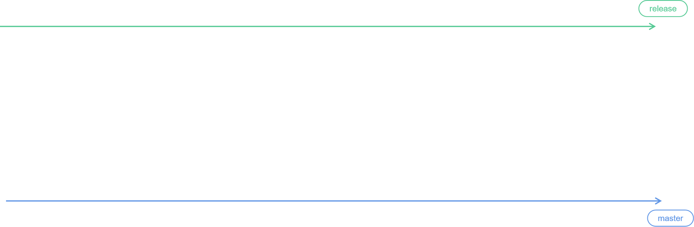
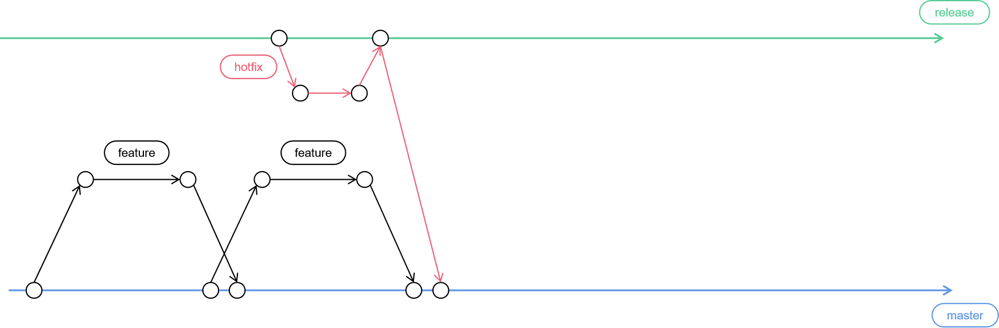
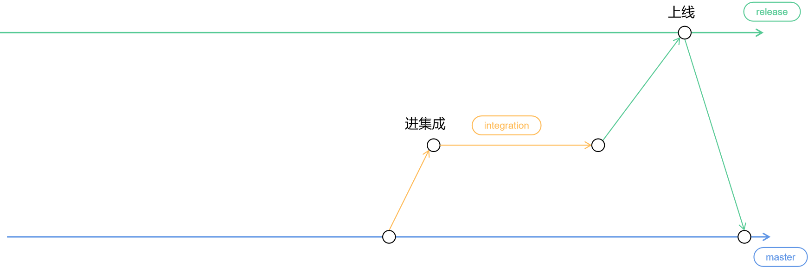
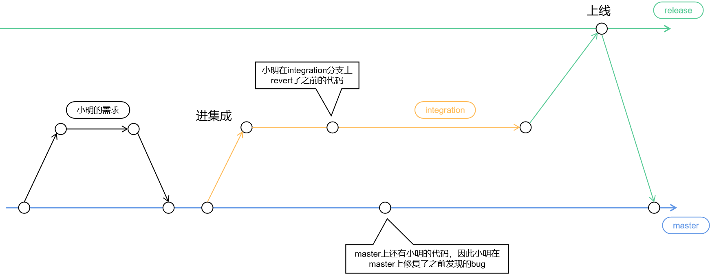
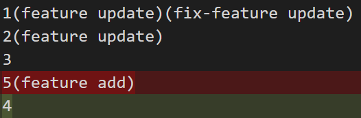
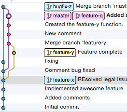
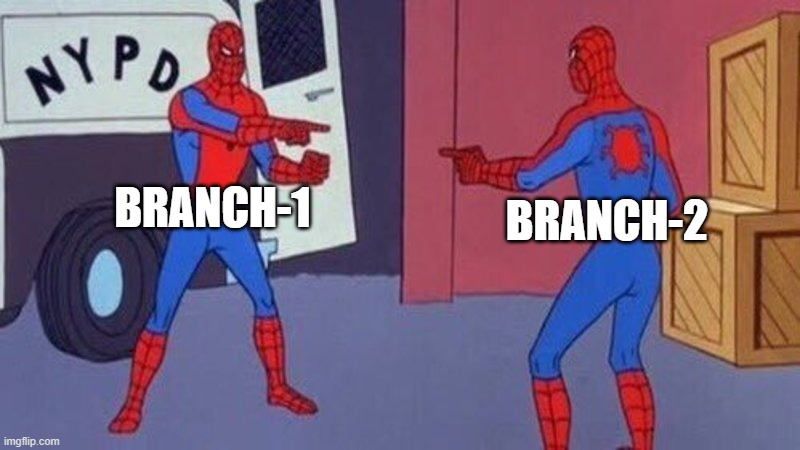
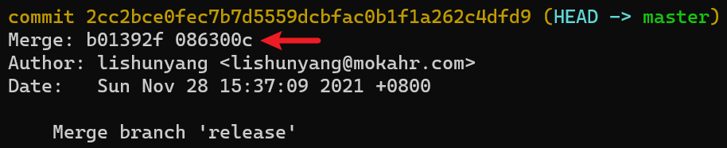
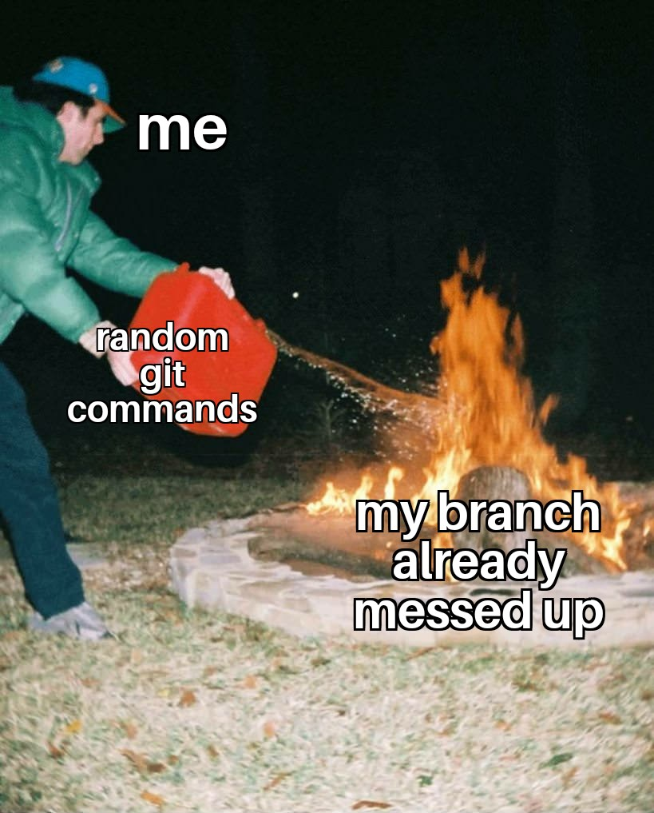

一提到 git 操作，很多同学都表示都能够熟练使用，但如果你所谓“熟练”仅限于`checkout`，`commit`，`解冲突`而已，那其实还远算不上熟练，毕竟上面这几种都是正常工作中会被大量使用的命令，想不熟练都难。

相反，对于一些特殊情况的处理，才是真的考验你对 git 的理解。

## git 流程规范

先简单介绍一下我们团队的 git 分支流程，方便理解。

首先，我们有两个长期稳定存在的分支，一个叫 master，一个叫 release。

其中，master 分支对应稳定的主干代码，master 上的代码都必须经过 code review 和自测，而 release 分支则对应生产环境的代码，release 上的代码会经过 QA 团队的充分测试。



平时大家开发的各种功能，都是直接合并到 master 分支上，只有 hotfix 的改动会合并到 release 分支：



每次正式迭代发版前，我们会从 master 分支上拉出一个 integration 分支做集成测试，同时 integration 也代表功能封版了（禁止将 master 分支合并到 integration 分支），后续即使再有代码合并到 master 也不会被带到线上。所有集成测试期间发现的问题，就在 integration 分支上做 fix。

上线过程其实就是将 integration 分支合并到 release 分支，然后上线 release 分支的代码，最后再将 release 分支合并回 master（确保集成测试期间的 fix 也带回 master）。



当然，完整的 git 分支规范比这个还要再复杂一些，例如权限如何管控，集成期间 hotfix 怎么办，灰度上线怎么办等等。这些细节跟本次讨论关系不大就不啰嗦了，如果感兴趣以后专门聊聊这个话题。

## 一个 revert 场景

某一天，小明的需求在集成测试环境被 QA 同学发现了太多问题，按照流程该需求要被打回。于是小明在 integration 分支上 revert 了他的改动，然后他在 master 分支上修复了发现的 bug。



接下来意想不到的情况发生了，上线后 release 分支合并回 master，此时不仅合并代码产生了冲突，而且还丢失了一部分小明的代码改动！

问，这是为什么？

## 做个实验

为了方便操作，下面的步骤我都写到一个代码块里了，感兴趣的话可以直接复制到 shell 里执行

```sh
# 首先初始化一下，创建一个a文件，内容是三行1、2、3、4，master分支和release分支最初都是一样的：
mkdir revert-test && cd revert-test && git init
cat <<EOF > a
1
2
3
4
EOF
git add . && git commit -m "initial commit"
git checkout -b release
git switch master


# 新建一个feature分支，将a文件修改为如下内容（改动了其中的第1、2行，删除了原来的第4行，新增了一行），然后将feature分支合并回master：
git checkout -b feature
cat <<EOF > a
1(feature update)
2(feature update)
3
5(feature add)
EOF
git add . && git commit -m "feature"
git switch master
git merge feature

#接下来模拟integraion期间的revert操作，从当前master分支创建一个integration分支，然后把feature分支的改动revert掉：
git checkout -b integration
git revert HEAD --no-edit # HEAD指向的正是之前合并feature分支的commit，由于之前的合并是fastforward所以这里可以直接revert

# 然后我们模拟小明回到master分支上对原来的代码做fix，新建一个fix-feature分支，对代码做一定修改（改动了第一行），然后合并回master：
git switch master
git checkout -b fix-feature
cat <<EOF > a
1(feature update)(fix-feature update)
2(feature update)
3
5(feature add)
EOF
git add . && git commit -m "fix feature"
git switch master
git merge fix-feature

# 最后我们模拟integration上线，并将release分支合并回master：
git switch release
git merge integration
git switch master
git merge release # 此时一定会产生冲突
```

当执行完最后一步后，悲剧就发生了。

先看看我们期望的 a 文件最后的状态是什么，显然就是 fix-feature 分支最后的改动内容：

```
1(feature update)(fix-feature update)
2(feature update)
3
5(feature add)
```

好了现在我们来看看目前 a 文件的冲突情况：

```
<<<<<<< HEAD
1(feature update)(fix-feature update)
2(feature update)
=======
1
2
>>>>>>> release
3
4
```

HEAD 代表 master，冲突的部分显然应该选择保留 HEAD 的改动，即：

```sh
git merge --abort
git merge release --strategy-option ours --no-edit
```

现在我们看看解完冲突后的 a 文件和我们期望的结果有什么不同：

```sh
git diff HEAD~1
```



可以看到，即使在解冲突的时候完全采用 master 分支，最终也仍然会丢失一部分代码改动（例子中`5(fix-feature add)`这一行没了，旧的`4`这一行反而出来了）。

那么什么样的代码改动会丢失呢？这个问题不妨留给聪明的你来回答好了，如果你真的理解了上面的例子，不难得出结论。

revert 的例子讲完了，回顾上面的过程，我们到底做错了什么呢？为什么会这样呢？

## 你真的理解 commit 吗？

我们知道，git 中每个 commit 是一次项目快照，包含了项目的所有文件内容，commit 保存的不是本次的代码改动 diff。这是 git 最基础也是最核心的设计思想，但很多人其实并没有真的理解。

比如，commit 是不包含 diff 信息的，你在各种工具上看到的 commit 的改动，是拿当前 commit 跟他的上一次 commit（parent）做 diff 得到的（每个 commit 包含了上一次 commit 的 hash，也就是 parent 指针）。

再比如，在很多人心中，branch 是一连串 commit 组成的一个分支，然而实际上，在 git 中 branch 仅仅就是一个指针（指向最后一次 commit）。而我们之所以容易把 branch 当成是一连串 commit，大概是因为这样更符合 branch 的意象，而很多可视化 git 工具的graph无形之中也加强的这个印象。



git 的分支概念，完全是人为赋予的逻辑概念，只是为了方便大家理解，但恰恰因为如此，大家就容易对一些 git 操作结果产生奇怪的误解。

举个例子，你是否有过这样的经历：修好了一个bug，正准备push的时候，突然发现：哎呀，糟了，直接commit在master上了，而master是受保护分支禁止直接commit，只能合并PR。那么这个时候，你该怎么办呢？

有的同学（包括我以前也是）的做法是这样的：

1. `git reset HEAD^ --soft`，拆掉最后一次commit
2. `git checkout -b fix-blablabla`，此时checkout出一个新分支
3. `git commit -m "blablabla"`，重新提交到新分支上
4. `git push`，push代码

当然，还有其他类似的做法，比如用到cherry-pick之类的。这样做当然一点问题没有，但最佳做法其实是：

1. `git checkout -b fix-blablabla`，直接在当前commit上checkout出新分支
2. `git push`，push代码

也就是说，拆commit和重新commit是完全没必要的操作。为什么呢？因为branch只是一个pointer。

再举一个分支合并的例子，`git merge`。相信有很多同学都知道 git 的分支合并策略是 3-way-merge（不考虑 fast-forward 的情况下）。那你有想过为什么是 3-way-merge 吗？既然每个 branch 上有什么改动都是已知的，为什么不能直接 2-way-merge 呢？为什么一定要三方合并呢？

不知道你有没有过这样的疑惑，反正当年我是挺迷惑的。

原因就是“既然每个 branch 上有什么改动都是已知的”，这句话是有问题的。正如前文所说，branch 就是一个 commit 的指针而已，而 commit 是完整的项目代码，因此每个 branch 上到底做了什么改动，这个信息其实只靠两个 branch 是得不出来的。



因此就需要引入第三个 commit 做基准（base），每个分支跟这个 commit 做 diff 操作就知道当前分支一共改动了什么。那么什么样的 commit 适合做这个基准呢？当然是这两个分支的最近公共祖先 commit 了。另外别以为寻找两个 commit 的最近公共祖先是一件简单的事情，这里面的算法相当复杂，如果感兴趣可以去看看`git merge-base`这个命令的解释。

## 为什么某些 revert 操作需要-m 参数？

我们知道 revert 操作的命令是：

```sh
git revert <commit>
```

有时候我们在 revert 一个 commit 的时候，会遇到这样的错误：

```
$ git revert 2cc2bc
error: commit 2cc2bc is a merge but no -m option was given.
fatal: revert failed
```

错误的表面意思是说缺少了一个-m 参数，不过有时候又不会遇到这样的错误，这是为什么呢？

在回答这个问题前再考你一个问题，如果某个 feature 分支上提交了 100 次 commit，现在将这个 feature 分支合并到 master，那么 master 分支上面会多出几个 commit，即 master 的 HEAD 指针向前移动几个 commit？

- A. 0
- B. 1
- C. 100
- D. 101

正确答案是 B 或者 C。如果你答错了，说明你对 commit 的概念还没有做到彻底理解。当然，这个例子还是有一点点特殊的。

先说下什么时候是 C，当 merge 操作是 fast-forward 模式时，这种情况的 merge 操作本质上只是把 HEAD 指针移动了下位置，实际上没有产生任何新的 commit。在上面的例子中，master 的 HEAD 指针移动到了 feature 分支的 HEAD 指针的位置，因此向前移动了 100 个 commit。

而当 merge 操作是 3-way-merge 的时候就是 B 了。

在 git 中，大部分 commit 都只有一个 parent，但 merge 操作产生的 commit 比较特殊，它有两个 parent。如果你执行`git log`就会发现这一点，而其他 commit 是没有这个信息的：



需要注意的是，只有 3-way-merge 产生的 commit 才会有两个 parent，如果是 fast-forward 模式，前面说了是不产生新 commit 的。

> 实际上在 git 中，还有一种合并模式叫 octopus merge，可以允许产生多于 2 个 parent 的 commit。

我们不妨将只有 1 个 parent 的 commit 叫 normal commit，将 2 个 parent 的 commit 叫做 merge commit（因为他们只能通过 merge 得到，fast-forward 本质上不算是 merge）。

回到一开始的问题，revert 操作实际上就是把代码的改动反向做一遍。如果 commit 只有一个 parent，那么我们只要拿这个 commit 和它的 parent 做 diff 操作就可以知道当前这次 commit 实际做了什么改动，但如果一个 commit 有 2 个 parent，我们就无法得知这个 commit 到底是改动了什么，也就没法做“revert”操作了，此时就需要你通过-m 参数的方式显式地告诉 git，应该以哪个 parent 做 diff 的基准（mainline）。你用 git log 看到的 parent 从左到右的编号分别是 1、2、3...。

## data & history

前面提过，revert 就是把指定 commit 反向操作一遍，那么 revert 是不是可以认为就是 undo 呢？

答案是“否”。

如果把项目中的代码称作 data，把项目的改动历史称作 history。显然，revert 只能恢复 data 而无法恢复 history。在 git 中，一个 commit 的内容代表 data，commit 本身则代表 history。revert 操作不但不能恢复 history，反而会忠实地产生一个 commit 记录下这次恢复操作，这是 revert 跟 undo 最大的不同。

那么，history 很重要吗？是的，因为 git 正是依赖 history 信息来判定冲突的。

怎样判定两个人的代码改动有冲突呢？只要改动了同一块代码就一定冲突吗？答案当然是否定的。举个最简单的例子，小明 5 年前改动了一段代码，我今天重构了他的代码，虽然我俩都改动了这块代码，但这明显不是冲突。因为我是基于小明的代码继续修改的。即如果两个修改有明确的先后关系，那么就不算是冲突。反映到 git 上，如果一个 commit 是另一个 commit 的祖先，那么这两个 commit 的改动就一定不算是冲突，反之才能算是冲突。

如果 commit A 和 B 的最近公共祖先就是 A 或者 B，那么 A 和 B 的改动就不是冲突。如果 A 和 B 的最近公共祖先是其他 commit，那么 A 和 B 对相同文件内容的改动就是冲突了。

> 推荐你去看看 git merge-base 命令的解释

而对 A 和 B 祖先关系的判断，正是通过分析 commit 之间的 parent 关系得到的，这就是 history 的意义。

简单来说，git 的冲突检测逻辑是这样：

1. 两个 commit 是否改动了相同的地方（文件或者行内）
2. 两个 commit 是否没有祖先关系（公共祖先是其他 commit）

这两个条件都满足才算是冲突，data + history 才能判断冲突。

这也就是为什么，对于任何一个 merge commit，git 完全知道这个 merge commit 是否是解冲突后得到的，因为只需要对两个 parent 做一次冲突检测算法即可。所以，如果 revert 的是一个经过解冲突的 merge commit，git 也会报冲突让你去解，没错，revert 代码也是可能遇到冲突的。

这里就有一个好玩的东西了。revert 产生的 commit 有几个 parent 呢？答案是 1 个（parent 就是那个被 revert 的倒霉蛋）。只有 1 个 parent 的 commit 是非常简单的，revert 起来既不需要加-m 参数，而且也不会遇到冲突（毕竟就一个 parent）。所以如果一个 merge commit 被反复 revert（即 revert revert commit），除了第一次 revert 能够包含最完整的 data 和 history 信息，后面的 revert commit 都会退化成普通 commit，越 revert 越简单，可能这就是为什么会见到那种反复 revert 的 commit 吧。但这里需要注意的是，这样做是有可能出 bug 的，毕竟冲突信息丢了。

> 我见过最长的 revert 是反复 revert 了 5 遍的，简直连亲妈都已经不认识了。

git官方文档首页中专门有一段内容区分什么是`git reset`和`git revert`，可见很多人都不太会真的使用revert命令。其实git revert跟git cherry-pick很类似，这俩应该是归为一类。revert其实就是cherry-pick的逆操作，如果你理解了cherry-pick，那完全可以仿照着去理解revert，反之也是一样。

那么问题来了，你觉得cherry-pick简单吗？

## 我们到底做错了什么？

回到最开头的丢代码的例子，为什么会产生这样的结果？相信如果你理解了前面的内容，心里早就有答案了。那么我们到底做错了什么呢？

小明肯定是有责任的，毕竟没有做好自测，在集成期间被 QA 同学打回，这才导致了后面一系列的问题。其实这种情况在实际开发中还是比较容易发生的。比如多人协作的项目，即使你自己的这部分完全没有问题，也可能因为其他某个人的代码原因导致整个项目的 revert（最典型的就是前端因为后端 revert 或者后端因为前端 revert）。

团队大了，分工细了，一些原本小概率发生的事情也会变得频繁。

是分支规范错了吗？的确，我们的分支规范中原先并没有明确这种 revert 代码场景的正确操作方式。那么正确的操作方式是什么呢？

其实在 git 的官方文档中就有一篇关于此问题的讨论，见[这里](https://github.com/git/git/blob/master/Documentation/howto/revert-a-faulty-merge.txt)，里面提到了一些很不错的建议，非常值得阅读一下。不过说实话，哪些方案其实也并不适合我们的分支规范。当然，还有一种解决办法就是如果只要 integration 上出现了 revert 操作，就立即将 integration 分支立刻合并回 master，确保 master 上也是 revert 状态，后续若想继续开发就重新 revert 之前的 revert。虽然看上去很愚蠢，但确实可以解决代码冲突的问题。

后续再改进优化和观察一下看看吧。

## 后记



如果能熟练运用 revert、reset、cherry-pick，那基本上真的可以解决 99%的 git 问题。

很多同学喜欢用 git 的图形化工具，比如最常见的有 sourcetree，平时用着也挺不错，不过说真的，还是更推荐使用 git 命令。因为对于那些奇怪的 git 问题，你需要结合 git 的原理分析问题产生的原因，进一步灵活组合各种 git 命令解决问题。不幸的是，图形化工具的能力是很有限的，而且也不够灵活，遇到这些奇怪的问题往往就是束手无策，降低了大家的解决问题能力。

说回 git 操作，这其实是一个很好的反映研发同学能力水平的东西。平常大家用用 commit、push、pull，都是“熟练掌握”。可一旦出了问题，如果不仔细思考就很容易越弄越乱，尤其是在你不熟悉 git 原理的情况下。面试的时候我也喜欢问 git 的问题，因为这才能真的考察出一个候选人的钻研问题的能力，可惜的是，大部分同学做得都不好。
